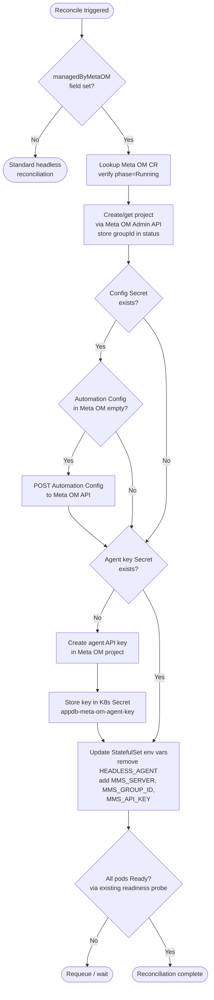

# Spike: AppDB Agent Mode Switch — Headless to Online via Meta OM

**Author:** Maciej Karaś
**Related docs:**
- [[SPIKE + TD] OM Backup with PITR and Deployment Reconciliation](https://docs.google.com/document/d/1UkcMpEVhCjvI-ouCp4hjOxjIDMi7cAxEA_myBmIk67U)
- [[Spike + TD] OM Backup (Phase 1)](https://docs.google.com/document/d/1ScQ9OjT-5XWTz3jtr-ECXBLlOuot6hiq_MUD0G8eaaI)
- [Spike: Ops Manager with externally managed AppDB](https://docs.google.com/document/d/1CePu35zPVPmJ1EOQMhLkgXuHPuLQV2Rk0xQx0f_eec8)

---

## Description

This is a Proof of Concept for enabling backup of an existing Ops Manager Application Database (AppDB) that is currently running in **headless mode**, without requiring data migration.

Today, MCK deploys AppDB agents in headless mode — each agent is configured via a static Automation Config stored in a Kubernetes Secret, with no connection to any Ops Manager instance. This makes the AppDB "unmanaged" and excludes it from backup coverage.

A [previous spike](https://docs.google.com/document/d/1CePu35zPVPmJ1EOQMhLkgXuHPuLQV2Rk0xQx0f_eec8) validated an alternative approach: deploy a brand-new MongoDB replicaset managed by a secondary (Meta) Ops Manager, then reference that replicaset as the AppDB in Primary OM. While valid, this approach requires a `mongodump`/`mongorestore` data migration — a significant burden for customers with existing deployments.

**This spike explores a different path:** for customers who already have Ops Manager and an AppDB deployed, switch the AppDB agents in-place from headless mode to online mode — connecting them to Meta OM — without any data migration. Meta OM then takes full management control of the AppDB (automation + backup).

---

## Context: How Headless Mode Works Today

When MCK deploys an AppDB:

1. An Automation Config is built from the `MongoDBOpsManager` CR spec and stored as a Kubernetes Secret (`{appdb-name}-config`).
2. Each AppDB pod runs a MongoDB Agent with the following env vars set:
   - `HEADLESS_AGENT=1` — instructs the agent to run without an Ops Manager connection
   - `AUTOMATION_CONFIG_MAP=<secret-name>` — path to the static Automation Config Secret
3. The agent reads the config from the Secret on startup and manages `mongod` accordingly. It never calls home to any Ops Manager instance.

To switch to online mode, the agent needs:
- `HEADLESS_AGENT` removed
- `MMS_SERVER`, `MMS_GROUP_ID`, `MMS_API_KEY` set (pointing to Meta OM)
- A valid Automation Config already present in Meta OM before the first agent poll

---

## Implementation

### 1. CR API Changes

A new optional field is added to `AppDBSpec` in `api/v1/om/appdb_types.go`:

```go
type AppDBSpec struct {
    // ... existing fields ...

    // ManagedByMetaOM, when set, transitions AppDB agents from headless mode
    // to online mode managed by the referenced secondary (Meta) Ops Manager.
    // The operator will register the AppDB with Meta OM, push the initial
    // Automation Config, and roll-restart the AppDB pods.
    // +optional
    ManagedByMetaOM *MetaOMRef `json:"managedByMetaOM,omitempty"`
}

type MetaOMRef struct {
    // Name of the MongoDBOpsManager CR acting as Meta OM.
    // +kubebuilder:validation:Required
    Name string `json:"name"`

    // Namespace of the Meta OM CR. Defaults to the same namespace as Primary OM.
    // +optional
    Namespace string `json:"namespace,omitempty"`

    // ProjectName is the name of the project to create or use in Meta OM
    // for this AppDB deployment.
    // +kubebuilder:validation:Required
    ProjectName string `json:"projectName"`

    // CredentialsSecretRef references a Secret containing Meta OM admin
    // API credentials (keys: publicKey, privateKey).
    // +kubebuilder:validation:Required
    CredentialsSecretRef corev1.LocalObjectReference `json:"credentialsSecretRef"`
}
```

Example CR:

```yaml
apiVersion: mongodb.com/v1
kind: MongoDBOpsManager
metadata:
  name: om-primary
spec:
  applicationDatabase:
    members: 3
    managedByMetaOM:
      name: om-meta
      namespace: meta-om-ns        # optional, defaults to same namespace
      projectName: primary-appdb
      credentialsSecretRef:
        name: meta-om-admin-credentials
  # ... rest of spec ...
```

The Secret referenced by `credentialsSecretRef`:

```yaml
apiVersion: v1
kind: Secret
metadata:
  name: meta-om-admin-credentials
stringData:
  publicKey: "<meta-om-api-public-key>"
  privateKey: "<meta-om-api-private-key>"
```

### 2. Reconciliation Flow

Because MCK's reconciler runs continuously, the implementation must be **fully idempotent**. Each step checks the actual state of the relevant resource and skips the action if it is already in the desired state.

**Reconciliation steps:**

1. Check if `spec.applicationDatabase.managedByMetaOM` is set. If not, proceed with standard headless reconciliation.
2. Look up the referenced `MongoDBOpsManager` CR (Meta OM). Verify it is in `Running` phase. Call Meta OM Admin API to create or retrieve the project named `spec.projectName`. Store the returned `groupId` in `status.applicationDatabase.metaOMGroupId` for use by subsequent steps.
3. Read the `{appdb-name}-config` Secret (headless Automation Config). If the Secret does not exist (it may have been deleted post-migration), skip. Otherwise, check whether the Meta OM project already has a non-empty Automation Config (GET `/api/public/v1.0/groups/{groupId}/automationConfig`). Only POST the config if the existing one is empty — this prevents overwriting a config that Meta OM is already managing.
4. Check if the agent API key Secret (`{appdb-name}-meta-om-agent-key`) already exists in-cluster. If not, create an agent API key in Meta OM for the project and store it in that Secret.
5. Update the AppDB StatefulSet template spec:
   - Remove env vars: `HEADLESS_AGENT`, `AUTOMATION_CONFIG_MAP`
   - Add env vars: `MMS_SERVER=<meta-om-url>`, `MMS_GROUP_ID=<groupId>`, `MMS_API_KEY=<agent-api-key>`
   - The update is applied on every reconciliation; Kubernetes will only trigger a rolling restart if the spec has actually changed.
6. Wait for all AppDB pods to pass their readiness probe (existing mechanism, no new polling required).

**Flow chart:**



### 3. MCK Code Changes

| Area                         | File(s)                                                                                                                                 | Change                                                                                                                                                             |
|------------------------------|-----------------------------------------------------------------------------------------------------------------------------------------|--------------------------------------------------------------------------------------------------------------------------------------------------------------------|
| **API types**                | `api/v1/om/appdb_types.go`, `opsmanager_types.go`                                                                                       | Add `ManagedByMetaOM *MetaOMRef` to `AppDBSpec`; add `MetaOMRef` struct; add `metaOMGroupId` to status                                                             |
| **CRD manifest**             | `config/crd/bases/...`                                                                                                                  | Auto-generated via `make generate`                                                                                                                                 |
| **AppDB controller**         | `controllers/operator/appdbreplicaset_controller.go`                                                                                    | Add `reconcileManagedByMetaOM()` branch in the main reconcile loop implementing the idempotent state machine above                                                 |
| **StatefulSet construction** | `controllers/operator/construct/appdb_construction.go`                                                                                  | Conditional: if `ManagedByMetaOM` is set, omit `HEADLESS_AGENT`/`AUTOMATION_CONFIG_MAP`, inject Meta OM connection env vars                                        |
| **OM connection reuse**      | `controllers/om/`                                                                                                                       | Reuse existing `omConnectionFactory` / Admin API client to call Meta OM (project creation, agent API key provisioning)                                             |
| **Unit tests**               | `controllers/operator/appdbreplicaset_controller_test.go`, `controllers/operator/construct/appdb_construction_test.go`, `api/v1/om/...` | Test: CR field validation, idempotent reconcile loop (all conditions already met → no-op), StatefulSet env var construction with and without `ManagedByMetaOM` set |
| **e2e tests**                | `test/e2e/`                                                                                                                             | New test scenario (see Section 4)                                                                                                                                  |

---

## Testing

### Unit Tests

- CR validation: `managedByMetaOM` with missing required fields is rejected at admission
- Reconciler is idempotent: when Meta OM project already exists, Automation Config is non-empty, and agent key Secret exists — no API calls to Meta OM are made; StatefulSet is always updated but Kubernetes does not restart pods if the spec is unchanged
- StatefulSet construction: when `ManagedByMetaOM` is set, `HEADLESS_AGENT` and `AUTOMATION_CONFIG_MAP` env vars are absent; `MMS_SERVER`, `MMS_GROUP_ID`, `MMS_API_KEY` are present
- StatefulSet construction: when `ManagedByMetaOM` is not set, original headless env vars are present (no regression)
- Reconciler fails gracefully and requeues if Meta OM CR is not yet in `Running` phase
- Automation Config push is skipped when the config Secret is absent or when Meta OM already has a non-empty config

### e2e Test Scenario

The following scenario reflects a real customer upgrading from an unmanaged AppDB to Meta OM-managed:

1. Deploy Primary OM (`om-primary`) via MCK with AppDB in headless mode (3 members)
2. Verify `om-primary` reaches `Running` phase; verify AppDB agents are headless (`HEADLESS_AGENT=1` present)
3. Deploy a sample `MongoDB` CR managed by `om-primary` (represents existing customer workload)
4. Verify the sample MongoDB deployment is healthy
5. Deploy Meta OM (`om-meta`) via MCK with its own Meta AppDB
6. Verify `om-meta` reaches `Running` phase
7. Patch `om-primary` CR: add `spec.applicationDatabase.managedByMetaOM`
8. Assert AppDB StatefulSet pods restart and all become Ready
9. Assert `HEADLESS_AGENT` env var is absent; `MMS_SERVER`/`MMS_GROUP_ID`/`MMS_API_KEY` are present on AppDB pods
10. Assert no data loss in AppDB (verify a pre-migration document is still present)
11. Assert `om-primary`'s sample MongoDB deployment is still healthy throughout

### Manual PoC Validation (beyond e2e)

After the e2e test passes, the following steps are performed manually to validate the full backup/restore story:

1. In Meta OM UI: verify the AppDB replicaset appears as a managed deployment in the configured project
2. In Meta OM UI: enable backup for the AppDB (configure oplog store + snapshot store)
3. Insert known test data into AppDB
4. Wait for a continuous backup snapshot to be taken by Meta OM
5. Trigger a PITR restore of the AppDB to a point-in-time after test data insertion, via Meta OM UI
6. Verify AppDB contains the restored data
7. Verify `om-primary` continues to manage its MongoDB deployments normally after the AppDB restore

---

## Success Criteria

- ✅ AppDB agents transition from headless → online with **zero data loss** and no Primary OM downtime
- ✅ Reconciler is fully idempotent — StatefulSet is updated every reconciliation but Kubernetes only restarts pods when the spec has actually changed
- ✅ Meta OM UI shows AppDB as an active managed deployment
- ✅ Backup can be manually enabled and a snapshot is taken via Meta OM UI
- ✅ PITR restore successfully recovers AppDB to a past point-in-time
- ✅ Primary OM continues managing its MongoDB deployments after the AppDB restore
- ✅ Unit tests pass
- ✅ e2e test passes in CI

---

## Risks and Open Questions

| # | Risk / Question                                                                                                                                                            | Severity      | Notes                                                                                                                                         |
|---|----------------------------------------------------------------------------------------------------------------------------------------------------------------------------|---------------|-----------------------------------------------------------------------------------------------------------------------------------------------|
| 1 | **Automation Config format compatibility** — the headless config may include agent-version-specific fields that Meta OM's API rejects or interprets differently | Medium        | Needs investigation during PoC; may require config sanitization before POST |
| 2 | **Rolling restart data availability** — during the rolling restart, the AppDB replicaset drops from 3→2 members temporarily; Primary OM must tolerate this    | Low           | Standard RS rolling restart; Primary OM's connection pool handles this      |
| 3 | **Reversibility** — switching back from online → headless mode is not designed in this PoC                                                                    | Low (for PoC) | Treat as out of scope; document as known limitation                         |

---

## Out of Scope

- Configuring backup in Meta OM via MCK CRD fields (backup is enabled manually via UI in this PoC)
- Reversing the migration (headless ← online)
- Multi-cluster AppDB (more than one member cluster) — single-cluster only for PoC
- Automated PITR restore triggered via MCK (MCK is not involved in the restore workflow)
- Migration of backup metadata or blockstore data alongside the AppDB switch

---

## PoC Steps Summary

For quick reference, the end-to-end PoC steps in sequence:

1. Deploy standard customer environment: Primary OM + headless AppDB + sample MongoDB deployment
2. Deploy Meta OM + Meta AppDB
3. Create admin credentials Secret for Meta OM
4. Patch Primary OM CR with `spec.applicationDatabase.managedByMetaOM`
5. Observe MCK reconciling through the four status conditions
6. Observe AppDB pods rolling restart and coming back online
7. Verify in Meta OM UI that AppDB appears as a managed deployment
8. Manually configure backup in Meta OM UI
9. Trigger PITR restore and verify recovery
10. Confirm Primary OM and its managed deployments are unaffected
