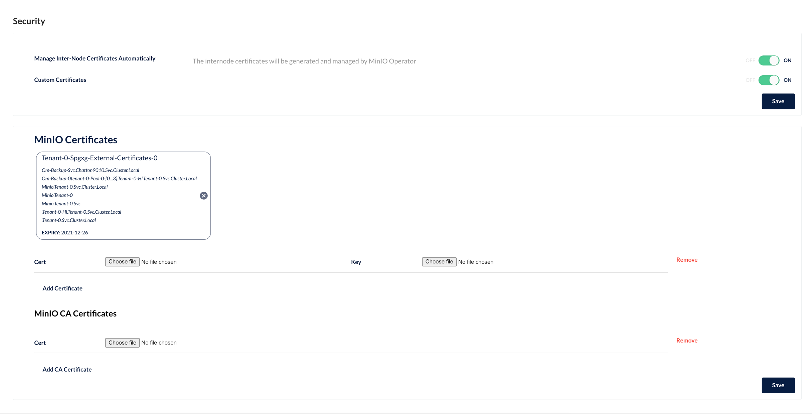

This document contains instructions on how to manually run the `om_ops_manager_backup_restore_minio.py` test. The
purpose of this test is to verify that it is possible to use s3 Oplog/Blockstores using a custom CA,
see [CLOUDP-97373](https://jira.mongodb.org/browse/CLOUDP-97373) for more details.

## Setting up the test environment.

1. Deploy the Minio operator. This can be done following the
   instructions [here](https://docs.min.io/minio/k8s/deployment/deploy-minio-operator.html)
2. Open the Minio **operator dashboard**. (`kubectl minio proxy` in a shell)
3. Login with the JWT token given and create a new tenant group, call it `tenant-0`. Take a note of the access key and
   secret key given.
4. Log into the **tenant dashboard** (different from operator dashboard) you will find the credentials in a secret called *-user-0 in the tenant-0 namespace. Create two buckets "oplog-s3-bucket" and "s3-store-bucket". (Ops Manager assumes these buckets exist.)
5. In the Mino Operator UI, add the tls.crt and tls.key from this directory as shown in the image. (this cert and key have been signed using the custom CA fixture.)     
6. Update the fixtures in the test to return all the correct values. You should only need to change the AWS keys.
7. Run the test locally with `make e2e test=e2e_om_ops_manager_backup_restore_minio`.
