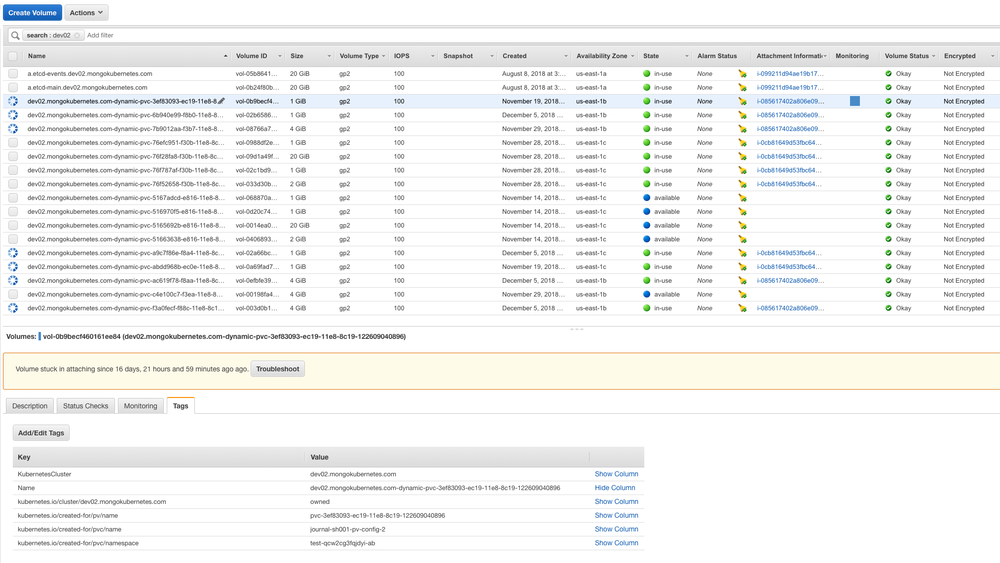
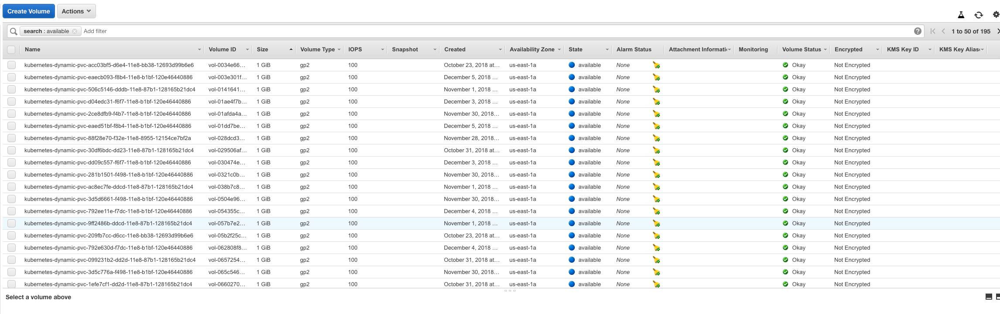

# E2E Tests

## General

We have single test suite which is run in two different platforms: native Kubernetes (AWS created by Kops) and Openshift
Each test creates a new K8s namespace and the new group in Ops Manager with the same name (something like `a-330-r1at3ukxl5b2sk6f20mcz`)
The namespace is left unremoved if the test fails so it was easier to check problems

## FAQ
#### How to use Openshift cluster and check its state?

1. login here https://master.openshift-cluster.mongokubernetes.com:8443   
1. user is "admin", password is "asdqwe1"
1. get a login token from the "admin" panel top-right
1. paste it in command line and use `oc` CMD app to query Openshift cluster

#### If the test has failed - how to check what happened there?
* Check logs in Evergreen
* Check the state of existing objects in namespace using `kubectl`/`oc` (if they were not deleted)
* Check the state of project in Ops Manager (for kops cluster it's `http://54.160.170.171:30039`). To find out the external ip of Ops Manager pod run the following command:
```bash
k get nodes -o wide | grep "$(k get pods/mongodb-enterprise-ops-manager-0 -n operator-testing -o wide | awk '{print $NF}')" | awk '{print $6}'
``` 


Note, that you need to open ports for Ops Manager instance first time:
    * login to `https://console.aws.amazon.com` using account `2685-5815-7000` and 
    * in `Security Groups` find the relevant group starting with `nodes.` prefix (e.g. `nodes.dev02.mongokubernetes.com`) 
    for Kops cluster or `openshift-test-workersecgroup-` for OpenShift  
    * add the following 'inbound' rule (opens the port `30039` for any client): 
```
Custom TCP Rule     TCP     30039   0.0.0.0/0, ::/0 
```

#### Cleaning the old namespaces manually
```bash
for f in $(kubectl get ns -o name | grep a-); do kubectl delete $f --force; done

# removing Ops Manager (will be created automatically before next test run)
kubectl delete operator-testing --force

```

#### Problems with EBS volumes
These are some facts that we gathered while fighting with EBS problems for e2e tests:
* Backing EBS volume (see `Volumes` in https://console.aws.amazon.com/ec2) are removed as soon as PVs are removed. We 
use dynamic PVs in our tests, so to get them removed their PVCs must be removed (this happens when the namespace is removed 
which happens after successful test or during namespaces cleanup). Dynamic removal happens because the `StorageClass` we use
(default one - `gp2`) declares the `Delete` reclaim policy.
* Usually this works fine, but sometimes the EBS volumes can get stuck in attaching and not removed even if PVs are removed:
 
 Such PVs get the status `Failed` and must be removed manually. This is done in `prepare_test_env`. It's still unclear 
 if AWS removes the corresponding volumes eventually (seems no) so it's necessary to go the the UI and "force detach" them
 and delete then 
* Seems there are problems cleaning volumes for Openshift (sometimes?). Volumes tend to stay in AWS but get status `available`:
 
 These volumes are removed manually in `scripts/evergreen/prepare_test_env` script
 
 #### How to restart kops cluster (creating new nodes)
 
If the volumes hacks don't help and volumes keep getting stuck the best option is to rebuild kops cluster (cloudonly flag 
means do not validate the cluster):

```bash
kops rolling-update cluster dev02.mongokubernetes.com --yes  --cloudonly --force
```

