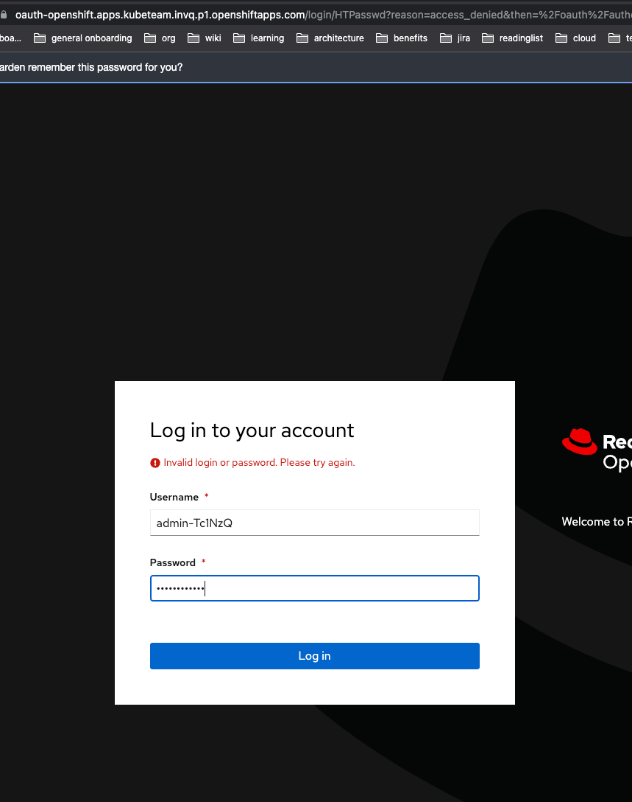

- [E2E Tests](#e2e-tests)
    * [General](#general)
- [How to choose the taskGroup/buildVariant for an e2e test](#how-to-choose-the-taskgroup-buildvariant-for-an-e2e-test)
- [Choose the correct tag](#choose-the-correct-tag)
    * [FAQ](#faq)
        - [How to connect to Openshift e2e cluster?](#how-to-connect-to-openshift-e2e-cluster-)
        - [How to connect to kops e2e cluster?](#how-to-connect-to-kops-e2e-cluster-)
        - [How to recreate e2e kops cluster?](#how-to-recreate-e2e-kops-cluster-)
        - [How to recreate e2e Openshift cluster?](#how-to-recreate-e2e-openshift-cluster-)
        - [If the test has failed - how to check what happened there?](#if-the-test-has-failed---how-to-check-what-happened-there-)
        - [Cleaning old namespaces via CronJob](#cleaning-old-namespaces-via-cronjob)
        - [How to avoid my test Namespaces being deleted?](#how-to-avoid-my-test-namespaces-being-deleted-)
        - [Problems with EBS volumes](#problems-with-ebs-volumes)
        - [Error terminating Ops Manager instance](#error-terminating-ops-manager-instance)
        - [SSH access to nodes](#ssh-access-to-nodes)

# E2E Tests

## General

We have single test suite which is run in two different platforms:
native Kubernetes (AWS created by Kops) and Openshift.

Each test creates a new K8s namespace and a new group in Ops Manager
with the same name as the namespace (something like
`a-330-r1at3ukxl5b2sk6f20mcz`). After the test finish, and in case of
a success run, the namespace will be removed. If the test fail, we
guarantee that the test namespace will remain for at least one hour
for you to investigate what is needed.

The tests are run against a combination of Ops Manager and Cloud
Manager releases and Kubernetes clusters (kops/Openshift)
 
# How to choose the taskGroup/buildVariant for an e2e test
1. Choose the task group (or create a new one) where the e2e test should fit into:
* `e2e_kube_only_task_group`: the task group for tests which focus on **Kubernetes features**
instead of Ops Manager ones. Examples: PersistentVolumes, CRD validation, Operator recovery 
from Kubernetes errors. This task group won't be run on all OM versions - only the
latest ones (1 per kops and Openshift cluster)
* `e2e_core_task_group`: the general task group which is run in both kops and Openshift
clusters for **all** the tested versions of OM and CloudManager QA. The tests are focused
on testing the OM + Automation Agents behavior
* `e2e_tls_task_group`: any tests focused on TLS. As they focus on OM more than on Kubernetes
they don't run on OM 4.2 version in both kops and Openshift clusters - only in kops one
* `e2e_scram_sha_task_group`: scram-sha related tests. Run on kops OM 4.2 and on Openshift CM QA.
* `e2e_tls_custom_ca_task_group`: the same as for scram-sha
* `e2e_x509_task_group`: the same as for scram-sha
* `e2e_om_4_2_plus_only_task_group`: includes tests for functionality which works in only OM 4.2.
Run in both kops OM 4.2 and Openshift OM 4.2
* `e2e_ops_manager_task_group`: the task group for all OM Custom Resource related tests

# Choose the correct tag

If your test is supposed to be run during patches, then make sure you add the
`patch-run` tag to it, like in tis example:

```
- name: e2e_replica_set_tls_prefer
  tags: ["patch-run"]
  exec_timeout_secs: 1200
  commands:
  - func: "e2e_test"
```
means that in the PRs the test will be run in the build variant `e2e_openshift_cloud_qa`
**It's important to make sure that the task group which the test belongs to is run by this build 
variant!** Otherwise, the test may be skipped from PR run totally and may get red only after merge 
to master.

## FAQ
#### How to connect to Openshift e2e cluster?
##### How to connect to the Console/WebUI
- The entry point of finding the openshift url should be the evergreen project setting page
- Go to evergreen (our ci) and our project, currently: https://evergreen.mongodb.com/projects##ops-manager-kubernetes
and find the openshift url from the variables, currently it is: `openshift_url`
- Use the URL and edit it to access the console 
  - replace `api` with `https://console-openshift-console.apps`
  - replace the port with 80 (default http port)
  - finally it should look like something like this: https://console-openshift-console.apps.kubeteam.invq.p1.openshiftapps.com/
- Ping your lead to share access credentials

With these you should be able to see the following page to login.


##### How to connect to the cluster via kubectl
- Follow the guide as described here: https://www.rosaworkshop.io/rosa/6-access_cluster/

#### How to connect to kops e2e cluster?
```bash
export KOPS_STATE_STORE=s3://kube-om-state-store
kops export kubecfg e2e.mongokubernetes.com
#(later when you need to switch to this cluster)
kubectl config use-context e2e.mongokubernetes.com
```

#### How to recreate e2e kops cluster?

```bash
make recreate-e2e-kops
```

Follow up:
* Add all team members public keys to `.ssh/authorized_keys` file on each node
* Configure firewall rules for Ops Manager (see below)

#### How to recreate e2e Openshift cluster?

Please follow the instructions [here](docs/openshift4.md). 

#### If the test has failed - how to check what happened there?
* **Check logs in Evergreen** (they show the output from testing application)
* Check the state of existing objects in the namespace - check the **files attached to the Evergreen job**:
    * `diagnostics.txt` - contains the output from `kubectl get.. -o yaml` for the most interesting objects in the namespace
    (if they exist): Persistent Volume Claims, Mongodb resources, pods
    * `operator.log` - contains the log from the Operator
    * `*` - set of files containing logs from Mongodb resource pods (for sharded clusters this includes only shards)
* If the files didn't provide enough information you can always use `kubectl` to query **more information for the Kubernetes cluster**
(`kubectl config use-context e2e.mongokubernetes.com/default/master-openshift-cluster-mongokubernetes-com:8443/admin`)
* Check the state of project in **Ops Manager**.
    * To find out the external ip of Ops Manager check the bottom of the output of a failed task in Evergreen - it will contain
    the following phrase:
    "Use the following address to access Ops Manager from the browser: http://3.87.239.164:30039 (namespace: a-042-y6y9c31v8j5kt9vumeptz)"
    * Use `admin/admin12345%` to login and search for the namespace
    * Note, that the external ports are opened automatically by the setup script so you don't need to do this
* If Ops Manager container is not running - the best way is to check its state using **Kubernetes Dashboard**:
    * switch kubectl context to the necessary cluster (for `e2e.mongokubernetes.com` the dashboard is installed automatically,
    for the openshift one you need to do this manually once)
    * call `make dashboard` and enter the token that is copied to the clipboard

#### Cleaning old namespaces via CronJob

The `docker/cluster-cleaner/job.yaml` should be applied on each
cluster. This file is a `CronJob` that runs every 10 minutes. Every
time this Job runs, it will remove all the testing namespaces in the
cluster that are older than 1 hour and that have "failed". Remember
that the tests that Succeed are removed immediately.


#### How to avoid my test Namespaces being deleted?

You can label your namespaces to flag them so the `cluster-cleaner`
script won't kill them. Use the `label` command from `kubectl` like:

``` bash
kubectl label namespace/my-namespace "evg/keep=true"
```

This will skip the cleaner for as long as you need from removing your
testing namespace. To remove the label so the cluster cleaner can
deallocate the resources, remove the label from it with:

``` bash
kubectl patch namespace/my-namespace --type=json -p='[{"op": "remove", "path": "/metadata/labels/evg~1keep"}]'
```

* note: the `~1` in the `jsonpath` is how `/` (slash) is escaped.

#### Problems with EBS volumes
These are some facts that we gathered while fighting with EBS problems for e2e tests:
* Backing EBS volume (see `Volumes` in https://console.aws.amazon.com/ec2) are removed as soon as PVs are removed. We
use dynamic PVs in our tests, so to get them removed their PVCs must be removed (this happens when the namespace is removed
which happens after successful test or during namespaces cleanup). Dynamic removal happens because the `StorageClass` we use
(default one - `gp2`) declares the `Delete` reclaim policy.
* Usually this works fine, but sometimes the EBS volumes can get stuck in attaching and not removed even if PVs are removed:
 
 Such PVs get the status `Failed` and must be removed manually. This is done in `prepare_test_env.sh`. It's still unclear
 if AWS removes the corresponding volumes eventually (seems no) so it's necessary to go the the UI and "force detach" them
 and delete then
* Seems there are problems cleaning volumes for Openshift (sometimes?). Volumes tend to stay in AWS but get status `available`:
 
 These volumes are removed automatically in `scripts/evergreen/prepare_test_env.sh` script
* One quite common and annoying thing is taint `NodeWithImpairedVolumes` that is sometimes added to the Kubernetes nodes.
It means that there are some stuck volumes. The fixes above try to fix all stuck volumes (though the taint is not removed automatically).
Also the taint is removed in `prepare_test_env.sh`. This doesn't mean that the problem is solved completely (AWS is quite
unpredictable) but may help sometimes avoid complete rebuilds of the cluster
* Sometimes deleting of the PVC/PV may get stuck. Even more - "Force detach" for the Volume in AWS console may get stuck as well.
Seems there are no well-knows ways of solving this except for recreating kops cluster...


#### Error terminating Ops Manager instance

This is something new and very rare. The first symptom of big problems is not being able to connect to the container:
```bash
kubectl -n "operator-testing" exec mongodb-enterprise-ops-manager-0 bash
rpc error: code = 14 desc = grpc: the connection is unavailable
command terminated with exit code 126
```

(Although the pod is in healthy state and `kubectl logs` return new logs all the time)

Trying to remove the namespace leaves the pod in `Terminating` state:
```bash
kubectl get all -n operator-testing -o wide
NAME                                  READY     STATUS        RESTARTS   AGE       IP             NODE
po/mongodb-enterprise-ops-manager-0   0/1       Terminating   0          3h        100.96.2.107   ip-172-20-96-41.ec2.internal
```

One possible inspection is to check the `kubelet` logs on the node but this requires `ssh` access to the node
Trying to detach/remove OM volumes in AWS console didn't succeed so only complete recreation of kops cluster helped

#### SSH access to nodes

* If there's someone who has the ssh access to the node then you should ask to add your public key to the
`.ssh/authorized_keys` on the node
* If the access is lost then it makes sense to use a new key pair (from https://github.com/kubernetes/kops/blob/master/docs/security.md#ssh-access)
```bash
kops delete secret --name e2e.mongokubernetes.com sshpublickey admin
kops create secret --name e2e.mongokubernetes.com sshpublickey admin -i ~/.ssh/newkey.pub
kops update cluster --yes
kops rolling-update cluster --yes
```
