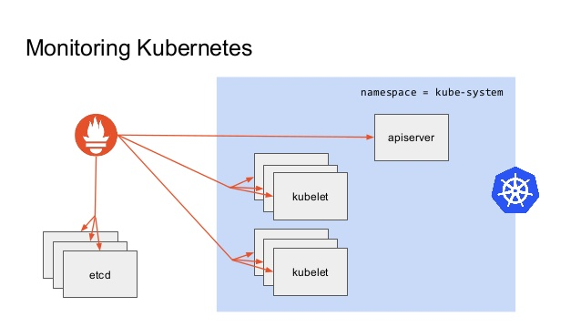

## Monitoring pipeline on Kubernetes

Monitoring pipeline was set up as a part of Loadtesting efforts. At the current state we have observability set up for `pod` resource usage such as (`cpu`/`memory`/`inodes`). Although we haven't set up graphs for other metrics like `memory_cache` usage, it should be fairly straightforward(writing a PromQL query) to add those graphs to a dashboard which will be discussed below.

### Setup

Following diagram roughly represents the setup we have at the moment:

We have prometheus scraping Kubelet(embedded cadvisor) for the pod level usage metrics. 
And on top of that we have Grafana querying the prometheus storage for the graph visualizations.
Both Pometheus and Grafana deployments are backed by persistent storage with a retention of 17 hours. One can also deploy the monitoring pipeline to any other `aws` or `kind` cluster. Just make sure to adjust the storage needs.

### Deploying the pipeline

To deploy the pipeline just run:

`kubectl apply -f production_notes/monitoring/`

Running this command creates the following objects in order:
1. `monitoring` namespace.
2. `clusterrole`, `serviceaccount` and `clusterrolebinding` for prometheus deployment.
3. `configmap`, `persistentVolumeClaim`, `deployment` and `service` object for Prometheus.
4. And finally `persistentVolumeClaim`, `deployment` and `service` object for grafana.

Finally one can access the grafana dashboard, from the `elb` link present in the `grafana service object`

### Adding new scrape target for Prometheus

One can add new scrape target for prometheus to scrape [here](../../production_notes/monitoring/cm.yaml) under the `scrape_configs` section.
After the adding the new scrape target, `prometheus` should start pulling metrics from the added source. 

### Adding new dashboards/graphs in grafana

First of all we need to make sure Grafana is able to connect to the underlying datasource. In the current setup Grafana and Prometheus is deployed in the same namespace(`monitoring`). So grafana can talk to datasource by just using the prometheus `service_name:port`.

To add new graphs please follow this [documentation](https://grafana.com/docs/grafana/latest/dashboards/)
