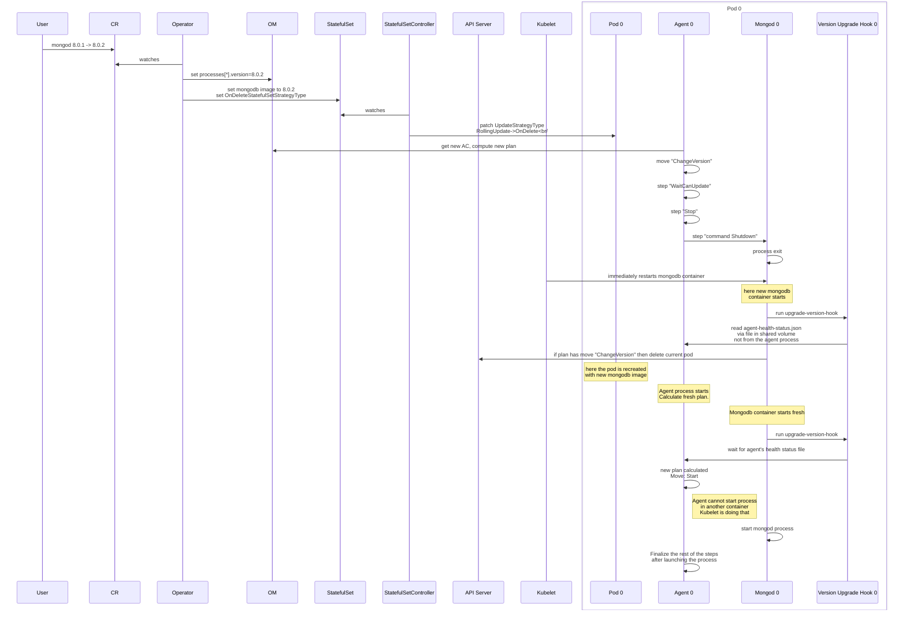

# MongoDBCommunity static architecture (version upgrade)

```mermaid
sequenceDiagram
    participant User
    participant CR
    participant Operator
    participant OM
    participant StatefulSet
    participant StatefulSetController
    participant API Server
    participant Kubelet
    box Pod 0
    participant Pod 0
    participant Agent 0
    participant Mongod 0
    participant Version Upgrade Hook 0
    end
    User->>CR: mongod 8.0.1 -> 8.0.2
    Operator->>CR: watches
    Operator->>OM: set processes[*].version=8.0.2
    Operator->>StatefulSet: set mongodb image to 8.0.2 <br/> set OnDeleteStatefulSetStrategyType
    StatefulSetController->>StatefulSet: watches
    StatefulSetController->>Pod 0: patch UpdateStrategyType<br/>RollingUpdate->OnDelete<br/
    Agent 0->>OM: get new AC, compute new plan
    Agent 0->>Agent 0: move "ChangeVersion"
    Agent 0->>Agent 0: step "WaitCanUpdate"
    Agent 0->>Agent 0: step "Stop"
    Agent 0->>Mongod 0: step "command Shutdown"
    Mongod 0->>Mongod 0: process exit
    Kubelet->>Mongod 0: immediately restarts mongodb container
    Note over Mongod 0: here new mongodb<br/> container starts
    Mongod 0->>Version Upgrade Hook 0: run upgrade-version-hook
    Version Upgrade Hook 0->>Agent 0: read agent-health-status.json<br/>via file in shared volume<br/>not from the agent process
    Mongod 0->>API Server: if plan has move "ChangeVersion" then delete current pod
    Note over Pod 0: here the pod is recreated<br/>with new mongodb image
    Note over Agent 0: Agent process starts<br/>Calculate fresh plan.
    Note over Mongod 0: Mongodb container starts fresh<br>
    Mongod 0->>Version Upgrade Hook 0: run upgrade-version-hook
    Version Upgrade Hook 0->>Agent 0: wait for agent's health status file<br/>
    Agent 0->>Agent 0: new plan calculated<br>Move: Start
    Note right of Agent 0: Agent cannot start process<br/>in another container<br/>Kubelet is doing that
    Mongod 0->>Mongod 0: start mongod process
    Agent 0->>Agent 0: Finalize the rest of the steps <br/>after launching the process


```
