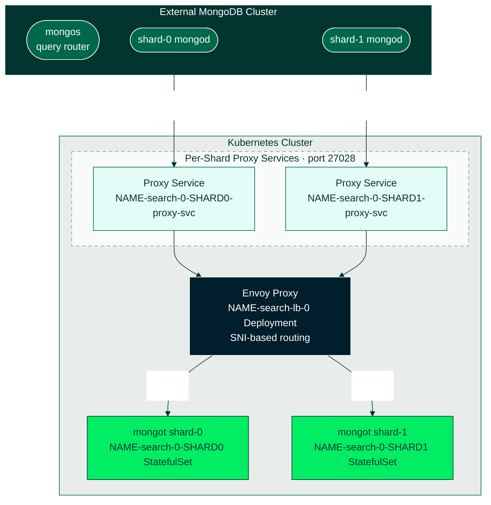

# MongoDB Search with External Sharded MongoDB + Managed Envoy LB

This guide walks you through deploying **MongoDB Search** against your **existing external MongoDB sharded cluster** (running on VMs, bare metal, or another Kubernetes cluster) using the operator's **managed Envoy load balancer**.

## Overview

### What is "Managed Envoy"?

When you set `spec.loadBalancer.managed: {}` in your MongoDBSearch resource, the operator automatically:

1. **Deploys an Envoy proxy** - A Deployment that handles L7 (application layer) load balancing
2. **Generates routing configuration** - SNI-based routing rules for each shard
3. **Creates proxy Services** - One Kubernetes Service per shard for traffic routing
4. **Manages TLS** - Configures mTLS between mongod → Envoy → mongot

You do NOT need to write Envoy configuration, deploy Envoy yourself, or create proxy Services manually.

### Traffic Flow



### Why Per-Shard Routing?

In a sharded cluster, each shard has its own data. MongoDB Search deploys separate mongot instances per shard, and each shard's mongod must connect to its corresponding mongot. SNI (Server Name Indication) routing allows the Envoy proxy to inspect the TLS handshake and route traffic to the correct mongot based on the hostname.

## What You're Responsible For

| Task | Your Responsibility |
|------|---------------------|
| External MongoDB cluster | ✅ You manage your mongod instances |
| Configure mongod search params | ✅ Point mongod at Envoy proxy endpoint |
| MongoDBSearch CR | ✅ Create with `loadBalancer.managed: {}` |
| TLS certificates | ✅ Create certs for mongot (and optionally LB) |
| Envoy deployment | ❌ Operator handles this |
| Envoy configuration | ❌ Operator generates this |
| Proxy Services | ❌ Operator creates these |
| SNI routing rules | ❌ Operator configures these |

## Prerequisites

- Kubernetes cluster with kubectl access
- Helm 3.x installed
- cert-manager installed (for TLS certificates)
- MongoDB Kubernetes Operator installed
- Access to an external MongoDB 8.2+ sharded cluster (or use the simulated cluster in this guide)

## Getting Started

```bash
cd docs/search/07-search-external-sharded-mongod-managed-lb

# Edit env_variables.sh to set your Kubernetes context, namespace, cluster topology, and TLS settings
vi env_variables.sh

# Source the environment variables
source env_variables.sh
```

To run all steps automatically:

```bash
./test.sh
```

## Step-by-Step Execution

Run these steps in order after sourcing `env_variables.sh`.

### Set Up Kubernetes and the Operator

#### Step 1: Validate Environment Variables

```bash
./code_snippets/07_0040_validate_env.sh
```

#### Step 2: Create Kubernetes Namespace

```bash
./code_snippets/07_0045_create_namespaces.sh
```

#### Step 3: Install the MongoDB Kubernetes Operator

```bash
./code_snippets/07_0100_install_operator.sh
```

### Configure TLS

#### Step 5: Install cert-manager

Required for automated TLS certificate lifecycle. Skipped if already installed.

```bash
./code_snippets/07_0301_install_cert_manager.sh
```

#### Step 6: Configure TLS Prerequisites

Creates the cert-manager bootstrap chain needed before any certificates can be issued:


| cert-manager Object | Env Var | Purpose |
|---------------------|---------|---------|
| Self-Signed ClusterIssuer | `MDB_TLS_SELF_SIGNED_ISSUER` | Bootstrap-only issuer; can only sign the CA's own certificate |
| CA Certificate (`isCA: true`) | `MDB_TLS_CA_CERT_NAME` / `MDB_TLS_CA_SECRET_NAME` | The root CA; stored as a Secret in the cert-manager namespace |
| CA ClusterIssuer | `MDB_TLS_CA_ISSUER` | References the CA Secret; all mongot, LB, and mongod certs are signed by this issuer |

```bash
./code_snippets/07_0302_configure_tls_prerequisites.sh
```

#### Step 7: Distribute CA Certificate for mongot

Create a Secret with the CA in the target namespace. MongoDBSearch expects the CA in a Secret (key `ca.crt`).

```bash
./code_snippets/07_0302b_configure_tls_prerequisites_mongot.sh
```

### Deploy MongoDB Search with Managed Envoy LB

#### Step 8: Create mongot TLS Certificates

Create TLS certificates for mongot pods (one cert-manager Certificate per shard). The `certsSecretPrefix` field in the CR (`MDB_TLS_CERT_SECRET_PREFIX`) determines how the operator locates these secrets — it expects names like `{prefix}-{resource}-search-0-{shard}-cert`.

```bash
./code_snippets/07_0316a_create_mongot_tls_certificates.sh
```

#### Step 9: Create Load Balancer TLS Certificates

The Envoy proxy terminates one mTLS session (from mongod) and initiates another (to mongot), so it needs **two** certificates:

| Certificate | Secret Name Pattern | Purpose |
|-------------|---------------------|---------|
| Server cert | `{prefix}-{name}-search-lb-0-cert` | Presented to mongod during TLS handshake (wildcard SAN covers all shards) |
| Client cert | `{prefix}-{name}-search-lb-0-client-cert` | Used by Envoy when connecting to mongot |

Both must be signed by the same CA that mongod and mongot trust.

```bash
./code_snippets/07_0316b_create_lb_tls_certificates.sh
```

#### Step 10: Create MongoDBSearch Resource

Applies the MongoDBSearch CR with `loadBalancer.managed: {}` and external cluster source configuration:

```yaml
apiVersion: mongodb.com/v1
kind: MongoDBSearch
metadata:
  name: ${MDB_SEARCH_RESOURCE_NAME}
spec:
  replicas: ${MDB_MONGOT_REPLICAS}
  source:
    username: search-sync-source
    passwordSecretRef:
      name: ${MDB_SEARCH_RESOURCE_NAME}-search-sync-source-password
      key: password
    external:
      shardedCluster:
        router:
          hosts:
            - "${MDB_EXTERNAL_MONGOS_HOST}"
        shards:
          - shardName: ${MDB_EXTERNAL_SHARD_0_NAME}
            hosts:
              - "${MDB_EXTERNAL_SHARD_0_HOST}"
          - shardName: ${MDB_EXTERNAL_SHARD_1_NAME}
            hosts:
              - "${MDB_EXTERNAL_SHARD_1_HOST}"
      tls:
        ca:
          name: ${MDB_TLS_CA_SECRET_NAME}
  security:
    tls:
      certsSecretPrefix: ${MDB_TLS_CERT_SECRET_PREFIX}
  loadBalancer:
    managed: {}
```

There is no `spec.loadBalancer.unmanaged.endpoint` — the operator creates and exposes the endpoints automatically.

```bash
./code_snippets/07_0320_create_mongodb_search_resource.sh
```

#### Step 11: Wait for MongoDBSearch

Wait for the MongoDBSearch resource to reach Running phase (up to 10 min).

```bash
./code_snippets/07_0325_wait_for_search_resource.sh
```

### Verify the Deployment

#### Step 12: Verify Envoy Deployment

Checks that the operator created the expected resources:

| Resource | Name Pattern | Purpose |
|----------|--------------|---------|
| ConfigMap | `{name}-search-lb-0-config` | Envoy bootstrap configuration |
| Deployment | `{name}-search-lb-0` | Envoy proxy pods |
| Service (per shard) | `{name}-search-0-{shardName}-proxy-svc` | SNI routing endpoints |
| StatefulSet (per shard) | `{name}-search-0-{shardName}` | mongot pods for one shard |
| Service (per shard, headless) | `{name}-search-0-{shardName}-svc` | Stable DNS for mongot pods |

```bash
./code_snippets/07_0326_internal_verify_envoy_deployment.sh
```

#### Step 13: Show Running Pods

```bash
./code_snippets/07_0330_show_running_pods.sh
```

### Next: Import Data and Run Search Queries

Proceed to [`08-search-sharded-query-usage`](../08-search-sharded-query-usage/) to import data, create search indexes, and run search queries.

### Configuring External mongod

After the MongoDBSearch resource is running, configure your external mongod instances to connect to the operator-created proxy Services. The endpoint format is:

```
{search-name}-search-0-{shard-name}-proxy-svc.{namespace}.svc.cluster.local:27028
```

Set these mongod parameters on each shard:
```javascript
{
  setParameter: {
    mongotHost: "${MDB_PROXY_HOST_SHARD_0}",
    searchIndexManagementHostAndPort: "${MDB_PROXY_HOST_SHARD_0}",
    searchTLSMode: "requireTLS",
    useGrpcForSearch: true
  }
}
```

## Troubleshooting

### Check Resource Status

```bash
kubectl describe mongodbsearch ${MDB_SEARCH_RESOURCE_NAME} -n ${MDB_NS}
kubectl get events -n ${MDB_NS} --field-selector involvedObject.name=${MDB_SEARCH_RESOURCE_NAME}
```

Look at the resource phase, conditions, and events for issues like missing secrets, invalid configuration, or TLS certificate problems.

### Get mongot Logs

Connectivity errors between mongot and MongoDB (auth failures, TLS mismatches, unreachable hosts) are visible here:

```bash
kubectl logs ${MDB_SEARCH_RESOURCE_NAME}-search-0-${MDB_EXTERNAL_SHARD_0_NAME}-0 -n ${MDB_NS}
```

### Get Envoy Proxy Logs

For issues with the managed Envoy proxy (routing errors, TLS handshake failures, backend health):

```bash
kubectl logs -l app=${MDB_SEARCH_RESOURCE_NAME}-search-lb-0 -n ${MDB_NS}
```

### mongod Cannot Reach Envoy

If your external mongod instances cannot connect to the Envoy proxy, verify proxy Services exist and test connectivity from the mongod host:

```bash
kubectl get svc -n ${MDB_NS} | grep proxy-svc
openssl s_client -connect <envoy-endpoint>:27028 -servername <sni-hostname>
```

## Glossary

| Term | Definition |
|------|------------|
| **SNI** | Server Name Indication - TLS extension allowing hostname-based routing |
| **mTLS** | Mutual TLS - Both client and server authenticate via certificates |
| **mongot** | MongoDB Search server that indexes and serves search queries |
| **Envoy** | High-performance L7 proxy used for traffic routing |
