# MongoDB Search, Operator-Per-Cluster with a Unified CR (Multi-Cluster Replica Set)

This guide deploys **MongoDB Search** against a **multi-cluster MongoDB replica set** (a `MongoDBMultiCluster` custom resource, "CR") using the **operator-per-cluster with a unified CR** deployment model: one identical `MongoDBSearch` manifest, applied independently to every member cluster, each running its own dedicated operator instance.

> **INTERNAL AUDIENCE ONLY.** This is not public documentation. The only publicly-documented multi-cluster pattern is **hub-and-spoke** (one central operator holding kubeconfig clients for every member cluster) -- see `public/architectures/ra-01` through `ra-12`. Operator-per-cluster is a Search-specific, already-implemented, e2e-tested deployment model, but it is intentionally not exposed in customer-facing docs. This scenario exists for TSEs, Solutions Architects, and Consulting Engineers who need to build, reproduce, or debug it.

## How It Works

**The model in one sentence:** every cluster gets the same `MongoDBSearch` CR and its own operator; each operator narrows the CR down to its own cluster's entry and manages only that; nothing coordinates across clusters.

The customer authors **one** `MongoDBSearch` YAML whose `spec.clusters[]` lists **every** member cluster (each entry has a `name` and a pinned, distinct `index`), and applies that identical YAML to every physical cluster. Each cluster runs its own operator instance, installed with Helm value `operator.clusterIdentity.clusterName=<that cluster's name>` (rendered as env `OPERATOR_CLUSTER_NAME` -- `helm_chart/values.yaml:31-37`, `helm_chart/templates/operator.yaml:234-236`).

An operator works in a **reconcile loop**: on a timer and on every relevant change, it re-reads the CR (the desired state), compares it against what actually exists in its cluster, and makes reality match -- repeatedly and idempotently. That also means a component that writes a wrong status once will keep re-writing it on every pass; that's the flap Step 5 exists to prevent.

On every reconcile, each operator:

1. Runs `ValidateOperatorPerClusterIndices()` (`api/mongodb/v1/search/mongodbsearch_types.go:1403`) against the **full, un-narrowed** spec -- every `spec.clusters[]` entry must carry a distinct `index`, or the CR goes `Invalid`.
2. Calls `LocalizeToCluster(operatorClusterName)` (same file, `:1421`), which narrows `spec.Clusters` down to the single entry whose `name` matches this operator's own cluster identity. If no entry matches, the operator logs and skips:
   > `spec.clusters does not list this operator's cluster %q; skipping (another operator owns this CR)`
   (`controllers/operator/mongodbsearch_controller.go:81`)
3. Reconciles as if it were managing a single-cluster `MongoDBSearch` -- it only ever creates or touches resources named with its own pinned index.

There is no cross-cluster coordination, no shared status, and no kubeconfig Secret for Search: each of the N `MongoDBSearch` objects (one per cluster, same name and namespace, but living in a different cluster's etcd) has its own independent `.status.phase`.

Search uses this model -- and no other CRD does -- because mongot is co-located with the replica-set members it indexes: each cluster's mongod only ever needs to reach the mongot running in that **same** cluster, so there is no cross-cluster search traffic to route and no need for Search's operator to hold kubeconfig access to every member cluster.

Between each cluster's mongod and its mongot sits a small proxy tier the operator manages: a stable **proxy Service** backed by an **Envoy** Deployment. mongod is pointed at the proxy Service rather than at mongot pods directly because the Service name stays valid across mongot restarts and rescaling, and Envoy terminates TLS in front of mongot (in the sharded variant it also routes each connection to the right per-shard mongot group by SNI).

Two mongod server parameters make a mongod actually use Search: `mongotHost`, where it sends `$search`/`$vectorSearch` query traffic, and `searchIndexManagementHostAndPort`, where it sends index-management commands like `createSearchIndex`. Both must point at the mongod's **own cluster's** proxy Service. No `MongoDBMultiCluster` CR field can express that per-cluster value, so this guide sets both directly in the **Ops Manager Automation Config** -- the JSON document Ops Manager pushes to every automation agent, telling it exactly how to run each mongod process. Values written there live in OM, not in any CR, so the operator never sees them and never reverts them (Step 12).

### Hub-and-Spoke vs. Operator-Per-Cluster

| Aspect | Hub-and-spoke (every other CRD; Search behind `SEARCH_ENABLE_MULTI_CLUSTER`, not GA) | Operator-per-cluster with a unified CR (Search only, this doc) |
|--------|---------------------------------------------------------------------------------------|------------------------------------------------------------------|
| Operator instances | 1 (central, holds kubeconfig clients for every member) | N -- one per member cluster |
| Helm value | `multiCluster.clusters={...}` | `operator.clusterIdentity.clusterName=<cluster>` |
| Kubeconfig Secrets | Yes (`kubectl mongodb multicluster setup` provisions them) | None |
| CR objects | 1, on the central cluster only | N, one per cluster, byte-identical spec |
| Status | Single, aggregated across clusters | N independent statuses; no cross-cluster awareness |
| Secret/cert replication to member clusters | Operator does it, via its kubeconfig clients | **Customer's job** -- no operator replication (see below) |
| Failure domain | Central operator outage stalls every cluster | Independent -- one cluster's operator issue doesn't touch the others |

### Traffic Flow (3 Clusters)

```mermaid
---
config:
  theme: base
  themeVariables:
    primaryColor: "#00684A"
    primaryTextColor: "#fff"
    primaryBorderColor: "#023430"
    lineColor: "#023430"
    edgeLabelBackground: "#fff"
    secondaryColor: "#E3FCF7"
    tertiaryColor: "#F9FBFA"
---
graph TD
    subgraph c0["Cluster 0 (index 0)"]
        op0["Search Operator<br/>OPERATOR_CLUSTER_NAME=cluster-0"]
        rs0(["mongod (local RS members)"])
        ps0["mdb-mc-search-0-proxy-svc"]
        envoy0["mdb-mc-search-lb-0<br/>(Envoy)"]
        mongot0["mdb-mc-search-0<br/>(mongot StatefulSet)"]
    end

    subgraph c1["Cluster 1 (index 1)"]
        op1["Search Operator<br/>OPERATOR_CLUSTER_NAME=cluster-1"]
        rs1(["mongod (local RS members)"])
        ps1["mdb-mc-search-1-proxy-svc"]
        envoy1["mdb-mc-search-lb-1<br/>(Envoy)"]
        mongot1["mdb-mc-search-1<br/>(mongot StatefulSet)"]
    end

    subgraph c2["Cluster 2 (index 2)"]
        op2["Search Operator<br/>OPERATOR_CLUSTER_NAME=cluster-2"]
        rs2(["mongod (local RS members)"])
        ps2["mdb-mc-search-2-proxy-svc"]
        envoy2["mdb-mc-search-lb-2<br/>(Envoy)"]
        mongot2["mdb-mc-search-2<br/>(mongot StatefulSet)"]
    end

    rs0 -- "mTLS, local only" --> ps0 --> envoy0 --> mongot0
    rs1 -- "mTLS, local only" --> ps1 --> envoy1 --> mongot1
    rs2 -- "mTLS, local only" --> ps2 --> envoy2 --> mongot2

    op0 -. "applies the SAME CR,<br/>narrows to index 0" .-> mongot0
    op1 -. "applies the SAME CR,<br/>narrows to index 1" .-> mongot1
    op2 -. "applies the SAME CR,<br/>narrows to index 2" .-> mongot2

    style rs0 fill:#00684A,stroke:#fff,color:#fff
    style rs1 fill:#00684A,stroke:#fff,color:#fff
    style rs2 fill:#00684A,stroke:#fff,color:#fff
    style ps0 fill:#E3FCF7,stroke:#00684A,color:#023430
    style ps1 fill:#E3FCF7,stroke:#00684A,color:#023430
    style ps2 fill:#E3FCF7,stroke:#00684A,color:#023430
    style envoy0 fill:#001E2B,stroke:#E3FCF7,color:#fff
    style envoy1 fill:#001E2B,stroke:#E3FCF7,color:#fff
    style envoy2 fill:#001E2B,stroke:#E3FCF7,color:#fff
    style mongot0 fill:#00ED64,stroke:#023430,color:#023430
    style mongot1 fill:#00ED64,stroke:#023430,color:#023430
    style mongot2 fill:#00ED64,stroke:#023430,color:#023430
    style op0 fill:#023430,stroke:#E3FCF7,color:#fff
    style op1 fill:#023430,stroke:#E3FCF7,color:#fff
    style op2 fill:#023430,stroke:#E3FCF7,color:#fff
    style c0 fill:#E8EDEB,stroke:#00684A,color:#023430
    style c1 fill:#E8EDEB,stroke:#00684A,color:#023430
    style c2 fill:#E8EDEB,stroke:#00684A,color:#023430
```



Notice there are no arrows between clusters for Search traffic: a cluster's mongod only ever dials its own cluster's proxy Service.

## Recognizing This Deployment Model

If you're looking at a customer's cluster and need to tell whether they're running hub-and-spoke or operator-per-cluster, check for these signals:

| Signal | Hub-and-spoke | Operator-per-cluster |
|--------|---------------|-----------------------|
| `OPERATOR_CLUSTER_NAME` env var on the operator Deployment | Absent | Set, to that cluster's own name |
| Helm value `operator.clusterIdentity.clusterName` | Empty / unset | Set per release |
| Number of operator Helm releases across the fleet | 1 (on the central cluster) | N (one per member cluster) |
| `MongoDBSearch` CR | Exists only on the central cluster | Identical copy exists on every member cluster |
| Resource names | `<name>-search-0-...` (single, implicit index 0) | `<name>-search-<idx>-...` with idx matching each cluster |
| Kubeconfig Secret for member-cluster access | Present (`multiCluster.clusters` wiring) | Absent -- Search never needs one |

Quick check from a member cluster:

```bash
kubectl get deployment -n "${MDB_NAMESPACE}" -o jsonpath='{range .items[*]}{.metadata.name}{"\t"}{.spec.template.spec.containers[0].env[?(@.name=="OPERATOR_CLUSTER_NAME")].value}{"\n"}{end}'
```

If a Deployment prints a non-empty value in the second column, that operator instance is running in operator-per-cluster mode.

## Resource-Name Decode Table

`SEARCH_RESOURCE_NAME` below is the `MongoDBSearch` CR's `metadata.name` (`mdb-mc` in this scenario's `env_variables.sh`); `<idx>` is that cluster's pinned `spec.clusters[].index`; `<prefix>` is `spec.security.tls.certsSecretPrefix`. Naming functions live in `api/mongodb/v1/search/mongodbsearch_types.go`.

| Pattern | Component | Example (name=`mdb-mc`, idx=1, prefix=`certs`) |
|---------|-----------|--------------------------------------------------|
| `<name>-search-<idx>` | mongot StatefulSet | `mdb-mc-search-1` |
| `<name>-search-<idx>-svc` | mongot headless Service | `mdb-mc-search-1-svc` |
| `<name>-search-<idx>-config` | mongot ConfigMap (mongot config YAML) | `mdb-mc-search-1-config` |
| `<name>-search-<idx>-proxy-svc` | Per-cluster proxy Service -- the stable endpoint this cluster's mongod points `mongotHost` at | `mdb-mc-search-1-proxy-svc` |
| `<name>-search-lb-<idx>` | Managed Envoy Deployment | `mdb-mc-search-lb-1` |
| `<name>-search-lb-<idx>-config` | Envoy bootstrap ConfigMap | `mdb-mc-search-lb-1-config` |
| `<prefix>-<name>-search-cert` | mongot TLS Secret -- **name is cluster-invariant**; issued ONCE with SANs covering every cluster, then the identical Secret is replicated to every cluster (see TLS step below) | `certs-mdb-mc-search-cert` |
| `<prefix>-<name>-search-lb-<idx>-cert` | LB server TLS Secret -- distinct name per cluster index, but issued from the same central-for-TLS cluster and copied only to its owning cluster | `certs-mdb-mc-search-lb-1-cert` |
| `<prefix>-<name>-search-lb-<idx>-client-cert` | LB client TLS Secret (per-cluster, distinct name; same issuance/copy pattern as the server cert) | `certs-mdb-mc-search-lb-1-client-cert` |
| `<name>-search-state` | Search controller state ConfigMap (per-cluster copy; deliberately not `<name>-state` to avoid colliding with the source MongoDB's own StateStore ConfigMap) | `mdb-mc-search-state` |

## What You're Responsible For

| Task | Your Responsibility |
|------|---------------------|
| Installing a Search operator release in every member cluster | Yes -- N distinct Helm releases |
| Applying the identical `MongoDBSearch` CR to every member cluster | Yes -- one `kubectl apply` per context |
| Pinning a distinct `spec.clusters[].index` per cluster | Yes -- required by `ValidateOperatorPerClusterIndices` |
| TLS certificates (mongot + per-cluster LB), all chained to one shared CA | Yes -- issued once via cert-manager on the central-for-TLS cluster, then the resulting Secrets are copied to whichever cluster(s) need them |
| Replicating Secrets/ConfigMaps (passwords, certs, CA) to every member cluster | Yes -- **no operator replication** in this model |
| Setting per-cluster `mongotHost` / `searchIndexManagementHostAndPort` | Yes -- via the OM Automation Config directly; no CR field carries per-process locality for a `MongoDBMultiCluster` source |
| mongot StatefulSet + Envoy Deployment per cluster | No -- the operator creates these once the CR and secrets are present |
| Cross-cluster status aggregation | Not available in this model -- each cluster's `MongoDBSearch.status` is independent by design, not a gap |

## Prerequisites

This scenario **composes with**, and does not duplicate, the existing multi-cluster reference architecture:

- [`public/architectures/setup-multi-cluster/ra-01-setup-gke`](../../../public/architectures/setup-multi-cluster/ra-01-setup-gke) through `ra-05-setup-cert-manager` -- 3 Kubernetes clusters, Istio east-west connectivity, cert-manager + a shared CA on `K8S_CLUSTER_0_CONTEXT_NAME`.
- [`ra-02-setup-operator`](../../../public/architectures/setup-multi-cluster/ra-02-setup-operator) -- the central hub-and-spoke operator, `kubectl mongodb multicluster setup`, and the `MDB_NAMESPACE`/`OM_NAMESPACE` namespaces (with pre-created ServiceAccounts/Roles) in every member cluster.
- [`public/architectures/ra-06-ops-manager-multi-cluster`](../../../public/architectures/ra-06-ops-manager-multi-cluster) -- Ops Manager, and the `mdb-org-owner-credentials` Secret / `mdb-org-project-config` ConfigMap this scenario reuses to talk to the OM API.
- [`public/architectures/ra-07-mongodb-replicaset-multi-cluster`](../../../public/architectures/ra-07-mongodb-replicaset-multi-cluster) -- the `MongoDBMultiCluster` replica set (`RS_RESOURCE_NAME`) this scenario uses as the Search source.

If you don't have GKE access, `scripts/dev/recreate_kind_clusters.sh` and `scripts/dev/interconnect_kind_clusters.sh` build an equivalent 3-kind-cluster, Istio-meshed environment locally; run the same ra-01..ra-07 steps against it.

> **Minimum versions (Search GA):** MongoDB Server **8.3.0**, Ops Manager **8.0.25**, Search (mongot) **1.70.1** (the default when `spec.version` is unset on the MongoDBSearch CR). The ra-06/ra-07 `env_variables.sh` defaults predate Search — export `OPS_MANAGER_VERSION=8.0.25` (or later) before running ra-06 and `MONGODB_VERSION=8.3.4-ent` (or later) before running ra-07, or upgrade the CRs afterwards. Symptom of a too-old source: the sync-source user (Step 7) fails with `Role searchCoordinator@admin doesn't exist` — that built-in role only exists from MongoDB 8.2, and this scenario's external source has no operator to create it as a custom role. Two more gates on the same path: Ops Manager only deploys versions in its **version manifest** (refresh it if the target version postdates the OM install), and MongoDB 8.2+ requires automation agent **108.0.13.8870+** (older operator charts default to less — set the `agent.version` Helm value on the operator managing the source).

> **Note:** ra-05 installs cert-manager and the shared CA (`root-secret` / `my-ca-issuer`) **only on `K8S_CLUSTER_0_CONTEXT_NAME`**, because the hub-and-spoke resources it supports are all managed from the central cluster. This scenario does **not** extend cert-manager to clusters 1 and 2 -- it reuses `ra-05`'s setup as-is. Every Search TLS certificate (mongot cert and every per-cluster LB cert) is issued from cert-manager on cluster 0 too, matching `tests/multicluster_search/simulated_mc_rs.py`'s `test_create_search_tls_certificate`/`test_deploy_lb_certificates`, which never switch API client per cluster. Only the resulting Kubernetes **Secrets** -- not cert-manager, not the CA -- are then copied out to whichever member cluster(s) need them. This is simpler than it sounds and is the single biggest thing to get right in this model: the operator-per-cluster pattern has no cross-cluster secret replication, so every Secret a cluster's mongot or Envoy mounts must physically exist in that cluster before its operator can reconcile past `Pending`.

## Getting Started

```bash
cd docs/search/12-search-percluster-operator-rs

# Prerequisite env files first, in this order, in the SAME shell (this
# scenario's env file reads ${K8S_CLUSTER_0_CONTEXT_NAME} and friends at
# source time). On kind, replace the ra-01 line with your own context exports.
source ../../../public/architectures/setup-multi-cluster/ra-01-setup-gke/env_variables.sh
source ../../../public/architectures/setup-multi-cluster/ra-02-setup-operator/env_variables.sh
source ../../../public/architectures/ra-06-ops-manager-multi-cluster/env_variables.sh
source ../../../public/architectures/ra-07-mongodb-replicaset-multi-cluster/env_variables.sh

# Edit env_variables.sh -- cluster identities, resource names, credentials
vi env_variables.sh

# Then this scenario's own variables
source env_variables.sh
```

> **Run the snippets with bash.** The snippet files have no shebang (repo convention). From a bash shell, `./code_snippets/<name>.sh` works; from zsh or any other shell, run `bash ./code_snippets/<name>.sh` -- otherwise the kernel hands the file to `/bin/sh`, which cannot parse bash-isms like process substitution (`syntax error near unexpected token '('`).

To run all steps automatically:

```bash
./test.sh
```

## Step-by-Step Execution

Run these steps in order after sourcing `env_variables.sh`.

### Set Up Kubernetes and the Per-Cluster Search Operator

#### Step 1: Validate Environment Variables

```bash
./code_snippets/12_0040_validate_env.sh
```

Snippet: [12_0040_validate_env.sh](code_snippets/12_0040_validate_env.sh)

#### Step 2: Create Namespaces in Every Member Cluster

`ra-02` already creates `MDB_NAMESPACE`; this is idempotent and here for standalone reproducibility.

```bash
./code_snippets/12_0045_create_namespaces.sh
```

Snippet: [12_0045_create_namespaces.sh](code_snippets/12_0045_create_namespaces.sh)

#### Step 3: Create Image Pull Secrets in Every Member Cluster

Only required for private container registries; skipped automatically otherwise.

```bash
./code_snippets/12_0046_create_image_pull_secrets.sh
```

Snippet: [12_0046_create_image_pull_secrets.sh](code_snippets/12_0046_create_image_pull_secrets.sh)

#### Step 4: Install the Per-Cluster Search Operator

Installs a **second, distinct** Helm release into every member cluster -- `operator.clusterIdentity.clusterName` pins each release to that cluster's identity, and `operator.watchedResources={mongodbsearch}` scopes it to Search only. `operator.createResourcesServiceAccountsAndRoles=false` avoids re-rendering the ServiceAccounts/Roles `ra-02`'s `kubectl mongodb multicluster setup` already created.

```bash
./code_snippets/12_0100_install_percluster_search_operator.sh
```

Snippet: [12_0100_install_percluster_search_operator.sh](code_snippets/12_0100_install_percluster_search_operator.sh)

#### Step 5: Stop the Central Operator Watching MongoDBSearch

`ra-02`'s central operator watches `mongodbsearch` in this namespace by default (`operator.watchedResources` in `helm_chart/values.yaml`), and it has no cluster identity -- so on every reconcile of a CR with more than one `spec.clusters[]` entry it **writes status `Invalid`** ("multi-cluster MongoDBSearch is not supported yet") before skipping, fighting the per-cluster Search operator that owns the CR and writes `Running`. This step narrows the central operator to every resource except `mongodbsearch` (a `helm upgrade --reuse-values`, so nothing else about the release changes; `mongodbmulticluster` stays auto-watched via `multiCluster.clusters`, so the `ra-07` source is unaffected). To revert later, run the same command with the chart's default list (append `mongodbsearch`).

You'll know it worked when the central operator's args no longer list `mongodbsearch`: `kubectl get deploy mongodb-kubernetes-operator-multi-cluster -n ${OPERATOR_NAMESPACE} -o yaml | grep watch-resource` -- and the `Running`/`Invalid` status flap stops once the Search CRs exist.

```bash
./code_snippets/12_0110_stop_central_operator_watching_search.sh
```

Snippet: [12_0110_stop_central_operator_watching_search.sh](code_snippets/12_0110_stop_central_operator_watching_search.sh)

### Create the Source CA ConfigMap

#### Step 6: Create the Source CA ConfigMap in Every Member Cluster

`spec.source.external.tls.ca` requires a ConfigMap with a `ca.crt` key specifically (`ExternalMongodTLS.CA` in `mongodbsearch_types.go`) -- distinct from `ra-05`'s own `ca-issuer` ConfigMap, which only carries `ca-pem`/`mms-ca.crt`. This is a plain copy of `ra-05`'s existing CA cert content -- no local cert-manager involved.

```bash
./code_snippets/12_0303_create_source_ca_configmap.sh
```

Snippet: [12_0303_create_source_ca_configmap.sh](code_snippets/12_0303_create_source_ca_configmap.sh)

### Create the Sync-Source User

#### Step 7: Create the search-sync-source User and Replicate Its Password

The `MongoDBUser` CRD is applied once, through the **central** operator that manages the source `MongoDBMultiCluster` (`ra-02`/`ra-07`). The resulting password Secret is then copied to clusters 1 and 2 -- every per-cluster Search operator reads it locally.

```bash
./code_snippets/12_0310_create_sync_source_user.sh
```

Snippet: [12_0310_create_sync_source_user.sh](code_snippets/12_0310_create_sync_source_user.sh)

### Search TLS Certificates

#### Step 8: Create the mongot TLS Certificate

The mongot TLS Secret has a **cluster-invariant name** (`{prefix}-{name}-search-cert`) and **cluster-invariant content**: it is issued exactly ONCE, on cluster 0, with SANs (Subject Alternative Names -- the hostnames the certificate is valid for) covering ALL 3 clusters' `-search-<idx>-svc` and `-search-<idx>-proxy-svc` names, and that same Secret is then copied verbatim into clusters 1 and 2. This mirrors `test_create_search_tls_certificate` in `tests/multicluster_search/simulated_mc_rs.py` exactly -- a per-cluster cert with only-local SANs is not the tested path and is not what this snippet does. Getting the union of SANs wrong (e.g. only covering the cluster you're currently testing) is the most common first-deploy failure mode.

```bash
./code_snippets/12_0316a_create_mongot_tls_certificate.sh
```

Snippet: [12_0316a_create_mongot_tls_certificate.sh](code_snippets/12_0316a_create_mongot_tls_certificate.sh)

#### Step 9: Create Per-Cluster Load Balancer TLS Certificates

LB certificates get a **distinct secret name per cluster index** -- each cluster's own Envoy Deployment presents its own server certificate. Like the mongot cert, all of them are issued from cert-manager on cluster 0 (mirroring `test_deploy_lb_certificates` in the same e2e module, which also never switches API client per cluster); every server cert's SANs cover the union of all 3 clusters' proxy-svc FQDNs. Only the resulting Secret pair is then copied out -- to just the cluster that owns that index.

```bash
./code_snippets/12_0316b_create_lb_tls_certificates.sh
```

Snippet: [12_0316b_create_lb_tls_certificates.sh](code_snippets/12_0316b_create_lb_tls_certificates.sh)

### Deploy the Unified MongoDBSearch CR

#### Step 10: Apply the MongoDBSearch CR to Every Member Cluster

The **same** manifest -- `spec.clusters[]` lists all 3 clusters with their pinned `index` values -- is applied independently to each cluster's own API server:

```yaml
apiVersion: mongodb.com/v1
kind: MongoDBSearch
metadata:
  name: ${SEARCH_RESOURCE_NAME}
spec:
  source:
    username: ${SEARCH_SYNC_USER_NAME}
    passwordSecretRef:
      name: ${SEARCH_RESOURCE_NAME}-${SEARCH_SYNC_USER_NAME}-password
      key: password
    external:
      hostAndPorts: [... every RS member's Service FQDN, across all 3 clusters ...]
      tls:
        ca:
          name: ${SOURCE_CA_CONFIGMAP}
  security:
    tls:
      certsSecretPrefix: ${SEARCH_TLS_CERT_SECRET_PREFIX}
  clusters:
    - name: ${SEARCH_CLUSTER_0_NAME}
      index: ${SEARCH_CLUSTER_0_INDEX}
      replicas: ${SEARCH_MONGOT_REPLICAS}
      loadBalancer:
        managed:
          externalHostname: ${SEARCH_PROXY_SVC_0}
    # ... one entry per cluster, each with its own distinct index and externalHostname
```

> **Optional tuning -- `syncSourceSelector`:** each `spec.clusters[].syncSourceSelector.matchTagSets` can pin a cluster's mongot to sync only from that cluster's LOCAL replica-set members (by replica-set tag), instead of the full cross-cluster seed list. This scenario's reference e2e (`tests/multicluster_search/simulated_mc_rs.py`) does **not** set it -- mongot syncs from the full seed list and lets `secondaryPreferred` read routing pick a nearby member. The hub-and-spoke `q2_mc_rs_steady.py` e2e demonstrates the tagged variant if you need strict data-locality for sync reads.

```bash
./code_snippets/12_0320_create_mongodb_search_resource.sh
```

Snippet: [12_0320_create_mongodb_search_resource.sh](code_snippets/12_0320_create_mongodb_search_resource.sh)

#### Step 11: Wait for MongoDBSearch to Reach Running in Every Cluster

Expect a few minutes per cluster (image pulls dominate on first deploy); the snippet waits up to 10 minutes per cluster before giving up.

```bash
./code_snippets/12_0325_wait_for_search_resources.sh
```

Snippet: [12_0325_wait_for_search_resources.sh](code_snippets/12_0325_wait_for_search_resources.sh)

### Configure Per-Cluster mongotHost

#### Step 12: Configure mongotHost via the Ops Manager Automation Config

> **WARNING -- this bypasses the operator's own reconcile on purpose.** A `MongoDBMultiCluster` resource has no per-process `additionalMongodConfig`, so there is no CR field that can point cluster 1's mongods at cluster 1's mongot and cluster 2's mongods at cluster 2's mongot. This step PUTs `mongotHost` and `searchIndexManagementHostAndPort` directly onto each mongod **process** in the Ops Manager Automation Config, keyed by the cluster index embedded in that process's name. Because these values never appear in any CR spec, the operator never learns them and never reverts them on a later reconcile -- that is the entire point.
>
> The Automation Config is normally protected by an `EXTERNALLY_MANAGED_LOCK` (`controlledFeature`); this step clears it immediately before the PUT and retries on 401 (the operator can re-assert the lock between the clear and the PUT).

> **Index-alignment assumption:** the patch derives each process's target proxy from the cluster index embedded in the process name (`<RS_RESOURCE_NAME>-<clusterIndex>-<memberIndex>`), which is the source `MongoDBMultiCluster`'s `clusterSpecList` **position**. This only resolves to a real Service because this scenario pins `spec.clusters[].index` on the `MongoDBSearch` CR to those same positions (0/1/2, see `env_variables.sh`). If you pin different Search indices, or order `clusterSpecList` differently from `spec.clusters[]`, you must adjust the mapping in `12_0400` -- otherwise mongods are pointed at proxy Services that don't exist.

```bash
./code_snippets/12_0400_configure_percluster_mongot_host.sh
```

Snippet: [12_0400_configure_percluster_mongot_host.sh](code_snippets/12_0400_configure_percluster_mongot_host.sh)

### Verify the Deployment

#### Step 13: Verify Per-Cluster Resources and Isolation

Confirms each cluster only created its own index-suffixed resources, its `MongoDBSearch.status.phase` is independently `Running`, and no foreign cluster's resources leaked in.

This step is read-only and safe to re-run at any time -- use it as your state snapshot when coming back to a deployment after an interruption.

```bash
./code_snippets/12_0410_verify_percluster_resources.sh
```

Snippet: [12_0410_verify_percluster_resources.sh](code_snippets/12_0410_verify_percluster_resources.sh)

### Functional Verification

Steps 1-13 prove the deployment *converges*; these steps prove it *works*: insert data, build both index types, and answer `$search`/`$vectorSearch` queries from every cluster's own local member.

#### Step 14: Create an Admin User for Data and Queries

A plain `readWriteAnyDatabase` user, applied once through the **central** operator that owns the source `MongoDBMultiCluster` (same pattern as Step 7's sync-source user). Used only by the verification steps below.

```bash
./code_snippets/12_0500_create_search_admin_user.sh
```

Snippet: [12_0500_create_search_admin_user.sh](code_snippets/12_0500_create_search_admin_user.sh)

#### Step 15: Run a mongodb-tools Pod in Every Member Cluster

A small `mongodb-community-server` pod per cluster with `mongosh` and the source CA mounted at `/tls/ca.crt`. The remaining steps run from inside these pods because the seed-list and proxy-service FQDNs only resolve in-cluster.

```bash
./code_snippets/12_0510_run_mongodb_tools_pods.sh
```

Snippet: [12_0510_run_mongodb_tools_pods.sh](code_snippets/12_0510_run_mongodb_tools_pods.sh)

#### Step 16: Insert Sample Data

A small deterministic dataset (text fields for `$search`, 8-dimension vectors for `$vectorSearch`), written **once** through a replica-set connection string -- every cluster's mongot then syncs it independently from its local members.

```bash
./code_snippets/12_0520_insert_sample_data.sh
```

Snippet: [12_0520_insert_sample_data.sh](code_snippets/12_0520_insert_sample_data.sh)

#### Step 17: Create the Search Indexes and Wait for READY

Creates one dynamic-mapping `$search` index and one `vectorSearch` index, then polls until both report `READY`. Index creation itself exercises Step 12's wiring: the mongod receiving `createSearchIndex` forwards it to its own cluster's proxy (`searchIndexManagementHostAndPort`). The snippet stops with an error if the indexes aren't `READY` within 5 minutes -- don't continue past that; check the mongot pod logs instead.

```bash
./code_snippets/12_0530_create_search_indexes.sh
```

Snippet: [12_0530_create_search_indexes.sh](code_snippets/12_0530_create_search_indexes.sh)

#### Step 18: Query Every Cluster's Local Member

For each cluster: connect **directly** to that cluster's own replica-set member (`directConnection`, `readPreference=secondaryPreferred`), print its runtime `mongotHost`, and run one `$search` and one `$vectorSearch` query. Success looks like: all three clusters return the same results (the baseball titles for `$search`, the space titles for `$vectorSearch`), and each member's `mongotHost` is **its own cluster's** proxy service -- the proof that queries are served locally, with no cross-cluster search traffic.

```bash
./code_snippets/12_0540_query_search_percluster.sh
```

Snippet: [12_0540_query_search_percluster.sh](code_snippets/12_0540_query_search_percluster.sh)

### Cleanup (Manual Only)

> **WARNING:** deletes the `MongoDBSearch` resource and the per-cluster Search operator release from every member cluster. Does not touch the source `MongoDBMultiCluster`, the central operator, or namespaces (those belong to `ra-02`/`ra-07`).

```bash
./code_snippets/12_9010_delete_resources.sh
```

Snippet: [12_9010_delete_resources.sh](code_snippets/12_9010_delete_resources.sh)

## Troubleshooting

| Symptom | Likely Cause | Check |
|---------|--------------|-------|
| `MongoDBSearch` CR exists in a cluster but the operator never creates anything | `spec.clusters[]` doesn't list this cluster's name, or a typo in `operator.clusterIdentity.clusterName` | Operator log: `spec.clusters does not list this operator's cluster "<name>"; skipping (another operator owns this CR)` |
| `.status.phase` flaps between `Running` and `Invalid` ("multi-cluster MongoDBSearch is not supported yet: spec.clusters must contain a single entry") | The `ra-02` central hub-and-spoke operator still watches `mongodbsearch` in this namespace -- it has no cluster identity, so it marks any multi-entry `spec.clusters[]` CR `Invalid` on every reconcile, racing the per-cluster operator's `Running` writes | Step 5 (`12_0110`): remove `mongodbsearch` from the central operator's `operator.watchedResources`; confirm with `kubectl get deploy mongodb-kubernetes-operator-multi-cluster -n ${OPERATOR_NAMESPACE} -o yaml \| grep watch-resource` |
| Phase `Invalid` | `spec.clusters[]` missing/empty, or an entry has no `index`, or two entries share an `index` | `kubectl describe mongodbsearch`; exact messages from `ValidateOperatorPerClusterIndices`: `"running one operator per cluster requires spec.clusters to be set"`, `"running one operator per cluster requires index on every spec.clusters[] entry (missing on ...)"`, `"index N is set on more than one spec.clusters[] entry (... and ...); pinned indices must be distinct"` |
| Everything created, but `mongot` pods sit `PodInitializing`/`CrashLoopBackOff` in one cluster | A customer-replicated Secret or ConfigMap (password, mongot TLS cert, source CA) is missing in THAT cluster -- there is no operator replication | Operator log line `MongoDBSearch missing customer-replicated secrets` with a `missing: [...]` list per cluster (`controllers/searchcontroller/secrets_presence.go`). This is a **log-only diagnostic requeue every 30s** -- it does not gate `.status.phase`, so a stuck-but-not-Failed phase elsewhere is a separate symptom to chase. |
| The source CA ConfigMap's name keeps appearing in that `missing: [...]` list even though the ConfigMap exists | The presence check does a Secret `Get` for every listed name, including the CA ConfigMap's -- a ConfigMap can never satisfy it | Confirm the ConfigMap exists in that cluster and disregard that one entry; only chase names that are real Secrets |
| Search works in cluster A, returns nothing (or times out) in cluster B | B's mongod still points `mongotHost` at the WRONG proxy (stale/never-patched OM Automation Config), or B's mongot TLS cert SANs don't cover B's own `-search-B-svc`/`-search-B-proxy-svc` names | `cat /data/automation-mongod.conf` in a B mongod pod, check `setParameter.mongotHost`; `openssl s_client -connect <B proxy-svc>:27028 -servername <B proxy-svc FQDN>` for a TLS/SAN mismatch |
| CR `Running` everywhere, but queries return nothing in EVERY cluster and index counts stay at 0 | mongot syncs from the seed list of RS member FQDNs spanning all clusters; if the service mesh doesn't resolve or route another cluster's Service names, that sync silently fails while the CR stays `Running` -- easy to misread as the mongotHost/SAN row above | mongot pod logs for `no such host` / connection timeouts on `<RS_RESOURCE_NAME>-<idx>-<member>-svc...` names; from a tools pod, `nslookup` another cluster's member Service FQDN -- the mesh must pass the `ra-04` connectivity check |
| A cluster's LB (Envoy) pod is `CrashLoopBackOff` / fails TLS handshake, but no "missing secret" log line appears | LB server/client certs (`{prefix}-{name}-search-lb-{idx}-cert`/`-client-cert`) are **not** covered by the secrets-presence diagnostic at all -- their absence surfaces as a mount/handshake failure, not a logged gap | `kubectl describe pod` on the Envoy pod for volume-mount errors; `kubectl logs` for TLS errors |
| Step 12 exits with `om-svc-ext has no LoadBalancer IP yet` | Ops Manager's external Service is `type: LoadBalancer` and the IP never got assigned -- no MetalLB on kind, or the cloud LB is still provisioning/out of quota | `kubectl get svc om-svc-ext -n ${OM_NAMESPACE} --context ${K8S_CLUSTER_0_CONTEXT_NAME}`: an `EXTERNAL-IP` of `<pending>` is the LB provisioner's problem, not this scenario's |
| Old StatefulSet/Service left behind after changing a cluster's `index` | `index` is a pinned, effectively-immutable identifier baked into every resource name; changing it does not rename or garbage-collect the old-indexed resources | `kubectl get sts,svc,deploy -n ${MDB_NAMESPACE}` for orphans at the old index; delete them manually |
| CR rejected with a duplicate-hostname validation error | Two `spec.clusters[].loadBalancer.managed.externalHostname` values are identical -- every cluster's hostname must be distinct (SNI) | `ManagedLBConfig.ExternalHostname` doc comment in `mongodbsearch_types.go`: "In multi-cluster deployments, every cluster's hostname must be distinct." |

## Glossary

| Term | Definition |
|------|------------|
| **Operator-per-cluster** | Deployment model where each member cluster runs its own operator instance, scoped to a single cluster identity, instead of one central operator managing all clusters |
| **Unified CR** | The single `MongoDBSearch` manifest (listing every cluster in `spec.clusters[]`) applied identically to every member cluster |
| **Pinned index** | `spec.clusters[].index` -- the stable integer baked into every per-cluster resource name; required and must be distinct in operator-per-cluster mode |
| **Cluster identity** | The value of `operator.clusterIdentity.clusterName` (env `OPERATOR_CLUSTER_NAME`) that scopes an operator instance to one `spec.clusters[]` entry |
| **`LocalizeToCluster`** | The Go method that narrows an operator's in-memory view of `spec.clusters[]` down to its own entry every reconcile |
| **Hub-and-spoke** | The alternative multi-cluster pattern (every other CRD) -- one central operator with kubeconfig clients for every member cluster |
| **Central operator** | The hub-and-spoke operator installed by `ra-02` on cluster 0; in this scenario it keeps managing the source `MongoDBMultiCluster` while the per-cluster operators own Search |
| **Member cluster** | One of the Kubernetes clusters participating in the multi-cluster deployment (contexts `K8S_CLUSTER_0/1/2_CONTEXT_NAME`) |
| **Automation Config** | The JSON document Ops Manager pushes to each automation agent describing exactly how to run every mongod process; Step 12 writes `mongotHost` there, outside any CR |
| **Seed list** | `spec.source.external.hostAndPorts` -- the replica-set member addresses mongot connects to for syncing data from the source |
| **SAN** | Subject Alternative Name -- a hostname a TLS certificate is valid for; Search certs must list every cluster's service names (see Step 8) |
| **SNI** | Server Name Indication -- the TLS extension Envoy uses to route incoming connections by hostname, one filter chain per cluster |
| **mTLS** | Mutual TLS -- both sides of a connection present and verify a certificate |
| **mongot** | The MongoDB Search server process that indexes data and serves `$search`/`$vectorSearch` queries |
| **Proxy Service** | The stable per-cluster Kubernetes Service (`<name>-search-<idx>-proxy-svc`) a cluster's mongod points `mongotHost` at; backed by the managed Envoy LB |
