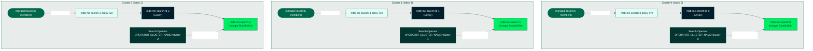

# MongoDB Search, Operator-Per-Cluster with a Unified CR (Multi-Cluster Replica Set)

This guide deploys **MongoDB Search** against a **multi-cluster MongoDB replica set** (a `MongoDBMultiCluster` custom resource, "CR") using the **operator-per-cluster with a unified CR** deployment model: one identical `MongoDBSearch` manifest, applied independently to every member cluster, each running its own dedicated operator instance.

**In a nutshell**, starting from a three-cluster MongoDB replica set (built by the prerequisite reference-architecture suites, with Ops Manager), you will: install a dedicated Search operator in each cluster, apply one identical `MongoDBSearch` manifest everywhere, wire each cluster's mongods to their **own local** search process, and finish by running `$search` and `$vectorSearch` queries proven to be served inside each cluster. Expect roughly 1-2 hours, most of it waiting on the Ops Manager prerequisite.

> **INTERNAL AUDIENCE ONLY.** This is not public documentation. The only publicly-documented multi-cluster pattern is **hub-and-spoke** (one central operator holding kubeconfig clients for every member cluster) -- see the **reference-architecture suites** (`ra-*`, the abbreviation used throughout this guide) at `public/architectures/ra-01` through `ra-12`. Operator-per-cluster is a Search-specific, already-implemented, e2e-tested deployment model, but it is intentionally not exposed in customer-facing docs. This scenario exists for TSEs, Solutions Architects, and Consulting Engineers who need to build, reproduce, or debug it.

## How It Works

**The model in one sentence:** every cluster gets the same `MongoDBSearch` CR and its own operator; each operator narrows the CR down to its own cluster's entry and manages only that; nothing coordinates across clusters.

The customer authors **one** `MongoDBSearch` YAML whose `spec.clusters[]` lists **every** member cluster (each entry has a `name` and a pinned, distinct `index`), and applies that identical YAML to every physical cluster. Each cluster runs its own operator instance, installed with Helm value `operator.clusterIdentity.clusterName=<that cluster's name>` (visible on the operator Deployment as the `OPERATOR_CLUSTER_NAME` environment variable -- useful when you need to check which identity a running operator has).

An operator works in a **reconcile loop**: on a timer and on every relevant change, it re-reads the CR (the desired state), compares it against what actually exists in its cluster, and makes reality match -- repeatedly and idempotently. That also means a component that writes a wrong status once will keep re-writing it on every pass; that's the flap Step 5 exists to prevent.

On every reconcile, each operator:

1. Validates the **full, un-narrowed** spec -- every `spec.clusters[]` entry must carry a distinct `index`, or the CR goes `Invalid`.
2. Narrows `spec.clusters[]` down to the single entry whose `name` matches this operator's own cluster identity. If no entry matches, the operator logs and skips:
   > `spec.clusters does not list this operator's cluster "<name>"; skipping (another operator owns this CR)`
3. Reconciles as if it were managing a single-cluster `MongoDBSearch` -- it only ever creates or touches resources named with its own pinned index.

There is no cross-cluster coordination, no shared status, and no kubeconfig Secret for Search: each of the N `MongoDBSearch` objects (one per cluster, same name and namespace, but living in a different cluster's etcd) has its own independent `.status.phase`.

Search uses this model -- and no other CRD does -- because mongot is co-located with the replica-set members it indexes: each cluster's mongod only ever needs to reach the mongot running in that **same** cluster, so there is no cross-cluster search traffic to route and no need for Search's operator to hold kubeconfig access to every member cluster.

Between each cluster's mongod and its mongot sits a small proxy tier the operator manages: a stable **proxy Service** backed by an **Envoy** Deployment. mongod is pointed at the proxy Service rather than at mongot pods directly because the Service name stays valid across mongot restarts and rescaling, and Envoy terminates TLS in front of mongot (in the sharded variant it also routes each connection to the right per-shard mongot group by SNI).

Two mongod server parameters make a mongod actually use Search: `mongotHost`, where it sends `$search`/`$vectorSearch` query traffic, and `searchIndexManagementHostAndPort`, where it sends index-management commands like `createSearchIndex`. Both must point at the mongod's **own cluster's** proxy Service. No `MongoDBMultiCluster` CR field can express that per-cluster value, so this guide sets both directly in the **Ops Manager Automation Config** -- the JSON document Ops Manager pushes to every automation agent, telling it exactly how to run each mongod process. Values written there live in OM, not in any CR, so the operator never sees them and never reverts them (Step 13).

### Hub-and-Spoke vs. Operator-Per-Cluster

| Aspect | Hub-and-spoke (every other CRD; Search behind `SEARCH_ENABLE_MULTI_CLUSTER`, not GA) | Operator-per-cluster with a unified CR (Search only, this doc) |
|--------|---------------------------------------------------------------------------------------|------------------------------------------------------------------|
| Operator instances | 1 (central, holds kubeconfig clients for every member) | N -- one per member cluster |
| Helm value | `multiCluster.clusters={...}` | `operator.clusterIdentity.clusterName=<cluster>` |
| Kubeconfig Secrets | Yes (`kubectl mongodb multicluster setup` provisions them) | None |
| CR objects | 1, on the central cluster only | N, one per cluster, byte-identical spec |
| Status | Single, aggregated across clusters | N independent statuses; no cross-cluster awareness |
| Secret/cert replication to member clusters | Operator does it, via its kubeconfig clients | **Customer's job** -- no operator replication (see below) |
| Failure domain | Central operator outage stalls every cluster | Independent -- one cluster's operator issue doesn't touch the others |

### Traffic Flow (3 Clusters)


```mermaid
---
config:
  theme: base
  themeVariables:
    primaryColor: "#00684A"
    primaryTextColor: "#fff"
    primaryBorderColor: "#023430"
    lineColor: "#023430"
    edgeLabelBackground: "#fff"
    secondaryColor: "#E3FCF7"
    tertiaryColor: "#F9FBFA"
---
graph TD
    subgraph c0["Cluster 0 (index 0)"]
        op0["Search Operator<br/>OPERATOR_CLUSTER_NAME=cluster-0"]
        rs0(["mongod (local RS members)"])
        ps0["mdb-mc-search-0-proxy-svc"]
        envoy0["mdb-mc-search-lb-0<br/>(Envoy)"]
        mongot0["mdb-mc-search-0<br/>(mongot StatefulSet)"]
    end

    subgraph c1["Cluster 1 (index 1)"]
        op1["Search Operator<br/>OPERATOR_CLUSTER_NAME=cluster-1"]
        rs1(["mongod (local RS members)"])
        ps1["mdb-mc-search-1-proxy-svc"]
        envoy1["mdb-mc-search-lb-1<br/>(Envoy)"]
        mongot1["mdb-mc-search-1<br/>(mongot StatefulSet)"]
    end

    subgraph c2["Cluster 2 (index 2)"]
        op2["Search Operator<br/>OPERATOR_CLUSTER_NAME=cluster-2"]
        rs2(["mongod (local RS members)"])
        ps2["mdb-mc-search-2-proxy-svc"]
        envoy2["mdb-mc-search-lb-2<br/>(Envoy)"]
        mongot2["mdb-mc-search-2<br/>(mongot StatefulSet)"]
    end

    rs0 -- "mTLS, local only" --> ps0 --> envoy0 --> mongot0
    rs1 -- "mTLS, local only" --> ps1 --> envoy1 --> mongot1
    rs2 -- "mTLS, local only" --> ps2 --> envoy2 --> mongot2

    op0 -. "applies the SAME CR,<br/>narrows to index 0" .-> mongot0
    op1 -. "applies the SAME CR,<br/>narrows to index 1" .-> mongot1
    op2 -. "applies the SAME CR,<br/>narrows to index 2" .-> mongot2

    style rs0 fill:#00684A,stroke:#fff,color:#fff
    style rs1 fill:#00684A,stroke:#fff,color:#fff
    style rs2 fill:#00684A,stroke:#fff,color:#fff
    style ps0 fill:#E3FCF7,stroke:#00684A,color:#023430
    style ps1 fill:#E3FCF7,stroke:#00684A,color:#023430
    style ps2 fill:#E3FCF7,stroke:#00684A,color:#023430
    style envoy0 fill:#001E2B,stroke:#E3FCF7,color:#fff
    style envoy1 fill:#001E2B,stroke:#E3FCF7,color:#fff
    style envoy2 fill:#001E2B,stroke:#E3FCF7,color:#fff
    style mongot0 fill:#00ED64,stroke:#023430,color:#023430
    style mongot1 fill:#00ED64,stroke:#023430,color:#023430
    style mongot2 fill:#00ED64,stroke:#023430,color:#023430
    style op0 fill:#023430,stroke:#E3FCF7,color:#fff
    style op1 fill:#023430,stroke:#E3FCF7,color:#fff
    style op2 fill:#023430,stroke:#E3FCF7,color:#fff
    style c0 fill:#E8EDEB,stroke:#00684A,color:#023430
    style c1 fill:#E8EDEB,stroke:#00684A,color:#023430
    style c2 fill:#E8EDEB,stroke:#00684A,color:#023430
```

Notice there are no arrows between clusters for Search traffic: a cluster's mongod only ever dials its own cluster's proxy Service.

## Recognizing This Deployment Model

If you're looking at a customer's cluster and need to tell whether they're running hub-and-spoke or operator-per-cluster, check for these signals:

| Signal | Hub-and-spoke | Operator-per-cluster |
|--------|---------------|-----------------------|
| `OPERATOR_CLUSTER_NAME` env var on the operator Deployment | Absent | Set, to that cluster's own name |
| Helm value `operator.clusterIdentity.clusterName` | Empty / unset | Set per release |
| Number of operator Helm releases across the fleet | 1 (on the central cluster) | N (one per member cluster) |
| `MongoDBSearch` CR | Exists only on the central cluster | Identical copy exists on every member cluster |
| Resource names | `<name>-search-0-...` (single, implicit index 0) | `<name>-search-<idx>-...` with idx matching each cluster |
| Kubeconfig Secret for member-cluster access | Present (`multiCluster.clusters` wiring) | Absent -- Search never needs one |

Quick check from a member cluster:

```bash
kubectl get deployment -n "${MDB_NAMESPACE}" -o jsonpath='{range .items[*]}{.metadata.name}{"\t"}{.spec.template.spec.containers[0].env[?(@.name=="OPERATOR_CLUSTER_NAME")].value}{"\n"}{end}'
```

If a Deployment prints a non-empty value in the second column, that operator instance is running in operator-per-cluster mode.

## Resource-Name Decode Table

`SEARCH_RESOURCE_NAME` below is the `MongoDBSearch` CR's `metadata.name` (`mdb-mc` in this scenario's `env_variables.sh`); `<idx>` is that cluster's pinned `spec.clusters[].index`; `<prefix>` is `spec.security.tls.certsSecretPrefix`.

| Pattern | Component | Example (name=`mdb-mc`, idx=1, prefix=`certs`) |
|---------|-----------|--------------------------------------------------|
| `<name>-search-<idx>` | mongot StatefulSet | `mdb-mc-search-1` |
| `<name>-search-<idx>-svc` | mongot headless Service | `mdb-mc-search-1-svc` |
| `<name>-search-<idx>-config` | mongot ConfigMap (mongot config YAML) | `mdb-mc-search-1-config` |
| `<name>-search-<idx>-proxy-svc` | Per-cluster proxy Service -- the stable endpoint this cluster's mongod points `mongotHost` at | `mdb-mc-search-1-proxy-svc` |
| `<name>-search-lb-<idx>` | Managed Envoy Deployment | `mdb-mc-search-lb-1` |
| `<name>-search-lb-<idx>-config` | Envoy bootstrap ConfigMap | `mdb-mc-search-lb-1-config` |
| `<prefix>-<name>-search-cert` | mongot TLS Secret -- **name is cluster-invariant**; issued ONCE with SANs covering every cluster, then the identical Secret is replicated to every cluster (see TLS step below) | `certs-mdb-mc-search-cert` |
| `<prefix>-<name>-search-lb-<idx>-cert` | LB server TLS Secret -- distinct name per cluster index, but issued from the same cluster 0 (where cert-manager lives) and copied only to its owning cluster | `certs-mdb-mc-search-lb-1-cert` |
| `<prefix>-<name>-search-lb-<idx>-client-cert` | LB client TLS Secret (per-cluster, distinct name; same issuance/copy pattern as the server cert) | `certs-mdb-mc-search-lb-1-client-cert` |
| `<name>-search-state` | Search controller state ConfigMap (per-cluster copy; deliberately not `<name>-state` to avoid colliding with the source MongoDB's own StateStore ConfigMap) | `mdb-mc-search-state` |

## What You're Responsible For

In this model, everything that crosses cluster boundaries is your job -- the per-cluster operators only ever act inside their own cluster:

- **Installing a Search operator release in every member cluster** -- N distinct Helm releases.
- **Applying the identical `MongoDBSearch` CR to every member cluster** -- one `kubectl apply` per context.
- **Pinning a distinct `spec.clusters[].index` per cluster** -- the operator rejects the CR as `Invalid` otherwise.
- **TLS certificates (mongot + per-cluster LB), all chained to one shared CA** -- issued once via cert-manager on cluster 0 (the only cluster running cert-manager), then the resulting Secrets are copied to whichever cluster(s) need them.
- **Replicating Secrets/ConfigMaps (passwords, certs, CA) to every member cluster** -- there is **no operator replication** in this model.
- **Setting per-cluster `mongotHost` / `searchIndexManagementHostAndPort`** -- via the OM Automation Config directly; no CR field carries per-process locality for a `MongoDBMultiCluster` source.

Two things are deliberately NOT on your plate: the mongot StatefulSets and Envoy Deployments (each cluster's operator creates them once the CR and secrets are present -- that's its whole job), and cross-cluster status aggregation (it doesn't exist in this model; each cluster's `MongoDBSearch.status` is independent by design, not a gap).

## Getting Started

### Getting the Files

This guide lives in the public [mongodb-kubernetes](https://github.com/mongodb/mongodb-kubernetes) repository, and its snippets compose with files elsewhere in the repo (the `public/architectures` reference suites and the snippet runner). A sparse checkout fetches exactly what you need.

To make the runbook match the operator version you're deploying (recommended -- `master` moves with operator development), add `--branch <tag>` to the clone below, using that version's release tag from the [releases page](https://github.com/mongodb/mongodb-kubernetes/releases), e.g. `--branch 1.10.0`.

```bash
git clone --filter=blob:none --sparse --depth 1 \
  https://github.com/mongodb/mongodb-kubernetes.git
cd mongodb-kubernetes
git sparse-checkout set \
  docs/search/12-search-percluster-operator-rs \
  public/architectures \
  scripts/code_snippets
```

Everything below assumes you're inside that checkout.

Prefer a single file? `python3 make_html.py` in this directory builds `guide.html`, a self-contained offline copy of this runbook with every snippet inlined -- handy for sharing outside the repo. Regenerate it after any README change.

### Tools

You need `kubectl`, `helm`, `jq`, `curl`, and `mongosh` on your PATH, plus one thing no suite installs for you: the **`kubectl mongodb` plugin** (ra-02 uses it). Download `kubectl-mongodb_<version>_<os>_<arch>.tar.gz` from your operator version's [GitHub release assets](https://github.com/mongodb/mongodb-kubernetes/releases) and put the binary on your PATH; `kubectl mongodb --help` confirms it works.

### Versions: floors, not pins

Treat every version in this guide as a **floor plus a dated example**, not a pin. Registries prune old image tags over time, and chart defaults drift -- a number that worked when this guide was written may not exist when you run it.

| Component | Floor | Why |
|---|---|---|
| MongoDB Server | **8.3.0** (8.2+ strictly required) | the built-in `searchCoordinator` role only exists from 8.2; this scenario's external source has no operator to create it as a custom role. Symptom of too-old: Step 7 fails with `Role searchCoordinator@admin doesn't exist` |
| Ops Manager | **8.0.25** | Search GA minimum |
| Search (mongot) | **1.70.1** | the default when `spec.version` is unset on the MongoDBSearch CR |
| Automation agent | **108.0.13.8870** | required by MongoDB 8.2+; operator charts can default to LESS -- check yours and set `agent.version` on the ra-02 operator release if needed |

Before you start, verify what you'll actually get instead of trusting examples:

```bash
# does the image tag you plan to use still exist? (empty result = pruned; pick the closest tag at or above the floor)
curl -s "https://quay.io/api/v1/repository/mongodb/mongodb-enterprise-server/tag/?specificTag=8.3.4-ent" | jq '.tags'

# what automation agent does YOUR chart default to? (compare against the floor above)
helm show values mongodb/mongodb-kubernetes | grep -A2 'agent:'
```

Two more version gates on the same path: Ops Manager only deploys server versions present in its **version manifest** (refresh it if your target version postdates the OM install), and a pod stuck in `ImagePullBackOff` on a documented tag means the tag rotted -- bump to the closest available tag at or above the floor, not blindly to latest.

### Environment

One file does the whole sourcing dance -- the prerequisite reference-architecture env files in the right order, the Search version floors after them (they'd be silently overwritten in any other order), then this scenario's own variables:

```bash
cd docs/search/12-search-percluster-operator-rs

# Not on GKE? Export your own contexts FIRST (env.sh then skips the GKE derivation):
#   export K8S_CLUSTER_0_CONTEXT_NAME=kind-e2e-cluster-1
#   export K8S_CLUSTER_1_CONTEXT_NAME=kind-e2e-cluster-2
#   export K8S_CLUSTER_2_CONTEXT_NAME=kind-e2e-cluster-3

# Edit env_variables.sh first -- cluster identities, resource names, credentials
vi env_variables.sh

source env.sh
```

The environment lives in your shell, not on disk: **re-run `source env.sh` in every new terminal** before running any snippet. If you forget, the snippet itself stops on its first line with a `not set -- source the env files first` message instead of failing somewhere confusing.

> **Run the snippets with bash.** The snippet files have no shebang (repo convention). From a bash shell, `./code_snippets/<name>.sh` works; from zsh or any other shell, run `bash ./code_snippets/<name>.sh` -- otherwise the kernel hands the file to `/bin/sh`, which cannot parse bash-isms like process substitution (`syntax error near unexpected token '('`).

## Part 1: Prerequisites

This scenario **composes with**, and does not duplicate, the existing multi-cluster reference-architecture (`ra-*`) suites. They were written as standalone recipes, so this part sequences their scripts the way this scenario needs them -- run each stage from this directory, in a shell where you've sourced `env.sh`, and check the checkpoint before moving on. (Skip any stage your environment already satisfies -- the checkpoint tells you.)

The `ra-01` recipe targets GKE, but nothing here is GKE-specific: any three Kubernetes clusters with cross-cluster pod connectivity and a service mesh that resolves the other clusters' Services by name will do.

### Stage 1: Clusters and Mesh Connectivity

Bring three clusters ([`ra-01`](../../../public/architectures/setup-multi-cluster/ra-01-setup-gke) on GKE, or your own) with Istio east-west connectivity ([`ra-03`](../../../public/architectures/setup-multi-cluster/ra-03-setup-istio)), then prove it:

```bash
bash ../../../public/architectures/setup-multi-cluster/ra-04-verify-connectivity/test.sh
```

*Checkpoint:* `ra-04` passes, including its cross-cluster check that a Service existing in only ONE cluster resolves by name from the others. If your substrate can't provide that (local kind can't), read the [substrate appendix](#appendix-running-on-a-constrained-substrate-kind-local-docker) before continuing -- two later stages will need its workarounds.

### Stage 2: Namespaces, Mesh Labels, then the Central Operator

Order matters here: pods only get their Istio sidecar at creation time, so the namespaces must be labeled **before** the operator (the first workload) exists. That's why ra-03's labeling step runs in the middle of ra-02's sequence:

```bash
ra02=../../../public/architectures/setup-multi-cluster/ra-02-setup-operator/code_snippets
bash ${ra02}/ra-02_0045_create_namespaces.sh
bash ${ra02}/ra-02_0046_create_image_pull_secrets.sh
bash ../../../public/architectures/setup-multi-cluster/ra-03-setup-istio/code_snippets/ra-03_0050_label_namespaces.sh
bash ${ra02}/ra-02_0200_kubectl_mongodb_configure_multi_cluster.sh
bash ${ra02}/ra-02_0205_helm_configure_repo.sh
bash ${ra02}/ra-02_0210_helm_install_operator.sh
bash ${ra02}/ra-02_0211_check_operator_deployment.sh

# Apply the automation-agent floor (see Versions above) -- skipping this
# surfaces confusingly late, in stage 5, as mongods refusing your MongoDB version:
helm upgrade --reuse-values --kube-context "${K8S_CLUSTER_0_CONTEXT_NAME}" \
  -n "${OPERATOR_NAMESPACE}" --set agent.version=<current agent> \
  mongodb-kubernetes-operator-multi-cluster "${OPERATOR_HELM_CHART}"
```

*Checkpoint:* the operator Deployment is 1/1 and `helm get values` shows your `agent.version`.

### Stage 3: cert-manager and the Shared CA

Cluster 0 only -- see the TLS note below for why that's the only place certificates are ever issued.

```bash
bash ../../../public/architectures/setup-multi-cluster/ra-05-setup-cert-manager/test.sh
```

*Checkpoint:* `root-secret` and `my-ca-issuer` exist in the `cert-manager` namespace on cluster 0.

### Stage 4: Ops Manager

This scenario needs *an* Ops Manager (8.0.25+), not a resilient multi-cluster one: the OM application is stateless behind its Application Database, so one reachable instance is enough, and resilience belongs in the AppDB replica set. Pick one of three shapes:

- **The customer already runs OM** (the common field reality): skip the deploy -- all this scenario needs is the org API key Secret and project ConfigMap, i.e. what `ra-06_0610` (last line below) creates.
- **Deploy single-cluster with ra-06** (the sufficient default, below).
- **Full [`ra-06`](../../../public/architectures/ra-06-ops-manager-multi-cluster)** if you specifically want to exercise the resilient-OM reference architecture too (its add-second-cluster steps buy OM-app HA this scenario never uses).

```bash
ra06=../../../public/architectures/ra-06-ops-manager-multi-cluster/code_snippets
bash ${ra06}/ra-06_0250_generate_certs.sh
bash ${ra06}/ra-06_0300_ops_manager_create_admin_credentials.sh
bash ${ra06}/ra-06_0310_ops_manager_deploy_on_single_member_cluster.sh
bash ${ra06}/ra-06_0311_ops_manager_wait_for_pending_state.sh
bash ${ra06}/ra-06_0312_ops_manager_wait_for_running_state.sh
bash ${ra06}/ra-06_0610_create_mdb_org_and_get_credentials.sh
```

Expect 20-40 minutes, dominated by the OM app start. (`env.sh` already pinned `OPS_MANAGER_VERSION` for you; edit it there if you need a different version.) This skips ra-06's backup steps (`0400`-`0522`, MinIO + S3 stores) -- Search doesn't use backup, and stage 5 disables it on the source instead. Run them only if you want OM backup for other reasons.

*Checkpoint:* the `MongoDBOpsManager` reports `Running`, and `mdb-org-owner-credentials` / `mdb-org-project-config` exist in `MDB_NAMESPACE` on cluster 0 -- this scenario reads its OM access from those.

### Stage 5: The Source Replica Set

```bash
ra07=../../../public/architectures/ra-07-mongodb-replicaset-multi-cluster/code_snippets
bash ${ra07}/ra-07_1050_generate_certs.sh
bash ${ra07}/ra-07_1100_mongodb_replicaset_multi_cluster.sh

# The suite's CR enables OM backup, which stage 4 skipped -- without this the CR
# parks in Failed ("Failed to configure backup for MongoDBMultiCluster RS")
# even though every member is healthy. Search does not use backup.
kubectl patch mdbmc "${RS_RESOURCE_NAME}" -n "${MDB_NAMESPACE}" \
  --context "${K8S_CLUSTER_0_CONTEXT_NAME}" \
  --type merge -p '{"spec":{"backup":{"mode":"disabled"}}}'

bash ${ra07}/ra-07_1110_mongodb_replicaset_multi_cluster_wait_for_running_state.sh
bash ${ra07}/ra-07_1200_create_mongodb_user.sh
```

(`env.sh` already pinned `MONGODB_VERSION`. ra-07's final `ra-07_1210` mongosh-over-LoadBalancer check is optional and needs LB IPs reachable from your workstation -- skip it on a constrained substrate.) ra-07's CR carries none of the search-specific mongod parameters -- that's expected; Part 2's Step 12 adds them.

*Checkpoint:* the `MongoDBMultiCluster` reports `Running`. You are now where Part 2's Step 1 expects you to be.

> **The TLS rule of this model, in one line: certificates are issued once, on cluster 0; only the resulting Secrets travel.**
>
> - ra-05 installs cert-manager and the shared CA (`root-secret` / `my-ca-issuer`) on `K8S_CLUSTER_0_CONTEXT_NAME` only, and this scenario keeps it that way -- clusters 1 and 2 never run cert-manager.
> - Every Search certificate (the mongot cert and each per-cluster LB cert pair) is issued there too, then the Kubernetes **Secret** is copied to whichever cluster needs it. (The operator's own end-to-end tests do exactly the same -- certificates are never issued per cluster.)
> - Why it matters: this model has **no cross-cluster secret replication**. A Secret a cluster's mongot or Envoy mounts must physically exist in that cluster, or its operator stays `Pending`. Copying Secrets is the single biggest thing to get right here.

## Part 2: The Search Deployment

Run these steps in order, in a shell where you've run `source env.sh` (see Environment above). Reminder: run each snippet with `bash` if your shell isn't bash -- `bash ./code_snippets/<name>.sh`.

To run all of Part 2 unattended instead (prerequisites are not included):

```bash
./test.sh
```

### Set Up Kubernetes and the Per-Cluster Search Operator

#### Step 1: Validate Environment Variables

Success looks like `[ok] All required environment variables are set` followed by a summary of your clusters and names; an `ERROR: Missing required environment variables` list means the environment isn't loaded -- re-run `source env.sh` in this shell.

```bash
./code_snippets/12_0040_validate_env.sh
```

Snippet: [12_0040_validate_env.sh](code_snippets/12_0040_validate_env.sh)

#### Step 2: Create Namespaces in Every Member Cluster

`ra-02` already creates `MDB_NAMESPACE`; this is idempotent and here for standalone reproducibility. Three `namespace/... unchanged` lines are the expected output on a prepared cluster.

```bash
./code_snippets/12_0045_create_namespaces.sh
```

Snippet: [12_0045_create_namespaces.sh](code_snippets/12_0045_create_namespaces.sh)

#### Step 3: Create Image Pull Secrets in Every Member Cluster

Only required for private container registries; skipped automatically otherwise.

```bash
./code_snippets/12_0046_create_image_pull_secrets.sh
```

Snippet: [12_0046_create_image_pull_secrets.sh](code_snippets/12_0046_create_image_pull_secrets.sh)

#### Step 4: Install the Per-Cluster Search Operator

Installs a **second, distinct** Helm release into every member cluster -- `operator.clusterIdentity.clusterName` pins each release to that cluster's identity, and `operator.watchedResources={mongodbsearch}` scopes it to Search only. `operator.createResourcesServiceAccountsAndRoles=false` avoids re-rendering the ServiceAccounts/Roles `ra-02`'s `kubectl mongodb multicluster setup` already created.

```bash
./code_snippets/12_0100_install_percluster_search_operator.sh
```

Snippet: [12_0100_install_percluster_search_operator.sh](code_snippets/12_0100_install_percluster_search_operator.sh)

#### Step 5: Stop the Central Operator Watching MongoDBSearch

The central operator from `ra-02` also watches `mongodbsearch` by default, and -- having no cluster identity -- it marks any multi-entry `spec.clusters[]` CR `Invalid` on every reconcile, fighting the per-cluster operator's `Running` writes (the status flap explained in How It Works). This step narrows its watch list to everything except `mongodbsearch`.

It's a `helm upgrade --reuse-values`, so nothing else about the release changes, and the `ra-07` source is unaffected (`mongodbmulticluster` stays auto-watched via `multiCluster.clusters`). To revert later, run the same command with `mongodbsearch` appended back.

You'll know it worked when the central operator's args no longer list `mongodbsearch`: `kubectl get deploy mongodb-kubernetes-operator-multi-cluster -n ${OPERATOR_NAMESPACE} -o yaml | grep watch-resource` -- and the `Running`/`Invalid` flap stops once the Search CRs exist.

```bash
./code_snippets/12_0110_stop_central_operator_watching_search.sh
```

Snippet: [12_0110_stop_central_operator_watching_search.sh](code_snippets/12_0110_stop_central_operator_watching_search.sh)

### Create the Source CA ConfigMap

#### Step 6: Create the Source CA ConfigMap in Every Member Cluster

`spec.source.external.tls.ca` requires a ConfigMap with a `ca.crt` key specifically -- distinct from `ra-05`'s own `ca-issuer` ConfigMap, which only carries `ca-pem`/`mms-ca.crt`. This is a plain copy of `ra-05`'s existing CA cert content -- no local cert-manager involved.

```bash
./code_snippets/12_0303_create_source_ca_configmap.sh
```

Snippet: [12_0303_create_source_ca_configmap.sh](code_snippets/12_0303_create_source_ca_configmap.sh)

### Create the Sync-Source User

#### Step 7: Create the search-sync-source User and Replicate Its Password

The `MongoDBUser` CRD is applied once, through the **central** operator that manages the source `MongoDBMultiCluster` (`ra-02`/`ra-07`). The resulting password Secret is then copied to clusters 1 and 2 -- every per-cluster Search operator reads it locally.

```bash
./code_snippets/12_0310_create_sync_source_user.sh
```

Snippet: [12_0310_create_sync_source_user.sh](code_snippets/12_0310_create_sync_source_user.sh)

### Search TLS Certificates

#### Step 8: Create the mongot TLS Certificate

The mongot TLS Secret has a **cluster-invariant name** (`{prefix}-{name}-search-cert`) and **cluster-invariant content**: it is issued exactly ONCE, on cluster 0, with SANs (Subject Alternative Names -- the hostnames the certificate is valid for) covering ALL 3 clusters' `-search-<idx>-svc` and `-search-<idx>-proxy-svc` names, and that same Secret is then copied verbatim into clusters 1 and 2. This union-SAN, issue-once pattern is the tested configuration -- a per-cluster cert with only-local SANs is not, and is not what this snippet does. Getting the union of SANs wrong (e.g. only covering the cluster you're currently testing) is the most common first-deploy failure mode.

```bash
./code_snippets/12_0316a_create_mongot_tls_certificate.sh
```

Snippet: [12_0316a_create_mongot_tls_certificate.sh](code_snippets/12_0316a_create_mongot_tls_certificate.sh)

#### Step 9: Create Per-Cluster Load Balancer TLS Certificates

LB certificates get a **distinct secret name per cluster index** -- each cluster's own Envoy Deployment presents its own server certificate. Like the mongot cert, all of them are issued from cert-manager on cluster 0 (mirroring `test_deploy_lb_certificates` in the same e2e module, which also never switches API client per cluster); every server cert's SANs cover the union of all 3 clusters' proxy-svc FQDNs. Only the resulting Secret pair is then copied out -- to just the cluster that owns that index.

```bash
./code_snippets/12_0316b_create_lb_tls_certificates.sh
```

Snippet: [12_0316b_create_lb_tls_certificates.sh](code_snippets/12_0316b_create_lb_tls_certificates.sh)

### Deploy the Unified MongoDBSearch CR

#### Step 10: Apply the MongoDBSearch CR to Every Member Cluster

The **same** manifest -- `spec.clusters[]` lists all 3 clusters with their pinned `index` values -- is applied independently to each cluster's own API server:

```yaml
apiVersion: mongodb.com/v1
kind: MongoDBSearch
metadata:
  name: ${SEARCH_RESOURCE_NAME}
spec:
  source:
    username: ${SEARCH_SYNC_USER_NAME}
    passwordSecretRef:
      name: ${SEARCH_RESOURCE_NAME}-${SEARCH_SYNC_USER_NAME}-password
      key: password
    external:
      hostAndPorts: [... every RS member's Service FQDN, across all 3 clusters ...]
      tls:
        ca:
          name: ${SOURCE_CA_CONFIGMAP}
  security:
    tls:
      certsSecretPrefix: ${SEARCH_TLS_CERT_SECRET_PREFIX}
  clusters:
    - name: ${SEARCH_CLUSTER_0_NAME}
      index: ${SEARCH_CLUSTER_0_INDEX}
      replicas: ${SEARCH_MONGOT_REPLICAS}
      loadBalancer:
        managed:
          externalHostname: ${SEARCH_PROXY_SVC_0}
    # ... one entry per cluster, each with its own distinct index and externalHostname
```

> **Optional tuning -- `syncSourceSelector`:** each `spec.clusters[].syncSourceSelector.matchTagSets` can pin a cluster's mongot to sync only from that cluster's LOCAL replica-set members (by replica-set tag), instead of the full cross-cluster seed list. This scenario does **not** set it -- mongot syncs from the full seed list and lets `secondaryPreferred` read routing pick a nearby member. The tagged variant exists if you need strict data-locality for sync reads.

```bash
./code_snippets/12_0320_create_mongodb_search_resource.sh
```

Snippet: [12_0320_create_mongodb_search_resource.sh](code_snippets/12_0320_create_mongodb_search_resource.sh)

#### Step 11: Wait for MongoDBSearch to Reach Running in Every Cluster

Expect a few minutes per cluster (image pulls dominate on first deploy); the snippet waits up to 10 minutes per cluster before giving up.

```bash
./code_snippets/12_0325_wait_for_search_resources.sh
```

Snippet: [12_0325_wait_for_search_resources.sh](code_snippets/12_0325_wait_for_search_resources.sh)

### Configure the Source's Search Connection (gRPC + TLS)

#### Step 12: Set the Source's Search Connection Parameters on the CR

mongod does not talk gRPC to the search tier unless told to. Four `setParameter`s make its search client speak gRPC over TLS (offering ALPN `h2`, which the Envoy proxy's listener expects) and authenticate to mongot. Without them, the TLS handshake to the proxy still *succeeds* -- but with no ALPN, Envoy silently falls back to HTTP/1, and every search call later hangs for ~20 seconds before failing with `Error connecting to Search Index Management service.` That failure surfaces six steps from its cause (Step 18), which is why this step exists as its own checkpoint.

These four values are identical for every mongod, so they go on the `MongoDBMultiCluster` CR itself (`spec.additionalMongodConfig.setParameter`) where the operator persists them -- unlike the **per-process** `mongotHost` values in the next step, which no CR field can express:

```yaml
useGrpcForSearch: true                              # search traffic is gRPC (HTTP/2) -- this is the ALPN switch
searchTLSMode: requireTLS                           # TLS to the proxy, verified against the source CA
skipAuthenticationToMongot: false                   # mongod authenticates to mongot
skipAuthenticationToSearchIndexManagementServer: false
```

```bash
./code_snippets/12_0390_configure_source_search_parameters.sh
```

Snippet: [12_0390_configure_source_search_parameters.sh](code_snippets/12_0390_configure_source_search_parameters.sh)

### Configure Per-Cluster mongotHost

#### Step 13: Configure mongotHost via the Ops Manager Automation Config

> **WARNING -- this bypasses the operator's own reconcile on purpose.** A `MongoDBMultiCluster` resource has no per-process `additionalMongodConfig`, so there is no CR field that can point cluster 1's mongods at cluster 1's mongot and cluster 2's mongods at cluster 2's mongot. This step PUTs `mongotHost` and `searchIndexManagementHostAndPort` directly onto each mongod **process** in the Ops Manager Automation Config, keyed by the cluster index embedded in that process's name. Because these values never appear in any CR spec, the operator never learns them and never reverts them on a later reconcile -- that is the entire point.
>
> The Automation Config is normally protected by an `EXTERNALLY_MANAGED_LOCK` (`controlledFeature`); this step clears it immediately before the PUT and retries if the PUT is rejected (the operator can re-assert the lock between the clear and the PUT).

> **Index-alignment assumption:** the patch derives each process's target proxy from the cluster index embedded in the process name (`<RS_RESOURCE_NAME>-<clusterIndex>-<memberIndex>`), which is the source `MongoDBMultiCluster`'s `clusterSpecList` **position**. This only resolves to a real Service because this scenario pins `spec.clusters[].index` on the `MongoDBSearch` CR to those same positions (0/1/2, see `env_variables.sh`). If you pin different Search indices, or order `clusterSpecList` differently from `spec.clusters[]`, you must adjust the mapping in `12_0400` -- otherwise mongods are pointed at proxy Services that don't exist.

```bash
./code_snippets/12_0400_configure_percluster_mongot_host.sh
```

Snippet: [12_0400_configure_percluster_mongot_host.sh](code_snippets/12_0400_configure_percluster_mongot_host.sh)

### Verify the Deployment

#### Step 14: Verify Per-Cluster Resources and Isolation

Confirms each cluster only created its own index-suffixed resources, its `MongoDBSearch.status.phase` is independently `Running`, and no foreign cluster's resources leaked in.

This step is read-only and safe to re-run at any time -- use it as your state snapshot when coming back to a deployment after an interruption.

```bash
./code_snippets/12_0410_verify_percluster_resources.sh
```

Snippet: [12_0410_verify_percluster_resources.sh](code_snippets/12_0410_verify_percluster_resources.sh)

### Functional Verification

Steps 1-14 prove the deployment *converges*; these steps prove it *works*: insert data, build both index types, and answer `$search`/`$vectorSearch` queries from every cluster's own local member.

#### Step 15: Create an Admin User for Data and Queries

A `readWriteAnyDatabase` + `clusterMonitor` user (the latter only so the final step can read each member's runtime `mongotHost`), applied once through the **central** operator that owns the source `MongoDBMultiCluster` (same pattern as Step 7's sync-source user). Used only by the verification steps below.

```bash
./code_snippets/12_0500_create_search_admin_user.sh
```

Snippet: [12_0500_create_search_admin_user.sh](code_snippets/12_0500_create_search_admin_user.sh)

#### Step 16: Run a mongodb-tools Pod in Every Member Cluster

A small `mongodb-community-server` pod per cluster with `mongosh` and the source CA mounted at `/tls/ca.crt`. The remaining steps run from inside these pods because the seed-list and proxy-service FQDNs only resolve in-cluster.

```bash
./code_snippets/12_0510_run_mongodb_tools_pods.sh
```

Snippet: [12_0510_run_mongodb_tools_pods.sh](code_snippets/12_0510_run_mongodb_tools_pods.sh)

#### Step 17: Insert Sample Data

A small deterministic dataset (text fields for `$search`, 8-dimension vectors for `$vectorSearch`), written **once** through a replica-set connection string -- every cluster's mongot then syncs it independently from its local members.

```bash
./code_snippets/12_0520_insert_sample_data.sh
```

Snippet: [12_0520_insert_sample_data.sh](code_snippets/12_0520_insert_sample_data.sh)

#### Step 18: Create the Search Indexes and Wait for READY

Creates one dynamic-mapping `$search` index and one `vectorSearch` index, then polls until both report `READY`. Index creation itself exercises Step 13's wiring: the mongod receiving `createSearchIndex` forwards it to its own cluster's proxy (`searchIndexManagementHostAndPort`). The snippet stops with an error if the indexes aren't `READY` within 5 minutes -- don't continue past that; check the mongot pod logs instead.

```bash
./code_snippets/12_0530_create_search_indexes.sh
```

Snippet: [12_0530_create_search_indexes.sh](code_snippets/12_0530_create_search_indexes.sh)

#### Step 19: Query Every Cluster's Local Member

For each cluster: connect **directly** to that cluster's own replica-set member (`directConnection`, `readPreference=secondaryPreferred`), print its runtime `mongotHost`, and run one `$search` and one `$vectorSearch` query. Success looks like: all three clusters return the same results (the baseball titles for `$search`, the space titles for `$vectorSearch`), and each member's `mongotHost` is **its own cluster's** proxy service -- the proof that queries are served locally, with no cross-cluster search traffic.

```bash
./code_snippets/12_0540_query_search_percluster.sh
```

Snippet: [12_0540_query_search_percluster.sh](code_snippets/12_0540_query_search_percluster.sh)

### Cleanup (Manual Only)

> **WARNING:** deletes the `MongoDBSearch` resource and the per-cluster Search operator release from every member cluster. Does not touch the source `MongoDBMultiCluster`, the central operator, or namespaces (those belong to `ra-02`/`ra-07`).

```bash
./code_snippets/12_9010_delete_resources.sh
```

Snippet: [12_9010_delete_resources.sh](code_snippets/12_9010_delete_resources.sh)

## Troubleshooting

#### `MongoDBSearch` CR exists in a cluster but the operator never creates anything

**Why:** `spec.clusters[]` doesn't list this cluster's name, or a typo in `operator.clusterIdentity.clusterName`

**Check:** Operator log: `spec.clusters does not list this operator's cluster "<name>"; skipping (another operator owns this CR)`

#### `.status.phase` flaps between `Running` and `Invalid` ("multi-cluster MongoDBSearch is not supported yet: spec.clusters must contain a single entry")

**Why:** The `ra-02` central hub-and-spoke operator still watches `mongodbsearch` in this namespace -- it has no cluster identity, so it marks any multi-entry `spec.clusters[]` CR `Invalid` on every reconcile, racing the per-cluster operator's `Running` writes

**Check:** Step 5 (`12_0110`): remove `mongodbsearch` from the central operator's `operator.watchedResources`; confirm with `kubectl get deploy mongodb-kubernetes-operator-multi-cluster -n ${OPERATOR_NAMESPACE} -o yaml | grep watch-resource`

#### Phase `Invalid`

**Why:** `spec.clusters[]` missing/empty, or an entry has no `index`, or two entries share an `index`

**Check:** `kubectl describe mongodbsearch`; the exact messages: `"running one operator per cluster requires spec.clusters to be set"`, `"running one operator per cluster requires index on every spec.clusters[] entry (missing on ...)"`, `"index N is set on more than one spec.clusters[] entry (... and ...); pinned indices must be distinct"`

#### Everything created, but `mongot` pods sit `PodInitializing`/`CrashLoopBackOff` in one cluster

**Why:** A Secret or ConfigMap you copy by hand (password, mongot TLS cert, source CA) is missing in THAT cluster -- there is no operator replication

**Check:** Operator log line `MongoDBSearch missing customer-replicated secrets` with a `missing: [...]` list per cluster. This is a **log-only diagnostic requeue every 30s** -- it does not gate `.status.phase`, so a stuck-but-not-Failed phase elsewhere is a separate symptom to chase.

#### The source CA ConfigMap's name keeps appearing in that `missing: [...]` list even though the ConfigMap exists

**Why:** The presence check does a Secret `Get` for every listed name, including the CA ConfigMap's -- a ConfigMap can never satisfy it

**Check:** Confirm the ConfigMap exists in that cluster and disregard that one entry; only chase names that are real Secrets

#### `createSearchIndex` (or any `$search`) hangs ~20s, then `Error connecting to Search Index Management service.` -- on EVERY cluster, while all CRs are `Running` and TLS handshakes to the proxy succeed

**Why:** The source CR is missing the Step 12 `setParameter`s (`useGrpcForSearch` etc.): mongod's TLS handshake to Envoy completes *without ALPN h2*, Envoy silently parses the connection as HTTP/1, and the request never completes

**Check:** `cat /data/automation-mongod.conf` in any mongod pod: `setParameter` must list `useGrpcForSearch`/`searchTLSMode` alongside `mongotHost`; on the Envoy pod's admin API, `downstream_cx_http1_total` climbing while `downstream_cx_http2_total` stays 0 is this exact bug

#### Search works in cluster A, returns nothing (or times out) in cluster B

**Why:** B's mongod still points `mongotHost` at the WRONG proxy (stale/never-patched OM Automation Config), or B's mongot TLS cert SANs don't cover B's own `-search-B-svc`/`-search-B-proxy-svc` names

**Check:** `cat /data/automation-mongod.conf` in a B mongod pod, check `setParameter.mongotHost`; `openssl s_client -connect <B proxy-svc>:27028 -servername <B proxy-svc FQDN>` for a TLS/SAN mismatch

#### CR `Running` everywhere, but queries return nothing in EVERY cluster and index counts stay at 0

**Why:** mongot syncs from the seed list of RS member FQDNs spanning all clusters; if the service mesh doesn't resolve or route another cluster's Service names, that sync silently fails while the CR stays `Running` -- easy to misread as the mongotHost/SAN row above

**Check:** mongot pod logs for `no such host` / connection timeouts on `<RS_RESOURCE_NAME>-<idx>-<member>-svc...` names; from a tools pod, `nslookup` another cluster's member Service FQDN -- the mesh must pass the `ra-04` connectivity check

#### A cluster's LB (Envoy) pod is `CrashLoopBackOff` / fails TLS handshake, but no "missing secret" log line appears

**Why:** LB server/client certs (`{prefix}-{name}-search-lb-{idx}-cert`/`-client-cert`) are **not** covered by the secrets-presence diagnostic at all -- their absence surfaces as a mount/handshake failure, not a logged gap

**Check:** `kubectl describe pod` on the Envoy pod for volume-mount errors; `kubectl logs` for TLS errors

#### ra-07's mongods never reach MongoDB 8.3.x (agents log an unsupported-version or upgrade error), long after ra-02 seemed fine

**Why:** The central operator's chart defaults `agent.version` to an automation agent older than the **108.0.13.8870** floor MongoDB 8.2+ needs -- the failure surfaces two suites away from its cause

**Check:** `helm upgrade --reuse-values --set agent.version=<current agent>` on the ra-02 operator release (see Minimum versions); restart the operator

#### Step 13 exits with `om-svc-ext has no LoadBalancer IP yet`

**Why:** Ops Manager's external Service is `type: LoadBalancer` and the IP never got assigned -- no MetalLB on kind, or the cloud LB is still provisioning/out of quota

**Check:** `kubectl get svc om-svc-ext -n ${OM_NAMESPACE} --context ${K8S_CLUSTER_0_CONTEXT_NAME}`: an `EXTERNAL-IP` of `<pending>` is the LB provisioner's problem, not this scenario's

#### Old StatefulSet/Service left behind after changing a cluster's `index`

**Why:** `index` is a pinned, effectively-immutable identifier baked into every resource name; changing it does not rename or garbage-collect the old-indexed resources

**Check:** `kubectl get sts,svc,deploy -n ${MDB_NAMESPACE}` for orphans at the old index; delete them manually

#### Connection to the proxy is silently dropped right after the TLS ClientHello -- no handshake error logged anywhere

**Why:** Envoy's single listener (0.0.0.0:27028, there is no other port) matches filter chains by **SNI**; a client that doesn't send the expected proxy-service name as SNI matches no chain and is dropped, which looks like a hang

**Check:** Envoy's per-stream JSON access log (`kubectl logs` the LB pod): a missing log line for your connection means no chain matched; each logged line's `%UPSTREAM_HOST%`/`%RESPONSE_FLAGS%` also tells you which mongot Envoy actually picked

#### CR rejected with a duplicate-hostname validation error

**Why:** Two `spec.clusters[].loadBalancer.managed.externalHostname` values are identical -- every cluster's hostname must be distinct (SNI)

**Check:** every cluster's `spec.clusters[].loadBalancer.managed.externalHostname` must be distinct (they are TLS SNI names); pick a unique hostname per cluster.


## Glossary

| Term | Definition |
|------|------------|
| **Operator-per-cluster** | Deployment model where each member cluster runs its own operator instance, scoped to a single cluster identity, instead of one central operator managing all clusters |
| **Unified CR** | The single `MongoDBSearch` manifest (listing every cluster in `spec.clusters[]`) applied identically to every member cluster |
| **Pinned index** | `spec.clusters[].index` -- the stable integer baked into every per-cluster resource name; required and must be distinct in operator-per-cluster mode |
| **Cluster identity** | The value of `operator.clusterIdentity.clusterName` (env `OPERATOR_CLUSTER_NAME`) that scopes an operator instance to one `spec.clusters[]` entry |
| **Hub-and-spoke** | The alternative multi-cluster pattern (every other CRD) -- one central operator with kubeconfig clients for every member cluster |
| **Central operator** | The hub-and-spoke operator installed by `ra-02` on cluster 0; in this scenario it keeps managing the source `MongoDBMultiCluster` while the per-cluster operators own Search |
| **Member cluster** | One of the Kubernetes clusters participating in the multi-cluster deployment (contexts `K8S_CLUSTER_0/1/2_CONTEXT_NAME`) |
| **Automation Config** | The JSON document Ops Manager pushes to each automation agent describing exactly how to run every mongod process; Step 13 writes `mongotHost` there, outside any CR |
| **Seed list** | `spec.source.external.hostAndPorts` -- the replica-set member addresses mongot connects to for syncing data from the source |
| **SAN** | Subject Alternative Name -- a hostname a TLS certificate is valid for; Search certs must list every cluster's service names (see Step 8) |
| **SNI** | Server Name Indication -- the TLS extension Envoy uses to route incoming connections by hostname, one filter chain per cluster |
| **mTLS** | Mutual TLS -- both sides of a connection present and verify a certificate |
| **mongot** | The MongoDB Search server process that indexes data and serves `$search`/`$vectorSearch` queries |
| **Proxy Service** | The stable per-cluster Kubernetes Service (`<name>-search-<idx>-proxy-svc`) a cluster's mongod points `mongotHost` at; backed by the managed Envoy LB |

## Appendix: Running on a Constrained Substrate (kind, local Docker)

A compliant environment -- three clusters, cross-cluster routing, a mesh whose DNS passes `ra-04` -- needs none of this. Local kind clusters (and similar lab setups) typically fail three specific prerequisites, each with a known, contained fix. All three were hit and validated on real kind runs of this guide.

### 1. The operator's kubeconfig Secret contains unreachable API addresses

`kubectl mongodb multicluster setup` (ra-02) copies API server URLs from YOUR kubeconfig into the operator's kubeconfig Secret. On kind those are `https://127.0.0.1:<port>` -- reachable from your machine, not from pods. **Symptom:** the central operator crash-loops, its log ending with `failed to wait for ... caches to sync`. **Fix:** rewrite each cluster's `server:` in the `mongodb-enterprise-operator-multi-cluster-kubeconfig` Secret to that cluster's in-cluster `kubernetes` Service clusterIP (`kubectl get svc -n default kubernetes -o jsonpath='{.spec.clusterIP}'` per context -- these route across interconnected kind clusters), re-apply the Secret, restart the operator.

### 2. LoadBalancer IPs are not reachable from your workstation

`ra-06_0610` and Step 13 (`12_0400`) call the Ops Manager API on `om-svc-ext`'s LoadBalancer IP. On kind with MetalLB that IP lives on the Docker network -- reachable between clusters, but (on macOS/Windows Docker Desktop) not from your shell. **Symptom:** those scripts hang or report `could not resolve project id` while everything looks healthy. **Fix:** `kubectl port-forward svc/om-svc 18443:8443` on cluster 0, copy the affected snippet to a scratch location, and point its `om_base_url` at `https://127.0.0.1:18443/api/public/v1.0`; everything else in the snippet stays unchanged.

### 3. Cross-cluster DNS is not federated (Service IPs route, names don't)

kind's cluster interconnect routes pod and Service IPs across clusters but does nothing for DNS -- resolving another cluster's Service NAMES is the mesh's job, and local istio-on-kind often cannot do it (this is exactly what `ra-04`'s cross-cluster check catches). One name in this stack genuinely needs it: **`om-svc`**, which exists only on cluster 0 and is dialed from other clusters at two different moments -- by the AppDB agents during the ra-06 install (immediate, obvious failure: `lookup om-svc.<ns>.svc.cluster.local: no such host`, AppDB stuck `Pending`), and again by ANY agent pod on clusters 1/2 that restarts later and re-fetches its binaries from OM (latent: everything runs fine until the first restart). **Fix:** mirror the Service into clusters 1 and 2 -- in `OM_NAMESPACE`, create a selectorless Service named `om-svc` with the same ports, plus an `EndpointSlice` labeled `kubernetes.io/service-name: om-svc` whose endpoint address is cluster 0's `om-svc` clusterIP. Do it once, right after ra-06 creates `om-svc`, and leave it in place -- it also covers the latent restart case. (The operator mirrors its own per-pod Services into every cluster, which is why nothing else in the stack hits this.)
