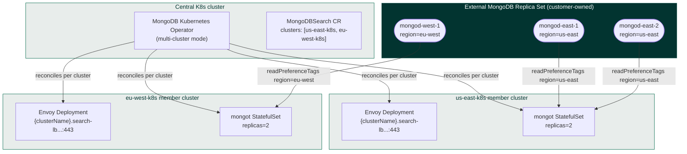

# Q2-MC MongoDBSearch — ReplicaSet source, managed Envoy, multi-cluster

Deploy **MongoDBSearch** in **multi-cluster (MC) mode** against an existing **external MongoDB replica set**, with the operator managing Envoy per cluster. This tutorial mirrors the load-test contract YAML from the MVP design spec §4.1.

## When to use this tutorial

You are a load-test or platform engineer who already has:

- A **3-node external replica set** with members spread across 2-3 regions, each member tagged in `replSetConfig` with `region: <region>` matching the K8s cluster's region (spec §6.1, §6.4).
- **2-3 Kubernetes member clusters** registered with a central operator via `kubectl mongodb multicluster setup`.
- Customer-replicated secrets in every member cluster (spec §6.3): `search-sync-password`, `external-ca`, plus mongot + Envoy server TLS certs under a known prefix.

For the single-cluster flavour, see [docs/search/10-search-external-rs-mongod-managed-lb](../10-search-external-rs-mongod-managed-lb/).

## Topology



Each member cluster's mongot pool pulls only from same-region external members via `readPreferenceTags`. Search queries hit each cluster's local Envoy on its `{clusterName}.search-lb.lt.example.com:443` endpoint.

## Prerequisites

- `kubectl` with one context per K8s cluster (one central + 2-3 members).
- `kubectl mongodb` plugin installed (the [MCK CLI](../../../tools/multicluster/)).
- `helm` 3.x.
- DNS layer that points each `{clusterName}.search-lb.lt.example.com` at the cloud LB / ingress fronting Envoy in that member cluster (cloud LB, ingress controller, or external-DNS).
- Secrets pre-replicated into the namespace in **every** member cluster — see spec §6.3.

## Getting started

```bash
cd docs/search/12-search-q2-mc-rs

# Edit env_variables.sh to set your contexts, member cluster names, region tags,
# external host:port entries, and TLS prefix.
vi env_variables.sh

source env_variables.sh
./test.sh
```

## Step-by-step

| Step | Snippet | What it does |
| ---- | ------- | ------------ |
| 1 | `12_0040_validate_env.sh` | Validates required env vars and that `externalHostname` template contains `{clusterName}` (or `{clusterIndex}`). |
| 2 | `12_0045_create_namespaces.sh` | Creates `${MDB_NS}` in central + every member cluster. |
| 3 | `12_0050_kubectl_mongodb_multicluster_setup.sh` | Registers member clusters with the central operator. |
| 4 | `12_0100_install_operator.sh` | Helm-installs the MongoDB Kubernetes Operator in multi-cluster mode. |
| 5 | `12_0200_verify_secrets_present.sh` | Verifies `${MDB_SYNC_PASSWORD_SECRET}` and `${MDB_EXTERNAL_CA_SECRET}` exist in each member cluster (spec §6.3). |
| 6 | `12_0320_create_mongodb_search_resource.sh` | Applies the MongoDBSearch CR (mirrors spec §4.1). |
| 7 | `12_0325_wait_for_search_resource.sh` | Waits for top-level `status.phase=Running` *and* per-cluster `clusterStatusList.clusterStatuses[i].phase=Running` (spec §4.3 — per-cluster phase is the real readiness gate, not the top-level phase alone). |
| 8 | `12_0326_verify_per_cluster_envoy.sh` | Confirms each member cluster has an Available Envoy Deployment. |
| 9 | `12_0330_show_running_pods.sh` | Shows pods + the MongoDBSearch resource. |
| 10 | `12_0340_query_through_envoy.sh` | Smoke-test the per-cluster `{clusterName}.search-lb...:443` SNI endpoint. |
| Cleanup | `12_9010_cleanup.sh` | Deletes the CR and the namespaces. |

## Key spec contract (§4.1)

The applied CR matches the load-test contract YAML byte-for-byte:

```yaml
apiVersion: mongodb.com/v1
kind: MongoDBSearch
metadata:
  name: lt-search
  namespace: mongodb
spec:
  source:
    external:
      hostAndPorts: [...]
      tls:
        ca:
          name: external-ca
    username: search-sync-source
    passwordSecretRef:
      name: search-sync-password
      key: password
  loadBalancer:
    managed:
      externalHostname: "{clusterName}.search-lb.lt.example.com:443"
  security:
    tls:
      certsSecretPrefix: lt-prefix
  clusters:
    - clusterName: us-east-k8s
      replicas: 2
      syncSourceSelector:
        matchTags:
          region: us-east
    - clusterName: eu-west-k8s
      replicas: 2
      syncSourceSelector:
        matchTags:
          region: eu-west
```

### Required, MVP

- `source.external.hostAndPorts[]`, `source.external.tls.ca`, `source.username`, `source.passwordSecretRef`
- `loadBalancer.managed.externalHostname` **must** contain `{clusterName}` or `{clusterIndex}`
- `security.tls.certsSecretPrefix`
- `clusters[].clusterName` (immutable, unique)
- `clusters[].replicas` (>= 1)
- `clusters[].syncSourceSelector.matchTags` (non-empty — the operator cannot peek at external `replSetConfig`, so the customer-owned tag is the only routing signal)

### Forbidden-at-MVP shapes (spec §4.4)

These will be rejected at admission once the MVP lands; load testers should avoid them up front:

- `len(clusters) > 1` with `loadBalancer.unmanaged.*` (Q3/Q4-MC out of scope).
- `len(clusters) > 1` with any internal source (`source.mongodbResourceRef.*`) — Q1-MC is phase 2.
- `externalHostname` missing `{clusterName}` / `{clusterIndex}` when `len(clusters) > 1`.
- `clusters[].clusterName` non-unique or empty.
- `clusters[].syncSourceSelector.matchTags` empty.
- `spec.replicas` set together with `spec.clusters[].replicas`.

## Status surface (load-test observability)

Per spec §4.3, treat `status.clusterStatusList.clusterStatuses[i].phase` + `observedReplicas` as the readiness gate, not the top-level `phase` alone:

```yaml
status:
  phase: Running                 # worst-of any active cluster
  clusterStatusList:
    clusterStatuses:
      - clusterName: us-east-k8s
        phase: Running
        observedGeneration: 7
        observedReplicas: 2
      - clusterName: eu-west-k8s
        phase: Running
        observedGeneration: 7
        observedReplicas: 2
```

## Troubleshooting

### Per-cluster `phase: Pending` with secret missing

```bash
kubectl get mongodbsearch "${MDB_SEARCH_RESOURCE_NAME}" -n "${MDB_NS}" \
  --context "${K8S_CENTRAL_CTX}" -o jsonpath='{.status.clusterStatusList}' | jq
```

If a cluster shows `phase: Pending` with `"Secret '...' missing in cluster"`, replicate the missing secret into that member cluster's namespace.

### mongot can't find a sync source

Re-check that every external mongod has its `region` tag in `replSetConfig.members[].tags`:

```bash
mongosh "<external-rs>" --eval 'rs.conf().members.forEach(m => print(m.host, JSON.stringify(m.tags)))'
```

If tags are missing, `mongot` will fail to find a sync source and search will be unavailable in that region (spec §6.4).

### Envoy not Available in a member cluster

```bash
kubectl describe deployment "${MDB_SEARCH_RESOURCE_NAME}-search-lb-0" \
  -n "${MDB_NS}" --context "${K8S_CLUSTER_0_CTX}"
kubectl logs -l "app=${MDB_SEARCH_RESOURCE_NAME}-search-lb-0" \
  -n "${MDB_NS}" --context "${K8S_CLUSTER_0_CTX}"
```

## Cleanup

```bash
./code_snippets/12_9010_cleanup.sh
```

## References

- [Multi-Cluster MongoDBSearch Q2-MC MVP design spec, §4.1, §4.3, §4.4](https://example.invalid/q2-mc-mvp-design)
- Single-cluster analogue: [docs/search/10-search-external-rs-mongod-managed-lb](../10-search-external-rs-mongod-managed-lb/)
- Multi-cluster setup architecture: [public/architectures/setup-multi-cluster](../../../public/architectures/setup-multi-cluster/)
