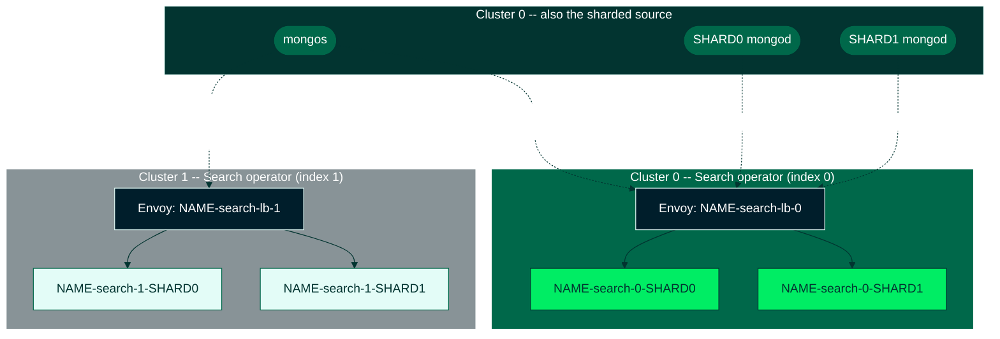

# MongoDB Search: Operator-Per-Cluster Model, Sharded Source

> **Internal audience.** This guide is written for TSEs, Solutions Architects, and Consulting Engineers. It documents a real, e2e-tested deployment model that is **not** part of the public docs set. Read [`12-search-percluster-operator-rs/README.md`](../12-search-percluster-operator-rs/README.md) first — it explains what "operator-per-cluster with a unified CR" means and how to recognize it, using the simpler replica-set case. **This document only covers the delta a sharded source adds on top of that.**

This scenario deploys **MongoDB Search** in the operator-per-cluster model across two Kubernetes clusters, both indexing the **same single-cluster sharded MongoDB** source.

## The topology: one source, N search clusters, pick-a-target

Unlike scenario 12 (replica-set), the sharded source here is **not** spread across the same physical clusters as Search. It is a plain, single-cluster, operator-managed sharded MongoDB (`type: ShardedCluster`, same shape as [scenario 09](../09-search-sharded-mongod-managed-lb/)) living entirely in one cluster (`K8S_CLUSTER_0`). Every search cluster (`K8S_CLUSTER_0` and `K8S_CLUSTER_1`) runs its own operator and gets a **full, independent set of mongot groups for every shard** — not a partitioned subset. There is no per-cluster co-location to exploit because there's only one physical copy of the source's data to begin with.

Because there's one source and multiple, functionally-interchangeable search clusters, the operational question isn't "which cluster holds this shard's data" (as in the replica-set/co-located case) — it's **"which search cluster is currently serving the source."** That's a single choice, made once on the OM Automation Config (`TARGET_CLUSTER_INDEX`), and it can be changed live: any search cluster indexes the same source independently and correctly, so flipping which one serves live traffic is a safe, reversible operation — useful for maintenance on one cluster's mongot fleet, or for validating a second cluster before cutting over to it permanently.

> This is a different pattern from a *sharded source whose own shard members are spread across the same physical clusters as Search*, with each cluster's mongot syncing from its local shard replicas. That variant is not covered here and is not e2e-validated as of this writing — see [scenario 12](../12-search-percluster-operator-rs/) for the co-located replica-set analog, which this doc's design does NOT generalize to sharded sources.



Cluster 1's mongot groups are fully built and Running at all times (the MongoDBSearch CR is identical and applied to both clusters) — they're simply not receiving live sync traffic until the source is flipped to point at them. This is what makes the flip safe: cluster 1 is never "cold."

## What sharded adds on top of scenario 12

Scenario 12's replica-set case has one naming axis: cluster index. A sharded source adds a second, independent axis: **shard**. Every mongot-facing resource is keyed by **(cluster index, shard name)**, and each cluster runs one Envoy proxy that uses SNI to route each shard's traffic to that shard's own mongot group — entirely within that cluster.

## Resource-name decode table (sharded case)

`{name}` is `spec.metadata.name` (this scenario: `mdbs-sh`), `{idx}` is that cluster's pinned `spec.clusters[].index`, `{shard}` is `spec.source.external.shardedCluster.shards[].shardName`, `{prefix}` is `spec.security.tls.certsSecretPrefix`. Verified against the naming functions in `api/mongodb/v1/search/mongodbsearch_types.go`.

| Pattern | What it is | Go source |
|---|---|---|
| `{name}-search-{idx}-{shard}` | mongot StatefulSet for this (cluster, shard) | `MongotStatefulSetForClusterShard` |
| `{name}-search-{idx}-{shard}-svc` | headless Service for that StatefulSet's pods | `MongotServiceForClusterShard` |
| `{name}-search-{idx}-{shard}-config` | mongot config ConfigMap for this (cluster, shard) | `MongotConfigMapForClusterShard` |
| `{name}-search-{idx}-{shard}-proxy-svc` | stable proxy Service this shard's mongod connects to in this cluster | `ProxyServiceNameForClusterShard` |
| `{name}-search-{idx}-proxy-svc` | shard-agnostic, per-cluster proxy Service this cluster's mongos connects to (`routerHostname`) | `ProxyServiceNamespacedNameForCluster` |
| `{prefix}-{name}-search-{idx}-{shard}-cert` | customer-provided mongot server TLS secret for this (cluster, shard) | `TLSSecretForClusterShard` |
| `{name}-search-{idx}-{shard}-certificate-key` | operator-managed combined cert+key (internal, do not create) | `TLSOperatorSecretForClusterShard` |
| `{name}-search-lb-{idx}` | Envoy Deployment for this cluster (fronts every shard in it) | `LoadBalancerDeploymentNameForCluster` |
| `{name}-search-lb-{idx}-config` | Envoy bootstrap ConfigMap for this cluster | `LoadBalancerConfigMapNameForCluster` |
| `{prefix}-{name}-search-lb-{idx}-cert` | Envoy server TLS secret, **one per cluster, not per shard** | `LoadBalancerServerCert` |
| `{prefix}-{name}-search-lb-{idx}-client-cert` | Envoy's client TLS secret for calling mongot, **one per cluster** | `LoadBalancerClientCert` |

For example, `mdbs-sh-search-2-mdb-sh-1-proxy-svc` decodes as: MongoDBSearch `mdbs-sh`, cluster index `2`, shard `mdb-sh-1`, the shard's proxy Service.

> **Note:** the type also defines `LoadBalancerServerCertForClusterShard` (`{prefix}-{name}-search-lb-{idx}-{shard}-cert`), and the admission-time resource-name-length validator checks it — but the Envoy reconciler (`mongodbsearchenvoy_controller.go`) only ever mounts `LoadBalancerServerCert` and `LoadBalancerClientCert` (per cluster, not per shard) when building the Envoy pod, and the e2e's own `create_lb_certificates` helper mints exactly that: one server + one client cert per cluster. **Create the per-cluster cert, not a per-shard one** — the per-shard name is unused dead code as of this writing.

## What You're Responsible For

| Task | Your Responsibility |
|------|---------------------|
| The sharded source MongoDB (single-cluster) | ✅ This scenario deploys it (steps 4-7) |
| A second, distinct Search operator Helm release per cluster | ✅ You install one per physical cluster |
| Identical MongoDBSearch YAML in every cluster | ✅ You author and apply it (see [12](../12-search-percluster-operator-rs/README.md#recognizing-this-deployment-model)) |
| Sync-source user + password secret, in **every** cluster | ✅ Not replicated automatically |
| CA ConfigMap, in **every** cluster | ✅ Not replicated automatically |
| Per-(cluster, shard) mongot TLS certs | ✅ You mint and place these — cert-manager may only run in one cluster |
| Per-cluster Envoy server/client TLS certs | ✅ Same as above |
| `mongotHost` / `searchIndexManagementHostAndPort` for every process | ✅ You set these directly on the OM Automation Config, and choose which cluster they point at |
| Envoy deployment, config, per-shard SNI routing | ❌ Each cluster's operator handles its own |
| Proxy Services (per shard and per cluster) | ❌ Each cluster's operator creates these |
| Cross-cluster status aggregation | ❌ Does not exist — read each cluster's `MongoDBSearch.status` independently |

## Prerequisites

- [`ra-01` through `ra-05`](../../../public/architectures/setup-multi-cluster/) — GKE/kind clusters, ra-02's central operator, Istio, connectivity, cert-manager. If you're on local kind clusters instead of GKE, `scripts/dev/recreate_kind_clusters.sh` sets up an equivalent multi-cluster kind environment.
- [`ra-06-ops-manager-multi-cluster`](../../../public/architectures/ra-06-ops-manager-multi-cluster) — Ops Manager itself (deployed on `K8S_CLUSTER_0`), plus the `mdb-org-owner-credentials` Secret / `mdb-org-project-config` ConfigMap this scenario reuses to talk to the OM API directly (same pattern scenario 12's `12_0400` uses; see `ra-06_0610`). There are no `OPS_MANAGER_API_*` placeholder vars in `env_variables.sh` — everything is derived at runtime.
- `helm`, `kubectl`, `jq`, `curl` — `jq` is required for the Automation Config step; there is no Python dependency anywhere in this scenario.
- This scenario does **not** depend on `ra-07`/`ra-08` — it deploys its own sharded source (steps 4-7 below), because the tested topology pins the source to a single cluster rather than spreading it across the same clusters Search runs in.
- **Minimum versions (Search GA):** MongoDB Server **8.3.0** (this scenario's `MDB_VERSION` default of `8.3.4-ent` satisfies it), Ops Manager **8.0.25** — ra-06's default `OPS_MANAGER_VERSION=8.0.5` is too old; export `OPS_MANAGER_VERSION=8.0.25` before running ra-06 or upgrade the CR. Search (mongot) defaults to **1.70.1** when `spec.version` is unset. Also: MongoDB 8.2+ needs automation agent **108.0.13.8870+** (`agent.version` Helm value on the operator), and OM's version manifest must include the target server version (refresh it if the version postdates the OM install).

## Getting Started

```bash
cd docs/search/13-search-percluster-operator-sharded

# Edit env_variables.sh: Kubernetes contexts and namespaces
vi env_variables.sh
source env_variables.sh
```

To run all steps automatically:

```bash
./test.sh
```

## Step-by-Step Execution

### Set Up Kubernetes and the Per-Cluster Operators

#### Step 1: Validate Environment Variables

```bash
./code_snippets/13_0040_validate_env.sh
```

#### Step 2: Create the Namespace in Every Cluster

Also creates image pull secrets in every cluster when a private container registry is configured; skipped automatically otherwise.

```bash
./code_snippets/13_0045_create_namespaces.sh
./code_snippets/13_0046_internal_create_image_pull_secrets.sh
```

#### Step 3: Install a Distinct Search Operator in Every Cluster

`K8S_CLUSTER_0` already runs ra-02's central operator in this namespace (it will manage the sharded source below), so the Search operator is a **second, independent Helm release** (`SEARCH_OPERATOR_RELEASE_NAME`), with `operator.clusterIdentity.clusterName` pinned to that cluster and `operator.watchedResources={mongodbsearch}` so it never touches `MongoDB` objects:

```bash
./code_snippets/13_0100_install_operator.sh
```

> The central operator does **not** safely ignore this scenario's CR by default: its reconcile gate (`mongodbsearch_controller.go`) **writes status `Invalid`** ("multi-cluster MongoDBSearch is not supported yet") on any CR with more than one `spec.clusters[]` entry before skipping it, and ra-02's install watches `mongodbsearch` in this namespace by default. Left as-is, it fights the per-cluster Search operator over cluster 0's CR status (`Invalid` ↔ `Running` flapping). Step 3b removes `mongodbsearch` from the central operator's watched resources to resolve this.

#### Step 3b: Stop the Central Operator Watching MongoDBSearch

Narrows ra-02's central operator to every resource except `mongodbsearch` (a `helm upgrade --reuse-values`, so nothing else about the release changes). It keeps watching `mongodb`, which it still needs to reconcile the sharded source below. To revert later, run the same command with the chart's default list (append `mongodbsearch`).

```bash
./code_snippets/13_0110_stop_central_operator_watching_search.sh
```

### Deploy the Sharded Source (Cluster 0 Only)

This scenario builds its own sharded MongoDB rather than depending on a prerequisite architecture, because the tested topology pins the source to one cluster. If you already have an equivalent sharded MongoDB, skip to Step 8. Ops Manager itself is a prerequisite (`ra-06`, above) — nothing here creates an OM project or API credentials; the Automation Config step (Step 15) derives everything it needs from what `ra-06` already left in the cluster.

#### Step 4: Install cert-manager (Cluster 0 Only)

```bash
./code_snippets/13_0201_install_cert_manager.sh
```

#### Step 5: Configure TLS Prerequisites and the CA ConfigMap

Bootstraps a self-signed CA chain, then writes one ConfigMap with three keys serving two different consumers: the source MongoDB's own `security.tls.ca` (key `ca-pem`) and MongoDBSearch's `spec.source.external.tls.ca` (key `ca.crt` — this is a ConfigMap, not a Secret, despite what some older docs in this repo say). It's created in **both** clusters since cluster 1's Search operator also needs it locally.

```bash
./code_snippets/13_0202_configure_tls_prerequisites.sh
./code_snippets/13_0203_create_ca_configmap.sh
```

#### Step 6: Generate the Source's TLS Certificates

```bash
./code_snippets/13_0210_generate_source_tls_certificates.sh
```

#### Step 7: Create the Sharded MongoDB Source and Wait

A plain, single-cluster `type: ShardedCluster` MongoDB (2 shards, 1 mongod per shard, 1 mongos, 2 config servers), registered against the OM project `ra-06` already created (`opsManager.configMapRef: mdb-org-project-config`, `credentials: mdb-org-owner-credentials`). `spec.mongos.additionalMongodConfig` and `spec.shard.additionalMongodConfig` set the search-related TLS/gRPC `setParameter`s the source needs; `mongotHost` is deliberately absent here — that's Step 15.

```bash
./code_snippets/13_0220_create_sharded_mongodb_source.sh
./code_snippets/13_0225_wait_for_sharded_source.sh
```

### Sync-Source User and Customer-Replicated Secrets

#### Step 8: Create the Sync-Source User

```bash
./code_snippets/13_0300_create_sync_source_user.sh
```

#### Step 9: Replicate the Sync-Source Password to Every Search Cluster

`spec.source.passwordSecretRef` is **cluster-invariant** — the operator's secrets-presence check expects the identical secret name in every member cluster, and nothing copies it there for you:

```bash
./code_snippets/13_0301_replicate_sync_source_secret.sh
```

### TLS Certificates for MongoDBSearch (Per Cluster, Per Shard)

#### Step 10: Create mongot TLS Certificates

One cert-manager `Certificate` per **(cluster index, shard)** pair — 2 clusters × 2 shards = 4 secrets, all requested against cluster 0 because that's the only cluster running cert-manager:

```bash
./code_snippets/13_0310_create_mongot_tls_certificates.sh
```

#### Step 11: Create Load Balancer TLS Certificates

One server + one client certificate **per cluster** (not per shard — see the resource-name table above): each cluster's single Envoy Deployment fronts every shard in that cluster via SNI, so it only needs one identity.

```bash
./code_snippets/13_0311_create_lb_tls_certificates.sh
```

#### Step 12: Replicate Cluster-1 Secrets

Because cert-manager only ran on cluster 0, every secret named for cluster index 1 was actually created *there*. Copy those four secrets (2 mongot certs + LB server + LB client) into cluster 1; cluster 0's own secrets are already in the right place and need no copy:

```bash
./code_snippets/13_0312_replicate_tls_secrets.sh
```

### Deploy MongoDB Search

#### Step 13: Apply the Unified MongoDBSearch CR to Every Cluster

The identical rendered YAML is applied to both clusters. Both clusters declare the **same two shards** in `spec.source.external.shardedCluster` — there's one source, so both clusters end up with a full, independent set of mongot groups for every shard, not a partitioned subset.

```bash
./code_snippets/13_0320_create_mongodb_search_resource.sh
```

#### Step 14: Wait for MongoDBSearch in Every Cluster

```bash
./code_snippets/13_0325_wait_for_search_resource.sh
```

### Route the Source at One Search Cluster

> ⚠️ **This is the step most likely to be missed, and it is the reason this deployment looks broken if skipped.** A plain sharded MongoDB exposes no per-process `additionalMongodConfig` for `mongotHost` in this model (it's not read from `mongodbResourceRef`), and no operator sets it for you. You set it directly on the **Ops Manager Automation Config**, once, outside the CR — and it survives every future operator reconcile because it was never in the CR to begin with.
>
> The script clears `controlledFeature` policies (`EXTERNALLY_MANAGED_LOCK`) immediately before every PUT and retries when the operator rejects it, because the operator can re-assert that lock on its own next reconcile between the clear and the PUT. Connection details (public/private key, org ID, OM's CA cert, OM's load-balancer IP) are all derived at runtime from what `ra-06` left in the cluster — see Step 15's script.

#### Step 15: Point the Source at `TARGET_CLUSTER_INDEX`

Every shard's mongod processes are pointed at the target cluster's per-shard proxy endpoint; the mongos process is pointed at the target cluster's `routerHostname`; config server processes are left untouched (they never talk to mongot). The OM project looked up is named after `MDB_RESOURCE_NAME` (the source's own resource name) — the operator's `opsManager.configMapRef` here has no explicit `projectName`, so `ReadProjectConfig` (`controllers/operator/project/projectconfig.go`) falls back to the MongoDB resource's own name as the OM project name:

```bash
./code_snippets/13_0330_configure_om_automation_config.sh
```

#### Step 15b (Optional): Flip to the Other Cluster

Re-export `TARGET_CLUSTER_INDEX` and re-run the same script — no other change is needed. This is the operational lever this deployment model gives you: cluster 1's mongot groups have been Running the whole time (Step 13 applied to both clusters), so this is a live traffic cutover, not a cold start.

```bash
export TARGET_CLUSTER_INDEX="${MDBS_CLUSTER_1_INDEX}"
./code_snippets/13_0330_configure_om_automation_config.sh
```

### Verify the Deployment

#### Step 16: Verify Per-Cluster Isolation

Confirms each cluster's operator only created resources for its own index, that `.status` is independent per cluster (no cross-cluster aggregation), and that each cluster's Envoy config contains no reference to the other cluster's resources:

```bash
./code_snippets/13_0335_internal_verify_per_cluster_deployment.sh
```

This scenario stops at infrastructure verification — it does not load sample data or run `$search` queries. For that pattern (data import, index creation, deterministic query assertions), see [`08-search-sharded-query-usage`](../08-search-sharded-query-usage/), applied through whichever cluster is currently `TARGET_CLUSTER_INDEX`'s mongos.

### Optional: Per-Shard Sizing Override

#### Step 17: Give One Shard More Mongot Capacity in One Cluster

`shardOverrides` sizes specific shards differently from the rest of their cluster — for example, a hot shard that needs more mongot replicas and resources than its siblings, but only in the cluster where you expect it to serve traffic. It is valid **only for external sharded sources**; every referenced `shardName` must already be declared in `spec.source.external.shardedCluster.shards[]`, and a shard may appear in at most one override per cluster (`validateShardOverrides` in `mongodbsearch_validation.go`). It lives inside `spec.clusters[].shardOverrides[]`, so it travels in the same unified YAML applied everywhere — cluster 1's operator simply ignores an override attached to cluster 0's entry:

```bash
./code_snippets/13_0340_apply_shard_overrides.sh
```

### Cleanup

```bash
./code_snippets/13_9010_internal_delete_resources.sh
```

This removes the MongoDBSearch resource and the per-cluster Search operator release from both clusters, and the sharded source MongoDB from cluster 0.

## Troubleshooting

Also see [scenario 12's general troubleshooting table](../12-search-percluster-operator-rs/README.md#troubleshooting) for issues not specific to sharding (wrong `OPERATOR_CLUSTER_NAME`, duplicate/missing `index`, orphaned resources after an index change).

| Symptom | Cause | Check |
|---|---|---|
| CR rejected: `routerHostname must be specified when using managed load balancer with an external sharded MongoDB source` | Forgot `routerHostname` on one cluster's `loadBalancer.managed` | Every `spec.clusters[]` entry needs it for a sharded source — it's not optional the way it is for ReplicaSet sources |
| CR rejected: `externalHostname must contain {shardName} for multi-cluster sharded deployments` | `externalHostname` was set to a resolved literal instead of the `{shardName}` template | Keep the literal `{shardName}` token in the value; the operator substitutes it per shard |
| After flipping `TARGET_CLUSTER_INDEX`, queries still return stale/empty results, or responses carry `routed_from_another_shard` | The AC PUT didn't actually apply (operator re-locked between clear and PUT and all 3 retries were exhausted), or the target cluster's mongot group isn't past `MinMongotReadyReplicas` yet | Re-run Step 15; check mongot pod readiness for `{name}-search-{idx}-{shard}` in the target cluster; read the source's on-disk `automation-mongod.conf` `setParameter.mongotHost` to confirm the flip actually landed |
| `MongoDBSearch.status.phase` flaps between `Invalid` ("multi-cluster MongoDBSearch is not supported yet") and `Running` on cluster 0 | Step 3b (narrowing ra-02's central operator away from `mongodbsearch`) was skipped, or was reverted — the central operator still watches `mongodbsearch` in the same namespace as the per-cluster Search operator and writes `Invalid` on every reconcile of a CR with more than one `spec.clusters[]` entry, before skipping further work on it | Run/re-run Step 3b (`13_0110_stop_central_operator_watching_search.sh`); confirm with `kubectl get deploy mongodb-kubernetes-operator-multi-cluster -n ${OPERATOR_NAMESPACE} --context ${K8S_CLUSTER_0_CONTEXT_NAME} -o jsonpath='{.spec.template.spec.containers[0].args}'` that no `-watch-resource=mongodbsearch` argument is present (each `operator.watchedResources` entry renders as a `-watch-resource=<kind>` container arg, not an env var — `helm_chart/templates/operator.yaml`) |
| Per-(cluster, shard) mongot cert secret missing in exactly one cluster, fine in the other | LB/mongot TLS certs are per-cluster secrets, not broadcast like the sync-source password — a copy step was skipped | Operator log: `MongoDBSearch missing customer-replicated secrets` with `cluster=<name>` and the exact missing secret name; requeues every 30s until it appears |
| cert-manager `Certificate`/CR create fails, or the operator later rejects the CR with `... exceeds the 63-character Kubernetes limit` | `shardName` must be a valid RFC 1123 DNS label, and the combined `{name}-search-{idx}-{shard}` (plus e.g. a pod ordinal or `-proxy-svc` suffix) must fit the 63-char Kubernetes label limit for StatefulSet/Service/proxy-Service names (253 for ConfigMap/Secret) | Shorten the MongoDBSearch resource name or the shard name; see `validateResourceName` / `generateShardResourceNames` in `mongodbsearch_validation.go` |
| CR rejected: `spec.clusters[].shardOverrides is only supported for external sharded sources` / `references unknown shardName` / `appears in more than one shardOverrides entry` | `shardOverrides` used against a non-sharded source, or references a shard not declared in `spec.source.external.shardedCluster.shards[]`, or duplicated within a cluster | `validateShardOverrides` in `mongodbsearch_validation.go` |
| Two clusters end up with duplicate/overlapping `routerHostname` or `externalHostname` and traffic silently lands on the wrong cluster's Envoy | **Not caught by validation.** The Go doc comments say every cluster's `routerHostname`/`externalHostname` "must be distinct," but only presence and the `{shardName}`-placeholder rule are actually enforced (`validateRouterHostname`, `validateMCExternalHostnames`) — cross-cluster uniqueness is a convention you must enforce yourself | Diff `spec.clusters[].loadBalancer.managed.{routerHostname,externalHostname}` across every cluster entry by hand |
| `MongoDBSearch` reaches `Running` but keeps re-requeuing every 30s forever, logging `MongoDBSearch missing customer-replicated secrets` naming your **CA ConfigMap** even though it exists | **Verified code-level bug**, not a real gap: `secrets_presence.go`'s `missingSecretsIn` does a `client.Get` against a `corev1.Secret{}` for every name it checks, including `spec.source.external.tls.ca.name` — which is a **ConfigMap**, not a Secret. The `Get` 404s against the Secret API regardless of how healthy the ConfigMap is, so this specific entry is permanently reported "missing" whenever an external source sets `tls.ca` (this scenario always does) | Confirm with `kubectl get configmap <ca-configmap-name> -n <ns> --context <ctx>` that it's actually present (it will be) and that the resource's `.status.phase` is `Running`; this is a harmless extra 30s requeue with a misleading log line, not a stuck deployment |

## Glossary (delta — see [scenario 12's glossary](../12-search-percluster-operator-rs/README.md#glossary) for the shared terms)

| Term | Definition |
|------|------------|
| **shard** | An independent replica set holding one slice of a sharded collection's data; identified by `spec.source.external.shardedCluster.shards[].shardName` |
| **routerHostname** | The shard-agnostic `host:port` a cluster's mongos processes use to reach that cluster's managed Envoy LB (`spec.clusters[].loadBalancer.managed.routerHostname`). Required for external sharded sources with a managed LB; must not contain `{shardName}` |
| **externalHostname (sharded)** | The per-shard SNI template Envoy matches against, e.g. `...-search-{idx}-{shardName}-proxy-svc...`; the literal `{shardName}` placeholder is kept in the CR and resolved by the operator, not by you |
| **SNI per-shard routing** | Envoy inspects the TLS ClientHello's SNI hostname to route a shard's traffic to that shard's own mongot group, entirely within one cluster — there is no cross-cluster equivalent in this model |
| **shardOverrides** | `spec.clusters[].shardOverrides[]`: per-shard sizing exceptions (replicas, resources, persistence, jvmFlags) within one cluster, valid for external sharded sources only |
| **TARGET_CLUSTER_INDEX / "the flip"** | Which search cluster's Envoy the single sharded source's mongod/mongos processes currently point `mongotHost` at, set on the OM Automation Config. Changing it is a live cutover between two already-Running mongot fleets, not a deployment change |

## A Note on What This Doc's Ground Truth Contradicted

While writing this guide against the actual `mongodbsearch_types.go` / `mongodbsearch_validation.go` / `secrets_presence.go` code and the `simulated_mc_sharded.py` e2e, a few assumptions turned out not to hold, and this doc follows the code/e2e instead:

1. **The source topology itself.** An earlier draft of this scenario modeled the source as a `ra-08`-style sharded MongoDB spread across the same two physical clusters as Search, with each cluster's mongot syncing locally. Direct reading of `simulated_mc_sharded.py` showed the tested topology is different: a **single-cluster** sharded source, with the Automation Config pointing ALL of its processes at ONE chosen search cluster at a time (the "flip"). This doc now matches that.
2. **`spec.source.external.keyfileSecretRef` is not required** for the default (gRPC) deployment. It is only read by `ensureSourceKeyfile`, which only runs when the deprecated legacy wireproto server is force-enabled via the `mongodb.com/v1.force-search-wireproto` annotation. Neither this doc nor the e2e it's modeled on sets it; mongot authenticates to the sync source over SCRAM instead. It's omitted from the CR in this guide.
3. **Duplicate `routerHostname`/`externalHostname` across clusters is not rejected.** The Go struct comments assert "must be distinct," but the actual validators (`validateRouterHostname`, `validateMCExternalHostnames`) only check presence and the `{shardName}` rule — see the troubleshooting table.
4. **LB server certs are per-cluster, not per-shard**, despite `LoadBalancerServerCertForClusterShard` existing in the API and being checked by the admission-time resource-name validator. Both `mongodbsearchenvoy_controller.go` (only mounts `LoadBalancerServerCert`) and the e2e's own `create_lb_certificates` helper (docstring: "One server
   + client cert is created per cluster index") confirm this independently.
5. **`secrets_presence.go`'s CA-ConfigMap presence check has a resource-kind bug** (checks a `Secret` where a `ConfigMap` lives) — see the troubleshooting table entry above. It produces a harmless but permanent false "missing secret" requeue/log line for every external source with `tls.ca` set, which is every deployment in this guide.
6. **The central operator does not silently skip a multi-cluster MongoDBSearch CR.** An earlier draft of this guide claimed a central operator with no `OPERATOR_CLUSTER_NAME` cleanly ignores a CR with more than one `spec.clusters[]` entry. In fact it writes status `Invalid` ("multi-cluster MongoDBSearch is not supported yet") on every reconcile before skipping further work — which fights the per-cluster Search operator's `Running` status on cluster 0, where both operators watch the same namespace. Step 3b (`13_0110_stop_central_operator_watching_search.sh`) removes `mongodbsearch` from the central operator's watched resources to avoid this.
