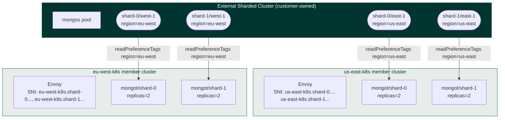

# Q2-MC MongoDBSearch — Sharded source, managed Envoy, multi-cluster

Deploy **MongoDBSearch** in **multi-cluster (MC) mode** against an existing **external sharded MongoDB cluster** (mongos pool + per-shard replica sets), with the operator managing one Envoy Deployment per K8s cluster that multiplexes per-shard SNI routes. This tutorial mirrors the load-test contract YAML from the MVP design spec §4.2.

## When to use this tutorial

You are a load-test or platform engineer who already has:

- An **external sharded cluster** — mongos pool + per-shard 3-node replica sets, each shard's members tagged per region (spec §6.1).
- **2-3 Kubernetes member clusters** registered with a central operator via `kubectl mongodb multicluster setup`.
- Customer-replicated secrets in every member cluster (spec §6.3): `search-sync-password`, `external-ca`, `mongod-keyfile` (sharded-only), plus mongot + Envoy server TLS certs under a known prefix.

For the single-cluster flavour, see [docs/search/07-search-external-sharded-mongod-managed-lb](../07-search-external-sharded-mongod-managed-lb/).

## Topology



Every (cluster, shard) tuple gets its own SNI route through the per-cluster Envoy: `{clusterName}.{shardName}.search-lb.lt.example.com:443`.

## Prerequisites

- `kubectl` with one context per K8s cluster (one central + 2-3 members).
- `kubectl mongodb` plugin installed (the [MCK CLI](../../../tools/multicluster/)).
- `helm` 3.x.
- DNS layer that points each `{clusterName}.{shardName}.search-lb.lt.example.com` at the cloud LB / ingress fronting Envoy in that member cluster (a wildcard `*.{clusterName}.search-lb.lt.example.com` typically suffices).
- Secrets pre-replicated into the namespace in **every** member cluster — see spec §6.3.

## Getting started

```bash
cd docs/search/13-search-q2-mc-sharded

vi env_variables.sh
source env_variables.sh
./test.sh
```

## Step-by-step

| Step | Snippet | What it does |
| ---- | ------- | ------------ |
| 1 | `13_0040_validate_env.sh` | Validates env vars and that `externalHostname` template contains both `{clusterName}` (or `{clusterIndex}`) and `{shardName}`. |
| 2 | `13_0045_create_namespaces.sh` | Creates `${MDB_NS}` in central + every member cluster. |
| 3 | `13_0050_kubectl_mongodb_multicluster_setup.sh` | Registers member clusters with the central operator. |
| 4 | `13_0100_install_operator.sh` | Helm-installs the MongoDB Kubernetes Operator in multi-cluster mode. |
| 5 | `13_0200_verify_secrets_present.sh` | Verifies sync-password, CA bundle, and (sharded-only) `mongod-keyfile` secrets in each member cluster. |
| 6 | `13_0320_create_mongodb_search_resource.sh` | Applies the MongoDBSearch CR (mirrors spec §4.2). |
| 7 | `13_0325_wait_for_search_resource.sh` | Waits for top-level `status.phase=Running` *and* per-cluster `clusterStatusList.clusterStatuses[i].phase=Running` (spec §4.3). |
| 8 | `13_0326_verify_per_cluster_envoy.sh` | Confirms each member cluster has an Available Envoy Deployment. |
| 9 | `13_0330_show_running_pods.sh` | Shows pods + the MongoDBSearch resource. |
| 10 | `13_0340_query_through_envoy.sh` | Smoke-test the per-(cluster, shard) SNI endpoints. |
| Optional | `13_0322_apply_shard_overrides_example.sh` | Demos `clusters[].shardOverrides[]` to bias hot vs. cold shards (spec §4.2 / §5.1.4). |
| Cleanup | `13_9010_cleanup.sh` | Deletes the CR and the namespaces. |

## Key spec contract (§4.2)

The applied CR matches the load-test contract YAML byte-for-byte:

```yaml
apiVersion: mongodb.com/v1
kind: MongoDBSearch
metadata:
  name: lt-search-sharded
  namespace: mongodb
spec:
  source:
    external:
      shardedCluster:
        router:
          hosts:
            - mongos-east-1.lt.example.com:27017
            - mongos-west-1.lt.example.com:27017
        shards:
          - shardName: shard-0
            hosts: [...]
          - shardName: shard-1
            hosts: [...]
      tls:
        ca:
          name: external-ca
      keyfileSecretRef:
        name: mongod-keyfile
    username: search-sync-source
    passwordSecretRef:
      name: search-sync-password
  loadBalancer:
    managed:
      externalHostname: "{clusterName}.{shardName}.search-lb.lt.example.com:443"
  security:
    tls:
      certsSecretPrefix: lt-prefix
  clusters:
    - clusterName: us-east-k8s
      replicas: 2                         # PER SHARD, not total
      syncSourceSelector:
        matchTags:
          region: us-east
    - clusterName: eu-west-k8s
      replicas: 2
      syncSourceSelector:
        matchTags:
          region: eu-west
```

### Required (in addition to Q2-MC RS)

- `source.external.shardedCluster.router.hosts[]`
- `source.external.shardedCluster.shards[].{shardName,hosts[]}`
- `source.external.keyfileSecretRef`
- `externalHostname` containing **both** `{clusterName}` (or `{clusterIndex}`) **and** `{shardName}`
- `clusters[].replicas` is mongot pods **per shard**, not total

### Per-shard tuning — `shardOverrides`

`clusters[i].shardOverrides[]` lets a load tester bias hot vs. cold shards without inflating the spec. Each entry takes a `shardNames[]` selector and any of `replicas`, `resourceRequirements`, `persistence`, `statefulSet`. See `code_snippets/13_0322_apply_shard_overrides_example.sh`.

### Forbidden-at-MVP shapes (spec §4.4)

- `len(clusters) > 1` with `loadBalancer.unmanaged.*`.
- `len(clusters) > 1` with any internal source.
- `externalHostname` missing `{clusterName}` / `{clusterIndex}` *or* missing `{shardName}` when sharded.
- `clusters[].clusterName` non-unique or empty.
- `clusters[].syncSourceSelector.matchTags` empty.
- `spec.replicas` set together with `spec.clusters[].replicas`.

## Status surface (load-test observability)

Per spec §4.3, sharded status nests `loadBalancer.shards[<shardName>].phase` per cluster:

```yaml
status:
  phase: Running
  clusterStatusList:
    clusterStatuses:
      - clusterName: us-east-k8s
        phase: Running
        observedReplicas: 4              # 2 shards * 2 replicas
        loadBalancer:
          phase: Running
          shards:
            shard-0: { phase: Running }
            shard-1: { phase: Running }
      - clusterName: eu-west-k8s
        phase: Running
        observedReplicas: 4
```

Treat per-cluster `phase` + per-shard `loadBalancer.shards[*].phase` as the readiness gate, not the top-level `phase` alone.

## Troubleshooting

### Per-cluster `phase: Pending` with secret missing

```bash
kubectl get mongodbsearch "${MDB_SEARCH_RESOURCE_NAME}" -n "${MDB_NS}" \
  --context "${K8S_CENTRAL_CTX}" -o jsonpath='{.status.clusterStatusList}' | jq
```

### mongot can't find a sync source for a shard

Re-check that every external shard mongod has its `region` tag in `replSetConfig.members[].tags`:

```bash
mongosh "<external-shard-rs>" --eval 'rs.conf().members.forEach(m => print(m.host, JSON.stringify(m.tags)))'
```

If tags are missing on a shard, mongot for that shard will fail to find a sync source in that region (spec §6.4).

### Envoy not Available in a member cluster

```bash
kubectl describe deployment "${MDB_SEARCH_RESOURCE_NAME}-search-lb-0" \
  -n "${MDB_NS}" --context "${K8S_CLUSTER_0_CTX}"
kubectl logs -l "app=${MDB_SEARCH_RESOURCE_NAME}-search-lb-0" \
  -n "${MDB_NS}" --context "${K8S_CLUSTER_0_CTX}"
```

## Cleanup

```bash
./code_snippets/13_9010_cleanup.sh
```

## References

- [Multi-Cluster MongoDBSearch Q2-MC MVP design spec, §4.2, §4.3, §4.4](https://example.invalid/q2-mc-mvp-design)
- Single-cluster analogue: [docs/search/07-search-external-sharded-mongod-managed-lb](../07-search-external-sharded-mongod-managed-lb/)
- Multi-cluster setup architecture: [public/architectures/setup-multi-cluster](../../../public/architectures/setup-multi-cluster/)
