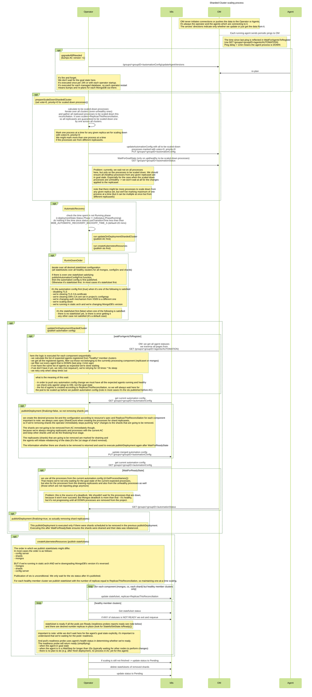

```mermaid
---
config:
  theme: forest
  noteAlign: left
---
sequenceDiagram
    title Sharded Cluster scaling process
    
    participant Operator
    participant k8s
    participant OM
    participant Agent
    Note over OM: OM never initiates connections or pushes the data to the Operator or Agents.<br/>It's always the operator and the agents which are connecting to it.<br/>The arrows' directions indicate only whether we update or just get the data from it.
    Agent --> OM: Each running agent sends periodic pings to OM
    note left of Agent: The time since last ping is reflected in WaitForAgentsToRegister<br/>(via GET /groups/<groupID>/agents/AUTOMATION)<br/>Ping delay > 1min means the agent process is DOWN
    opt
        note left of Operator: upgradeAllIfNeeded<br/>(bumps AC version +1)
        Operator->>OM: /groups/<groupID>/automationConfig/updateAgentVersions
        Agent->>OM: re-plan
        Note over Operator: It's fire and forget.<br/>We don't wait for the goal state here.<br/>It's executed once per 24h or with each operator startup.<br/>It's executed for each managed database, so each operator restart<br/>means bumps and re-plans for each MongoDB out there.
    end
    opt
        note left of Operator: prepareScaleDownShardedCluster<br/>(set vote=0, priority=0 for scaled down processes))
        Operator->>Operator: calculate to-be-scaled-down processes:<br/>Iterate over all clusters (even unhealthy ones)<br/>and gather all replicaset processes to be scaled down this<br/>reconciliation. It uses scalers+ReplicasThisReconciliation,<br/>so all replicasets are guaranteed to be scaled down one <br/>by one across all clusters.

        Note over Operator: Mark one process at a time for any given replica set for scaling down<br/>with votes=0, priority=0<br/>We might mark more than one process at a time<br/>if the processes are from different replicasets.
        Operator->>OM: updateAutomationConfig with all to-be-scaled-down<br/>processes marked with votes=0, priority=0<br/>PUT /groups/<groupID>/automationConfig
        Operator->>OM: WaitForGoalState (only on up&healthy to-be-scaled-down processes)<br/>GET /groups/<groupID>/automationStatus<br/>
        note right of Operator: Problem: currently, we wait not on all processes<br/>here, but only on the processes to be scaled down. We should <br/>ensure all (healthy) processes from any given replicaset are <br/>in goal state. Especially for the case when the scaled down <br/>processes are unhealthy -> we won't wait at all for the changes<br/>applied to the replicaset
        note right of Operator: note that there might be more processes to scale down from <br/>any given replica set, but we'll be marking maximum of one <br/>process at a time (but it can be multiple at once but from <br/>different replicasets)
    end

    opt
        note left of Operator: AutomaticRecovery
        Operator->>Operator: check the time spent in not Running phase<br/>(r.deploymentState.Status.Phase != mdbstatus.PhaseRunning)<br/>do nothing if the time since status.LastTransitionTime less than than <br/>MDB_AUTOMATIC_RECOVERY_BACKOFF_TIME_S (default=20 mins)<br/>
        Note right of Operator: run updateOmDeploymentShardedCluster<br/>(publish AC first)
        Note right of Operator: run createKubernetesResources<br/>(publish sts first)
    end

    opt
        note left of Operator: RunInGivenOrder
        Note over Operator: iterate over all desired statefulset configuration<br/>(all statefulsets over all healthy clusters for all mongos, configSrv and shards)<br/><br/>if there is even one statefulset satisfying<br/>publishAutomationConfigFirst function, <br/>then the automation config is first published. <br/>Otherwise it's statefulset first. In most cases it's statefulset first.
        Note over Operator: it's the automation config first (true) when it's one of the following is satisfied: <br/>- disabling TLS<br/>- we're clearing TLS CA certificate<br/>- we're clearing OM's CA cert set in project's configmap<br/>- we're changing auth mechanism from X509 to a different one<br/>- we're scaling down<br/>- we're running in static arch and we're changing MongoDB's version
        Note over Operator: it's the statefulset first (false) when one of the following is satisfied: <br/>- there is no statefulset yet, or there is error getting it<br/>- any other case not satisfied (it's a default case)
    end

    opt
        note left of Operator: updateOmDeploymentShardedCluster<br/>(publish automation config)
        opt waitForAgentsToRegister
            OM ->> Operator: OM: we get all agent statuses<br/> we traverse all pages from<br/>GET /groups/<groupID>/agents/AUTOMATION)
            Note over Operator: here the logic is executed for each component sequentially:<br/>- we calculate the list of expected agents registered from *healthy* member clusters<br/>- we get all the registered agents, filter out those not belonging to the currently processing component (replicaset or mongos)<br/>- we filter out every agent that is DOWN (last ping >1min ago)<br/>- if we have the same list of agents as expected we're done waiting<br/>- if we don't have it yet, we retry (not requeue!), we're retrying for 10 times * 9s sleep<br/>- we retry only when sleep times out
            Note over Operator: what is the meaning of this wait:<br/><br/>- in order to push any automation config change we must have all the expected agents running and healthy <br/>- we check only agents' pings to OM, not the goal state<br/>- the list of agents is created according to ReplicasThisReconciliation, so we will always wait here for<br/>the pod to be scaled up before we publish automation config (note in most cases it's the sts published before AC)
        end
        k8s ->> Operator: get current automation config<br/>GET groups/<groupID>/automationConfig
        opt
            Note left of Operator: publishDeployment (finalizing=false, so not removing shards yet)
            Note over Operator: we create the desired process list and the configuration according to resource's spec and ReplicasThisReconciliation for each component<br/>important to note: we always uses spec.ShardCount when creating the processes for shard replicasets,<br/>so if we're removing shards the operator immediately stops pushing *any* changes to the shards that are going to be removed.<br/><br/>The shards are not going to be removed from AC immediately though, <br/>because we're always merging replicasets and processes with the current AC<br/>and keep other shards until we do the finalizing=true stage.<br/><br/>The replicasets (shards) that are going to be removed are marked for draining and<br/>the agents will initiate rebalancing of the data (it's the 1st stage of shard removal).<br/><br/>The information whether there are shards to be removed is returned and used to execute publishDeployment again after WairForReadyState

            Operator->>k8s: update merged automation config<br/>PUT groups/<groupID>/automationConfig
        end
        k8s ->> Operator: get current automation config<br/>GET groups/<groupID>/automationConfig
        opt WaitForReadyState
            Note over Operator: we use all the processes from the current automation config (d.GetProcessNames())<br/>That means we're not only waiting for the goal state of the current expected processes,<br/>but also for the processes from the draining replicasets and also from the unhealthy processes as well<br/>(those which are not reporting pings anymore)<br/>
            Note over Operator: Problem: this is the source of a deadlock. We shouldn't wait for the processes that are down,<br/>because it won't ever succeed. But Mongos deadlock is more than that - it's healthy,<br/>but it's not progressing until all DOWN processes are removed from the project.
            OM ->> Operator: GET /groups/<groupID>/automationStatus
        end
        opt
            Note left of Operator: publishDeployment (finalizing=true, so actually removing shard replicasets)
            Note over Operator: This publishDeployment is executed only if there were shards scheduled to be removed in the previous publishDeployment. <br/>Executing this after WaitForReadyState ensures the shards were drained and their data was rebalanced.
        end
    end
    opt
        note left of Operator: createKubernetesResources (publish statefulsets)
        note over Operator: The order in which we publish statefulsets might differ.<br/>In most cases the order is as follows:<br/>- config server<br/>- shards<br/>- mongos<br/><br/>BUT if we're running in static arch AND we're downgrading MongoDB's version it's reversed:<br/>- mongos<br/>- shards<br/>- config server<br/><br/>Publication of sts is unconditional. We only wait for the sts status after it's published.<br/><br/>For each healthy member cluster we publish statefulset with the number of replicas equal to ReplicasThisReconciliation, so maintaining one-at-a-time scaling.

        loop for each component (mongos, cs, each shard) but healthy member clusters only
            Operator->>k8s: update statefulset, replicas=ReplicasThisReconciliation
        end
        loop healthy member clusters
            Operator->>k8s: Get statefulset status
            Operator ->> k8s: if ANY of statuses is NOT READY we exit and requeue
            Note over Operator: statefulset is ready if all the pods are Ready (readiness probes reports ready see note below)<br/>and there are desired number replicas in place (look for StatefulSetState.IsReady())
            Note over Operator: important to note: while we don't wait here for the agent's goal state explicitly, it's important to <br/>understand that we're waiting for the pods' readiness. <br/><br/>And pod's readiness probe uses agent's health status in determining whether we're ready. <br/>The readiness probe will return ready (simplifying): <br/>- when the agent in goal state<br/>- when the agent is in a WaitStep for longer than 15s (typically waiting for other nodes to perform changes)<br/>- there is no plan to do (e.g. after fresh deployment, no process in AC yet for this agent)
        end
    end
    Operator->>k8s: if scaling is still not finished -> update status to Pending
    Operator->>k8s: delete statefulsets of removed shards
    Operator->>k8s: update status to Pending
```
