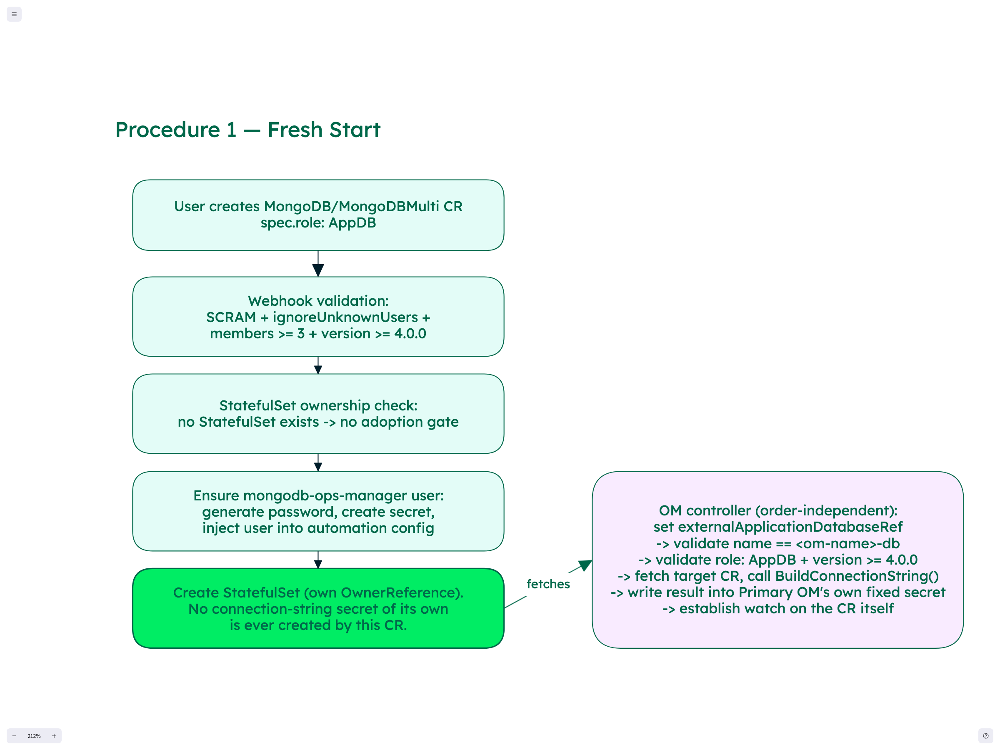
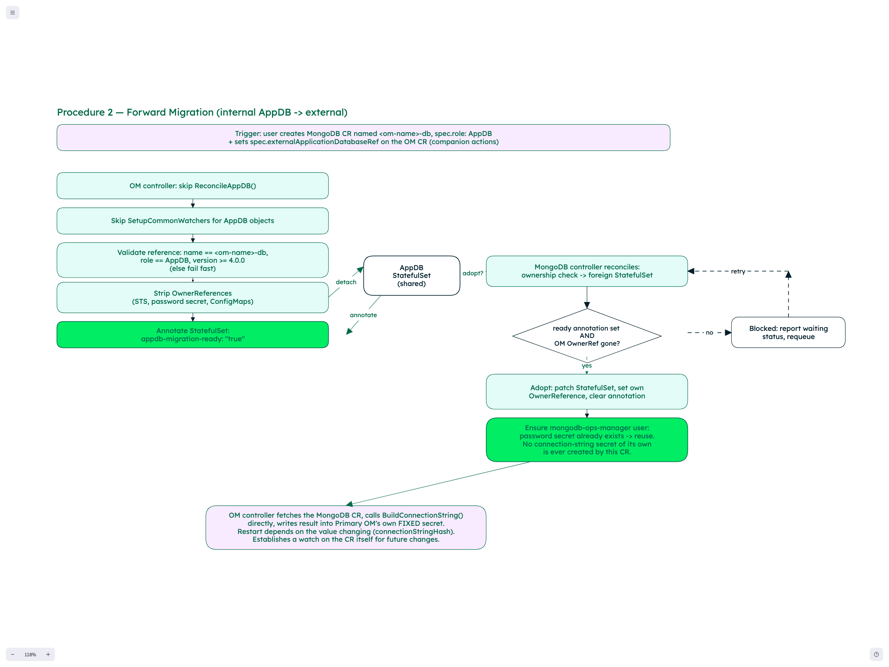
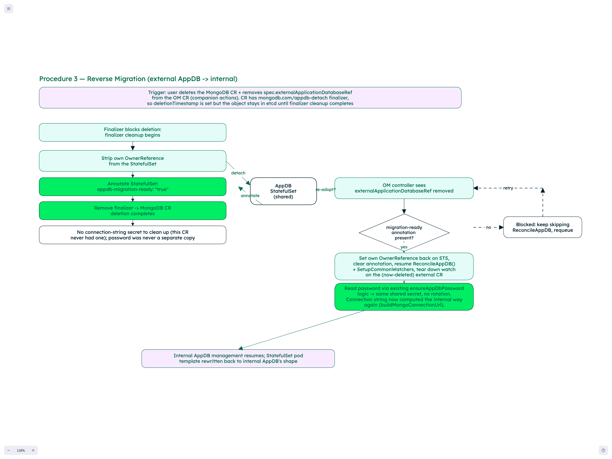

# External AppDB via MongoDB/MongoDBMultiCluster CR Reference — Design

**Date:** 2026-07-02
**Branch:** `maciejk/external-appdb-with-ref`
**Source doc:** [Spike: Ops Manager with externally managed AppDB](https://docs.google.com/document/d/1CePu35zPVPmJ1EOQMhLkgXuHPuLQV2Rk0xQx0f_eec8) — implements the second "Open Questions" option ("Reference to MongoDB/MongoDBMultiCluster custom resources") and directly addresses the doc's "No downtime rollout of the switch" open question.

---

## Goal

Let Ops Manager's AppDB be backed by a reference to an actual `MongoDB` or `MongoDBMultiCluster` custom resource, instead of only ever being an implicit, internally-managed component of the `MongoDBOpsManager` resource. The referenced resource is marked as playing the AppDB role, and the operator auto-manages the credentials and connection-string plumbing end to end — no manual secret copying, and Primary OM's StatefulSet volume-mount identity never changes when switching between internal and external AppDB, which eliminates one whole class of restart this design would otherwise cause. Whether the switch triggers a restart at all still depends on whether the computed connection string's *value* changes — Procedure 2 is designed to keep it unchanged (same StatefulSet/hostnames via takeover, same password via the Naming convention), but this depends on `AppDBSpec.BuildConnectionURL` and `MongoDB.BuildConnectionString` producing equivalent output for the same inputs, which is flagged as an open item, not assumed.

---

## API Changes

```go
// New field on MongoDBOpsManagerSpec.
ExternalApplicationDatabaseRef *ExternalApplicationDatabaseRef `json:"externalApplicationDatabaseRef,omitempty"`

type ExternalApplicationDatabaseRef struct {
	// Name of the MongoDB or MongoDBMultiCluster resource to use as the external AppDB.
	// Must be in the same namespace as the MongoDBOpsManager resource.
	// +kubebuilder:validation:Required
	Name string `json:"name"`

	// Kind of the referenced resource.
	// +kubebuilder:validation:Enum=MongoDB;MongoDBMultiCluster
	// +kubebuilder:validation:Required
	Kind string `json:"kind"`
}
```

```go
// New field on MongoDbSpec (DbCommonSpec, inherited by MongoDBMultiSpec too).
// +kubebuilder:validation:Enum=AppDB
// +optional
Role string `json:"role,omitempty"`
```

No `userRef` field — the well-known `mongodb-ops-manager` username is guaranteed to exist by the `role: AppDB` auto-creation logic (see below), so there's nothing to reference.

**Finalizer**: any MongoDB/MongoDBMultiCluster CR with `spec.role: AppDB` gets a `mongodb.com/appdb-detach` finalizer added as soon as the role is set (not added for ordinary replica sets). This is required for Procedure 3 (reverse migration) — see that section for why removing the role field alone, without a finalizer-gated deletion, isn't safe.

---

## Naming convention (supersedes the earlier "Naming asymmetry" section)

Any `MongoDB`/`MongoDBMultiCluster` CR that will be referenced by an OM's `spec.externalApplicationDatabaseRef` must be named `<om-name>-db` (`ExpectedAppDBResourceName(om) = om.Name + "-db"`) — the same convention Procedure 2's takeover already required for matching its existing StatefulSet. This design now enforces that convention generically, for every procedure, not just takeover:

- Whenever `externalApplicationDatabaseRef` is set or changed on an OM CR, the OM controller validates `externalApplicationDatabaseRef.Name == ExpectedAppDBResourceName(om)` before anything else — the same validation point used in Procedure 2, step 2c, now also exercised in Procedure 1, step 6, and always run alongside the existing role/version checks.
- If the referenced CR doesn't exist yet, or exists with the wrong name, the OM controller reports a clear validation error status (same failure path as an existing role/version mismatch) and does not proceed with any external-AppDB behavior — it keeps managing internal AppDB, or reports "waiting for correctly-named external AppDB reference" if none exists, until the user creates or renames the target correctly.
- This applies identically to `MongoDB` and `MongoDBMultiCluster` — the check is against the CR's own top-level name, not any per-cluster name.

**Why this replaces the password-copy steps:** because the CR's name is now always deterministically required to equal `<om-name>-db`, and `AppDBSpec.Name()` (`appdb_types.go:385-387`) returns exactly that same value (`m.OpsManagerName + "-db"`) for internal AppDB, both controllers already compute the exact same well-known password secret name — from their own respective CR name — without ever needing to copy a value between two different naming conventions, and **without needing to strip or derive anything**:
- Internal AppDB's password secret name is `AppDBSpec.GetOpsManagerUserPasswordSecretName()` = `OpsManagerUserPasswordSecretName(m.Name())` = `<om-name>-db-om-password` (`appdb_types.go:257`, delegating to the free function `OpsManagerUserPasswordSecretName(name string) string` — extracted so callers without an `*AppDBSpec` receiver can compute the same name).
- The generic MongoDB controller, when reconciling a CR with `spec.role: AppDB`, calls `om.OpsManagerUserPasswordSecretName(mdb.Name)` **directly on its own CR name** — no suffix-stripping or OM-name derivation needed, since `mdb.Name` is already required (by the naming-convention check above) to equal `<om-name>-db`, the exact same value `AppDBSpec.Name()` produces for internal AppDB. This is simpler than an earlier draft of this section assumed (which incorrectly described deriving a bare `om-name` by stripping the CR's own `-db` suffix and re-appending `-om-password` — that would have computed a *different*, mismatched secret name, `<om-name>-om-password` instead of `<om-name>-db-om-password`, breaking the shared-secret premise entirely. Caught during implementation, before it was built.)
- This convention is used instead of the generic `<mdb-name>-mongodb-ops-manager-password` convention every other MongoDB CR uses, and there is therefore only **one** password secret for a given OM's AppDB user, regardless of whether it's currently managed internally or externally — eliminating the password-copy sub-steps that an earlier revision of this design specified in Procedure 2's detach sequence and Procedure 3's finalizer cleanup, entirely.
- OM's own **fixed connection-string secret** (Procedure 2 step 4) is unaffected by this change — that indirection exists for an unrelated reason (avoiding a pod restart on switch, since Primary OM's pod always mounts the same-named secret) and is retained as-is.

**Known limitation of this approach:** the MongoDB controller computes the password secret name from its own CR name alone — it does not itself verify that a real OM CR is currently, validly referencing it (that check only happens from the OM controller's side, per above). In practice this means a `role: AppDB` CR named `<foo>-db` will always compute, and may create, a password secret named `<foo>-db-om-password`, whether or not an OM named `<foo>` actually exists or references it. This is harmless (at worst, an unused, orphaned secret) but is a soft coupling worth being aware of — if it becomes a real problem in practice (e.g. secret sprawl, confusion during audits), consider tightening it in a follow-up by having the MongoDB controller check for a live back-reference before creating the secret.

---

## Connection string: computed directly by the OM controller, not copied from a secret

The referenced `MongoDB`/`MongoDBMultiCluster` CR **never creates its own connection-string secret.** Instead, the OM controller computes Primary OM's connection string itself, directly from the live CR object, the same way `MongoDBUserReconciler` already does for ordinary database users:

- Whenever `externalApplicationDatabaseRef` is validated (Procedure 1, Procedure 2 step 2c), the OM controller fetches the referenced `MongoDB`/`MongoDBMultiCluster` object and calls its exported `BuildConnectionString(username, password, scheme, connectionParams)` method (`api/mongodb/v1/mdb/mongodb_types.go:1681`; `MongoDBMultiCluster` exposes the equivalent), using the credentials from the shared password secret (per Naming convention above). For an ordinary replica set — which is all an AppDB-role CR ever is, never a sharded cluster — this method needs no externally-supplied hostname list; it derives everything (name, namespace, replica count, service name, cluster domain, external domain) from the object's own fields. Confirmed by `MongoDBUserReconciler.getMongoDBConnectionBuilder` (`mongodbuser_controller.go:113-136`), which passes an empty hostname slice for this exact case and only computes hostnames explicitly for the sharded-cluster branch, which never applies here.
- The OM controller writes the result directly into Primary OM's own **fixed** connection-string secret — the same secret used for internal AppDB, same name regardless of mode. This keeps a strict single-writer invariant: the OM controller is the only thing that ever writes this secret, in both internal and external mode. There is no cross-controller shared write to reason about, and no separate secret for the MongoDB controller to create or for OM to copy from.
- To recompute the connection string whenever the external AppDB's live state changes (membership scale change, TLS rotation, etc.), the OM controller establishes a dynamic watch on the referenced CR itself, keyed off the name/kind currently set in `externalApplicationDatabaseRef`. **This is not a new mechanism** — `OpsManagerReconciler` already does exactly this for KMIP-referenced MongoDB CRs today (`watchMongoDBResourcesReferencedByKmip`, `mongodbopsmanager_controller.go:1073`, with a second, independent example in `watchMongoDBResourcesReferencedByBackup`, `mongodbopsmanager_controller.go:1119`): it iterates dynamically-discovered `MongoDB` CRs and calls `r.resourceWatcher.AddWatchedResourceIfNotAdded(m.Name, m.Namespace, watch.MongoDB, opsManagerObjectKey)`, including for secret names computed at runtime (`ClientCertificateSecretName(m.GetName())`). Watching the externally-referenced AppDB CR by name is the same call, pointed at a different name.
- If `externalApplicationDatabaseRef` changes (a different target, or removed via Procedure 3), the watch is re-established the same way `SetupCommonWatchers` and the KMIP watcher already handle this today: remove all previously-registered watches for this OM CR, then re-add whatever's currently relevant — a "remove-then-readd" cycle, not new teardown logic.

**On restarts:** none of this needs the running Primary OM process to pick up a changed secret's content live. `mongodbopsmanager_controller.go:961,1081` already computes `hashConnectionString(appDBConnectionString)` and feeds it into the StatefulSet's pod template as an annotation (`construct.WithConnectionStringHash`, `opsmanager_construction.go:423-424`) — any change to the connection string changes this hash, and standard StatefulSet rolling-update semantics restart Primary OM's pod(s) with the current value on the next reconcile. This mechanism is unrelated to this design and already exists for internal AppDB; external AppDB just needs to feed it a correct, current value. The job here is narrowly "keep the fixed secret's stored value correct," not "propagate changes into a running process without a restart."

---

## Procedure 1 — Fresh start (new external AppDB, no prior internal AppDB)



Full reconciliation flow when a `MongoDB`/`MongoDBMultiCluster` CR with `spec.role: AppDB` is created and no StatefulSet exists yet for its name.

1. **Webhook validation** (admission-time): reject unless all of —
   - `spec.security.authentication.enabled: true` with `SCRAM` in modes
   - `spec.security.authentication.ignoreUnknownUsers: true`
   - `spec.members >= 3` (or per-cluster member sum for MongoDBMultiCluster)

   These mirror what internal `AppDBSpec` hardcodes unconditionally today (`GetAuthOptions()`, `appdb_types.go:187-197`; CRD-level `Members` min=3 marker, `appdb_types.go:37`) — none of these are enforced by default on a generic MongoDB CR, so they must be added explicitly, gated on `role: AppDB`. There is deliberately no minimum MongoDB version requirement — an earlier revision of this design required `>= 4.0.0`, mirroring internal AppDB's `validAppDBVersion`, but that floor was removed as unnecessarily restrictive; any version the referenced CR itself supports is acceptable.

2. **MongoDB controller reconciles.** StatefulSet ownership check finds no StatefulSet at all for this CR's name → no adoption gate applies, proceed directly to normal creation.

3. **Ensure the `mongodb-ops-manager` user**, mirroring the internal AppDB reconciler's existing `ensureAppDbPassword` + `AppDBSpec.GetAuthUsers()` pattern — relocated into this controller's own logic rather than going through a separate `MongoDBUser` CR:
   - Check whether the well-known password secret computed from this CR's own name (`<om-name>-db-om-password`, per Naming convention above) already exists — it doesn't (fresh start).
   - Generate a new password, create the secret under that name, same as `ensureAppDbPassword` does today for internal AppDB.
   - Inject a synthetic `mongodb-ops-manager` user (roles: `readWriteAnyDatabase`, `dbAdminAnyDatabase`, `clusterMonitor`, `backup`, `restore`, `hostManager` — all on `admin`, verbatim from `AppDBSpec.GetAuthUsers()`) directly into this CR's own automation-config user list.

4. **Create the StatefulSet**, with this CR's own `OwnerReference` set on it (`kube.BaseOwnerReference(&mdb)`, `construct/database_construction.go:191-220` — the standard mechanism the generic controller already uses for every replica set, no new code needed here). This CR never creates a connection-string secret of its own — see "Connection string: computed directly by the OM controller" above.

5. Resource reaches `Running`.

6. **Separately, order-independent**: whenever `spec.externalApplicationDatabaseRef` is set on an OM CR pointing at this resource, the OM controller validates that the reference's name matches the required naming convention (see Naming convention above) and that `role: AppDB` holds on the target, skips `ReconcileAppDB()`/`SetupCommonWatchers`, fetches the target CR, and computes Primary OM's fixed connection-string secret directly via `BuildConnectionString` (see above), using the shared password secret's credentials. The OM controller also establishes a watch on this CR at this point (see above), so any subsequent change — e.g. a membership change or TLS rotation on the external AppDB — causes the connection string to be recomputed and the fixed secret's stored value kept current. No detach steps run in this procedure (nothing to detach from — there was never an internal AppDB for this OM to begin with).

   **`spec.applicationDatabase` is optional and may be omitted entirely once `externalApplicationDatabaseRef` is set** — it is no longer required to keep a placeholder internal AppDB spec around just to satisfy validation (`MongoDBOpsManagerSpec.AppDB` is `*AppDBSpec`, `+optional`). When omitted, the operator still defaults a non-nil, correctly-named zero-value `AppDBSpec` internally so that name-derivation helpers keep working — this defaulting is purely internal bookkeeping and never surfaces a real internal AppDB or StatefulSet. The internal-AppDB-only validators (version, TLS/security hardcoding, etc.) are skipped whenever `ExternalApplicationDatabaseRef != nil`, since there's no embedded AppDB configuration left to validate.

---

## Procedure 2 — Forward migration (internal AppDB → external, via takeover)



Full reconciliation flow when an existing internal AppDB is handed over to a `MongoDB`/`MongoDBMultiCluster` CR.

1. **Trigger**: user creates a MongoDB CR named identically to the existing AppDB StatefulSet (`<om-name>-db`) with `spec.role: AppDB`, **and** sets `spec.externalApplicationDatabaseRef` on the OM CR to point at it. These are companion actions performed together. Webhook validation (as in Procedure 1, step 1) applies to the new MongoDB CR immediately on admission.

2. **OM controller, seeing the new reference, performs a one-time detach** (idempotent — skipped on subsequent reconciles once done):
   a. Skip `ReconcileAppDB()` — must become conditional on `ExternalApplicationDatabaseRef == nil`, since today it always runs.
   b. Skip `SetupCommonWatchers` for the AppDB objects. Today this call (`mongodbopsmanager_controller.go:444-445`) runs unconditionally every reconcile regardless of external mode — confirmed directly, no conditional guard exists around it. A nearby `TODO` comment (`mongodbopsmanager_controller.go:440`) notes a related but distinct concern (watch-registration *ordering* between AppDB and OM's own watches) — it doesn't itself acknowledge this specific external-mode gap, so don't cite it as direct corroboration. Must become conditional on `ExternalApplicationDatabaseRef == nil`.
   c. Validate the reference: fetch the target, fail fast with a clear error if `spec.role != "AppDB"` or its name doesn't match `ExpectedAppDBResourceName(om)` (see Naming convention above — for a forward migration this is automatically satisfied by the existing StatefulSet-name-match requirement, but the check is now uniform across all procedures). There is no minimum-version check on the referenced CR (see Procedure 1, step 1).
   d. Strip OwnerReferences from the AppDB StatefulSet, password secret, and ConfigMaps (confirmed as the *only* deletion-safety mechanism today — no finalizers exist). Without this, deleting the OM CR later would cascade-delete a StatefulSet now owned by a separate MongoDB CR.
   e. Only after a–d succeed: annotate the StatefulSet with `mongodb.com/appdb-migration-ready: "true"`.

   **AppDB host deregistration from Primary OM's project monitoring, previously specified as a sub-step here, has been dropped from this design.** Deregistering hosts mid-migration added complexity and a confirmed retry-safety gap (`conn.RemoveHost` doesn't tolerate "already removed") for limited benefit. Hosts are left registered as-is during and after the switch; if a customer wants them deregistered, that's a separate, customer-driven action outside this design's scope.

   **No password copy step is needed here either** (an earlier revision of this design specified one at this point in the detach sequence) — see Naming convention above: the MongoDB controller computes and finds the same password secret directly, so there is nothing to copy.

3. **MongoDB controller reconciles**:
   - StatefulSet ownership check: the StatefulSet exists but does not carry this CR's own `OwnerReference` (it still has the OM's, until step 2d runs; and even after, it has none until this step completes) → foreign StatefulSet, takeover adoption gate applies.
   - **Gate check (two independent signals, both required)**: the `mongodb.com/appdb-migration-ready: "true"` annotation must be present, **and** the StatefulSet must no longer carry the OM's own `OwnerReference`. Either signal being unsatisfied blocks adoption — do not touch the StatefulSet, report a clear status/condition ("waiting for Ops Manager to finish detaching AppDB StatefulSet `<name>`"), requeue. Checking both, rather than the annotation alone, guards against ever adopting a StatefulSet the OM controller hasn't actually finished releasing.
   - Once both checks pass: adopt — patch the StatefulSet into the desired generic-MongoDB-CR shape, set this CR's own `OwnerReference` on it (completing the ownership swap), clear the annotation.
   - Ensure the `mongodb-ops-manager` user: password secret already exists (same secret internal AppDB was already using, per Naming convention above — no copy ever needed) → reuse those exact credentials unchanged. Rotating them here would break authentication against a StatefulSet that already has this user's SCRAM credentials stored in mongod.
   - This CR never creates a connection-string secret of its own — see "Connection string: computed directly by the OM controller" above.

4. **OM controller** computes Primary OM's connection string directly from the MongoDB CR via `BuildConnectionString` (see above) and writes it into Primary OM's own **fixed** connection-string secret (same name regardless of internal/external/which-external-target) — this is what eliminates the pod-restart-on-switch problem *specific to the volume-mount identity*, since Primary OM's StatefulSet volume mount never changes; the value's content still reaches the running process only via the existing `connectionStringHash`-triggered rolling restart (see above), same as any other AppDB connection-string change. The OM controller also establishes a watch on the referenced CR at this point (see above), so subsequent changes to the external AppDB keep the fixed secret's stored value current.

---

## Procedure 3 — Reverse migration (external AppDB → internal, handing back to Ops Manager)



Full reconciliation flow when an externally-managed AppDB is handed back to Ops Manager's internal management.

**Why this can't be "just remove `spec.role: AppDB` and leave the CR in place"** (an earlier version of this design assumed exactly that, and it's unsafe): the generic MongoDB (ReplicaSet) controller's normal reconcile path unconditionally rebuilds and re-applies its own `OwnerReference` onto its StatefulSet every single reconcile (`construct/database_construction.go`, no gate exists anywhere in `Reconcile()` to skip this) — confirmed there is no first-class "paused"/"skip reconciling" field on `MongoDbSpec` to lean on instead. If `role: AppDB` were simply unset while the CR kept existing, the object would immediately fall back to being treated as an ordinary replica set, and its *very next* reconcile would re-claim the StatefulSet's `OwnerReference` — almost certainly before the OM controller ever gets a chance to see the readiness annotation. Detaching and continuing to exist are incompatible for this resource type; the only safe way to permanently relinquish the StatefulSet is for the MongoDB CR to stop existing.

**Trigger**: user deletes the MongoDB CR **and** removes `spec.externalApplicationDatabaseRef` from the OM CR, together. (A MongoDB CR has no way to detect "some OM stopped referencing me" without an expensive reverse-lookup across all OM CRs, so this remains a paired action — each controller reacts purely to its own state changing, no cross-CR watching needed.)

**This is irreversible once started** — standard Kubernetes semantics: once `deletionTimestamp` is set, there is no supported API to cancel or revert the deletion. The only recovery path if a user changes their mind mid-migration is to let finalizer cleanup and deletion complete, then re-create the MongoDB CR from scratch (i.e., re-run Procedure 1 or 2). Don't expect `kubectl edit`/removing the delete request to abort an in-progress reverse migration.

1. **Any MongoDB/MongoDBMultiCluster CR with `spec.role: AppDB` registers a finalizer** (e.g. `mongodb.com/appdb-detach`) as soon as the role is set — scoped to AppDB-role CRs only, not added for ordinary replica sets. This follows the exact established pattern already used by `MongoDBUserReconciler` (`ensureFinalizer`/`controllerutil.AddFinalizer` + `client.Update`, `mongodbuser_controller.go:540-543`) rather than inventing a new mechanism.

2. **User deletes the MongoDB CR.** Kubernetes sets `deletionTimestamp` but does not remove the object from etcd while the finalizer is present — this is what buys time for a safe pre-delete detach. (Without the finalizer, deleting the CR would let Kubernetes garbage-collect the StatefulSet immediately: `kube.BaseOwnerReference` builds a real controller owner reference via `metav1.NewControllerRef` with `Controller: true` and `BlockOwnerDeletion: true`, `pkg/kube/kube.go:21-32`.)

3. **MongoDB controller's finalizer cleanup runs** (mirrors Procedure 2 step 2, in reverse):
   a. Strip its own `OwnerReference` from the StatefulSet.
   b. Annotate the StatefulSet with the same `mongodb.com/appdb-migration-ready: "true"` marker (one shared annotation key works for both directions, since only one controller is ever gated at a time).
   c. Only once a–b both succeed: remove the finalizer, letting Kubernetes finish deleting the MongoDB CR object. The StatefulSet — now carrying no `OwnerReference` at all — is unaffected by the CR's deletion. There is no connection-string secret of this CR's own to clean up (see "Connection string: computed directly by the OM controller" above — it never created one); its password secret was never a separate copy in the first place (see Naming convention above), so there is nothing to preserve or migrate back either.

   Because the MongoDB CR ceases to exist once the finalizer is removed, there is no "next reconcile of this same CR" that could re-claim the StatefulSet — the race described above is eliminated structurally, not just avoided by timing.

4. **OM controller sees `externalApplicationDatabaseRef` removed**:
   - Annotation **absent** → block resuming internal management, keep skipping `ReconcileAppDB()`, report a clear waiting status, requeue (mirrors the forward gate).
   - Annotation **present** → sets its own `OwnerReference` back on the StatefulSet, clears the annotation, resumes `ReconcileAppDB()` and re-establishes `SetupCommonWatchers` (AppDB hosts were never deregistered from Primary OM's project monitoring during the forward migration — see Procedure 2 — so there is nothing to re-register here), tears down the watch it held on the external CR (removed the same way it was added — see "Connection string: computed directly by the OM controller" above), and reads the password via its existing internal `ensureAppDbPassword` logic — finds it already correctly placed as the same shared secret (see Naming convention above), no rotation. The connection string is now computed the internal way again (`buildMongoConnectionUrl` from `ReconcileAppDB`'s own output, as it always was for internal AppDB) instead of via the external CR's `BuildConnectionString`, and written into the same fixed secret as before.

   Note: the OM controller can see the annotation (set in step 3b) and start re-adopting *before* the MongoDB CR has finished being deleted (step 3c hasn't necessarily run yet) — don't assume "OM won't re-adopt until the CR is fully gone." This is safe, not a race: by step 3b the MongoDB CR's `OwnerReference` is already stripped (3a) and it no longer touches the StatefulSet at all; step 3c only removes the finalizer from the CR object itself, which has no further effect on the StatefulSet.

5. Internal AppDB management resumes as if the external interlude never happened, modulo the StatefulSet's pod template being rewritten back to the internal AppDB's expected shape (container set, env vars) — the same category of rolling restart Procedure 2's forward takeover also causes, and should be tested the same way (see Testing plan).

---

## Idempotency and partial-failure recovery

Every step across all three procedures is designed as a **check-current-state-then-converge** operation, re-evaluated fresh on every reconcile — none of them depend on remembering "how far a previous attempt got." This is what makes it safe for a reconcile to fail or be interrupted at any point and simply resume from the top on the next call:

- **State checks are inherently re-evaluated fresh**: the StatefulSet ownership check (OwnerReference present or not), the two-signal takeover gate (readiness annotation present *and* the OM's OwnerReference gone — see Procedure 2, step 3), and the "does the well-known password secret already exist" check all re-read live cluster state on every reconcile — there's no separate "progress" record that could go stale or desync from reality.
- **Writes are overwrite-safe**: creating/patching a secret, setting an annotation to a fixed value, setting an OwnerReference, and creating/patching the StatefulSet itself into its desired shape (Procedure 1 step 4's creation, Procedure 2 step 3's "patch into desired shape") are all idempotent operations — retrying them with the same input produces the same end state, whether or not the previous attempt partially succeeded. This is standard, already-proven reconcile behavior elsewhere in this codebase, not something new this design introduces.
- **Destructive/validating steps run before mutating steps, in a fixed order, every time**: e.g., Procedure 2's OM controller validates the reference (role + version + naming convention) *before* stripping any OwnerReferences — if validation fails, the reconcile returns early having made no changes yet, and simply retries validation from scratch next time. The detach sequence (skip watchers → validate → strip owner refs → annotate) is re-run in full on every reconcile of an in-progress migration; each sub-step is a no-op if it already succeeded (e.g., stripping an already-absent OwnerReference, or re-annotating with the same value), so re-running the whole sequence from the top is always safe, regardless of exactly which prior sub-step failed.
- **Best-effort vs. correctness-critical steps**: if Procedure 2's "adopt" step sets the MongoDB CR's own OwnerReference but fails before clearing the readiness annotation, the annotation is left behind harmlessly — the *next* reconcile's ownership check already finds this CR's own OwnerReference present and skips the gate/annotation check entirely. Clearing the annotation is best-effort tidiness, not something the correctness of the flow depends on.
- **Procedure 3's finalizer is the one place where "resume" has a hard boundary**: per the established `MongoDBUserReconciler` pattern, the finalizer is only removed after steps 3a–3b *both* succeed. If the controller crashes or errors partway (e.g., after stripping the OwnerReference but before annotating), the MongoDB CR remains stuck in `deletionTimestamp`-set-but-not-yet-deleted state, and the finalizer's cleanup logic simply re-runs in full on the next reconcile — safe, because 3a–3b are each idempotent as described above.
- **A single shared annotation key is sufficient for both directions** — no direction-specific annotation names or explicit in-progress state are needed. Which direction an in-progress migration is in is always independently derivable from existing state without inspecting the annotation itself: a forward migration in progress is indicated by the OM CR having `externalApplicationDatabaseRef` set together with the MongoDB CR existing; a reverse migration in progress is indicated by the reference being unset together with the MongoDB CR carrying a `deletionTimestamp`. When debugging via `kubectl describe statefulset` alone (without cross-referencing the OM/MongoDB CRs), the annotation only tells you "is it safe to proceed" — for direction, check the OM CR's reference field and the MongoDB CR's deletion state.

---

## Removal / cleanup behavior

**Removing `spec.role: AppDB` without deleting the CR** (not a reverse migration — no finalizer cleanup runs, since that only triggers on deletion, per Procedure 3): the MongoDB CR simply stops being subject to AppDB-specific webhook validation and continues to exist, own, and reconcile its StatefulSet exactly as an ordinary replica set. Nothing is detached, nothing is deleted — this is a benign, non-destructive field change.

**Removing only the OM's `externalApplicationDatabaseRef`** without deleting the target MongoDB CR: the OM CR simply has no external AppDB reference and no internal one either (since `role: AppDB` websocket validation and the takeover flow are independent of this field) — the OM CR would need either a new `externalApplicationDatabaseRef` or to go through Procedure 3's full delete-based handoff to resume internal management. Nothing gets auto-deleted here either.

In both cases: never make credential or StatefulSet deletion a side effect of an unrelated field change — this design's switch behavior between internal and external management is non-destructive by construction, not just for these two specific cases.

---

## Explicitly out of scope for v1

- **Collision guard**: no admission-time check preventing a manually-created `MongoDBUser` CR also named `mongodb-ops-manager` on the same target from conflicting with the controller-managed synthetic user. Documented as a known limitation; revisit if it comes up in practice.
- **`MonitoringAgent.StartupParameters` parity**: internal AppDB has a top-level field for this; the generic MongoDB CR only has a nested `LogRotate` sub-field, nothing for startup params. Accepted as a v1 limitation.
- **`AutomationConfigOverride` parity**: internal AppDB's escape hatch for merging custom `process.disabled`/`logRotate` fields has no equivalent on the generic MongoDB CR. Accepted as a v1 limitation.
- **Cross-namespace references**: `ExternalApplicationDatabaseRef` is same-namespace only.
- **Shared/cross-OM references**: an AppDB-role CR is only ever validly referenced by the one OM whose name it's derived from (`<om-name>-db`, see Naming convention) — this design does not support one AppDB CR being referenced by multiple OM instances simultaneously or interchangeably.

---

## Field parity: AppDBSpec vs. MongoDB/MongoDBMultiCluster CR

Full comparison, confirming nothing else silently regresses:

| Area | AppDBSpec | MongoDB CR | MongoDBMultiCluster CR | Notes |
|---|---|---|---|---|
| Version / FCV | `Version`, `FeatureCompatibilityVersion` | same | same | Equivalent |
| Members | `Members` (CRD min=3/max=50) | `Members` (no CRD floor) | `ClusterSpecList[].Members` | Floor added explicitly via `role: AppDB` webhook (see above), not inherited |
| PodSpec | `PodSpec` | same type | same + per-cluster override | Equivalent; MongoDB CR has finer granularity |
| StatefulSet overrides | none (only `PodSpec`) | `StatefulSetConfiguration` (full pod-template merge) | same + per-cluster | Not a gap — MongoDB CR's mechanism is strictly more capable |
| Security/TLS | `Security`, hardcoded SCRAM + `AuthoritativeSet: false` | `Security`, user-configurable | same | Same struct; AppDB's hardcoding replicated via webhook validation instead |
| Connectivity | `Connectivity` | same | same | Equivalent |
| External domains | `ExternalAccessConfiguration`, `GetExternalDomain()` | same shape/method | same + per-cluster | Equivalent |
| AdditionalMongodConfig | yes | yes (same type) | same | Equivalent; minor note — AppDB's `BuildConnectionURL` doesn't set port explicitly, MongoDB CR's does. This is one concrete instance of the broader builder-output-equivalence question tracked in Open Item 2 — don't treat this as a separate, smaller concern from that one. |
| Automation agent config | `AutomationAgent` | `Agent` (same type, different field name) | same | Equivalent, naming difference only |
| Monitoring agent config | top-level `MonitoringAgent.StartupParameters` | nested `LogRotate` only | same | **Gap, accepted as v1 limitation** (see above) |
| AutomationConfigOverride | yes | none | none | **Gap, accepted as v1 limitation** (see above) |
| Prometheus | yes | same type | same | Equivalent |
| MemberConfig | yes | same type | per-cluster | Equivalent |
| Multi-cluster topology | one resource (`AppDBSpec` + `Topology` switch) | N/A (single-cluster only) | native `ClusterSpecList` | Confirms the `kind: MongoDB \| MongoDBMultiCluster` discriminator is necessary |
| Connection string builder | `BuildConnectionURL` via shared `connectionstring.Builder()` | `BuildConnectionString` via same shared builder, called directly by the OM controller (see "Connection string: computed directly by the OM controller" above) | `MongoDBMultiCluster` exposes the equivalent method | Not a gap — this design has the OM controller call the referenced CR's own exported method directly, the same way `MongoDBUserReconciler` already does, rather than relying on the CR to produce a secret; confirm `MongoDBMultiCluster`'s method is exercised by at least one test, since its hostname generation is more complex than a plain replica set's |
| Admin user / password field | `PasswordSecretKeyRef` | none (by design — see "Ensure the mongodb-ops-manager user" above) | none | Not a gap given this design's approach; see Naming convention section for how the same secret is shared across internal/external management with no copying |
| Version validation | `validAppDBVersion` requires a valid semver on the embedded spec | AppDB-role webhook requires a valid semver on the CR itself | same | No minimum-version floor on either side (the earlier `>= 4.0.0` requirement was removed); `validAppDBVersion` is skipped entirely when `ExternalApplicationDatabaseRef != nil`, since there's no embedded version to validate |

---

## Testing plan

Build a new e2e test (e.g. `om_external_appdb.py`) covering these phases: setup, pre-switch canary, switch, takeover, backup+PIT restore.
- Create a `MongoDB`/`MongoDBMultiCluster` CR with `spec.role: AppDB` and point `ExternalApplicationDatabaseRef` at it by name/kind — no manual secret or connection-string setup should be needed anywhere in the test, since the controller manages all of it per this design.
- No `MongoDBUser` fixture or `ignoreUnknownUsers` manual security-block workaround should be needed — both are handled automatically by the controller logic in this design.
- Add a test asserting Primary OM's StatefulSet volume-mount identity never changes across the switch. Whether the pod actually restarts depends on whether the computed connection-string value changes — see Open Item 2; assert `restartCount`/pod creation timestamp are unchanged *if and only if* `AppDBSpec.BuildConnectionURL` and `MongoDB.BuildConnectionString` are confirmed to produce equivalent output for the same inputs. Don't assert an unconditional no-restart guarantee here until that's resolved.
- Add a test for the adoption-gate blocking behavior: manually create a StatefulSet with the target name but without the readiness annotation, and separately one still carrying the OM's OwnerReference despite the annotation being present, confirm the MongoDB controller reports the waiting status and does not modify it in either case.
- Add a test for the ownership-check fix specifically: reconcile a fresh-start `role: AppDB` MongoDB CR twice in a row, confirm the second reconcile does **not** hit the adoption gate (regression test for the self-blocking bug this design revision fixes).
- Add a reverse-migration test: starting from a completed forward migration, delete the MongoDB CR and remove `externalApplicationDatabaseRef` together, confirm the finalizer holds the CR in `deletionTimestamp`-set state until detach completes, Primary OM resumes internal AppDB management, the shared password secret is unchanged throughout (no auth breakage, and confirm no separate copy of it was ever created), and data survives — write a sentinel document before the switch and confirm it's still present afterward.
- Add a regression test for the race this design revision fixes: assert that removing `spec.role: AppDB` *without* deleting the CR leaves the StatefulSet's OwnerReference pointing at the MongoDB CR unchanged (i.e., confirms the benign "no detach happens" behavior in Removal/cleanup behavior, and that this is clearly distinct from Procedure 3).
- Add a partial-failure/idempotency test for Procedure 3: kill the operator (or inject a failure) between finalizer cleanup sub-steps, restart it, confirm the finalizer cleanup resumes and completes correctly rather than leaving the StatefulSet in a broken or double-owned state.
- Add a test confirming the OM controller rejects an `externalApplicationDatabaseRef` whose name doesn't match `<om-name>-db`, with a clear validation error, both when the target CR doesn't exist yet and when it exists with the wrong name (Fresh Start and Forward Migration scenarios).
- Add a test confirming the password secret used by a `role: AppDB` CR is the exact same secret object internal AppDB would have used (`<om-name>-db-om-password`, per the shared `OpsManagerUserPasswordSecretName` convention) in both Fresh Start and Forward Migration scenarios — no separate secret is ever created or copied.
- Add a test confirming Primary OM's fixed connection-string secret is recomputed and stays current when the external AppDB's underlying state changes post-migration (e.g. a membership scale change), without requiring any further explicit user action.
- Add a test confirming the referenced `MongoDB`/`MongoDBMultiCluster` CR never creates a connection-string secret of its own — Primary OM's fixed secret is the only connection-string secret that exists, in both Fresh Start and Forward Migration scenarios.
- Add a test exercising `MongoDBMultiCluster.BuildConnectionString` specifically via this path (not just `MongoDB`'s), given its hostname generation is more complex than a plain replica set's.

---

## Open items to verify during implementation

### Resolved

1. ~~Whether Procedure 2 (Forward Migration) genuinely avoids a Primary OM restart, not just a StatefulSet volume-remount.~~ **Verified during implementation (Task 0 of the implementation plan):** `AppDBSpec.BuildConnectionURL` and `MongoDB.BuildConnectionString` produce identical output for the same replica set shape in the standard case — both funnel through the same shared `connectionstring.Builder()`, and the one apparent asymmetry (AppDB's builder never calls `SetPort` explicitly) turned out not to matter, since both sides resolve to the same default port when no override is configured. No code fix was needed. **Caveat carried forward, not fully resolved**: this was only verified for the default-port case — if an external AppDB CR sets a non-default MongoDB port via `additionalMongodConfig`, equivalence hasn't been checked and `AppDBSpec`'s builder has no port-override path today. Low-priority since this is an unusual configuration, but worth a dedicated test in Task 8 rather than assuming it's covered.

### Non-blocking — verify during implementation

2. `MongoDBMultiCluster.BuildConnectionString`'s hostname generation is more complex than a plain replica set's — confirm it produces an equivalent, correctly-authenticated URI when called directly by the OM controller (see "Connection string: computed directly by the OM controller" above), exercised by at least one test.
3. Whether `conn.ReadUpdateDeployment`'s TLS configuration (`ConfigureTLS`, `appdbreplicaset_controller.go:1725`) needs an explicit reversal call during the forward-migration detach step (Procedure 2), or whether it's harmless to leave as-is — note this is now largely moot for monitoring specifically, since AppDB hosts are no longer deregistered during the switch (see Procedure 2), but the TLS configuration question stands independently and still needs verification. Also verify whether it needs to be explicitly re-applied during reverse migration's re-adoption (Procedure 3) rather than assuming it's still correctly configured.
4. Confirm no reconcile ordering hazard exists between the paired user actions in Procedures 2 and 3 (e.g. if a user sets `role: AppDB` on the MongoDB CR but hasn't yet set `externalApplicationDatabaseRef` on the OM CR, or vice versa) — the MongoDB controller's takeover gate should naturally handle this by just staying blocked until the OM controller's detach completes, but this ordering-independence should be explicitly tested, not assumed.
5. Confirm the dynamic watch on the externally-referenced CR (see "Connection string: computed directly by the OM controller" above) is correctly re-registered/torn down as `externalApplicationDatabaseRef` changes, following the same remove-then-readd cycle `SetupCommonWatchers` and `watchMongoDBResourcesReferencedByKmip`/`watchMongoDBResourcesReferencedByBackup` already use — this is a precedented pattern (two independent existing examples), not novel, but the specific integration with this design's validation flow still needs test coverage.
6. The MongoDB controller computes its password secret name from its own CR name alone, with no verification that a real OM CR currently references it (see Naming convention) — a soft, unverified coupling. Confirm in practice this doesn't cause confusing behavior if a CR happens to be named `<something>-db` without any corresponding OM ever validly referencing it.

   **Alternative considered and rejected:** adding an explicit `OpsManagerRef` on the MongoDB CR, mutually validated against OM's own reference, would close this gap outright. Rejected for now because it removes Fresh Start's order-independence (the MongoDB CR would block until a reciprocating OM exists) and requires new watch-type plumbing this codebase doesn't have today — nothing currently watches `MongoDBOpsManager` objects from another controller (`controllers/operator/watch/config_change_handler.go` has no `OpsManager` watch type). Revisit if the soft-coupling risk above proves real in practice.
7. **TLS trust for Primary OM against a TLS-enabled external AppDB is not yet handled.** Primary OM's own StatefulSet mounts a CA config map derived from `opsManager.Spec.AppDB.GetCAConfigMapName()` (`getSharedOpsManagerOptions`, `construct/opsmanager_construction.go`) so it can trust internal AppDB's TLS certificate. Since `spec.applicationDatabase` can now be omitted entirely once `externalApplicationDatabaseRef` is set, this always resolves to "no CA, TLS not trusted" regardless of whether the *referenced* MongoDB/MongoDBMultiCluster CR actually has TLS enabled — there is currently no equivalent path that reads the external CR's own CA config map. Tracked as new functionality, not part of this change; needs its own design (fetch the referenced CR's security config during reference validation and thread its CA name into the OM/backup-daemon StatefulSet options).
