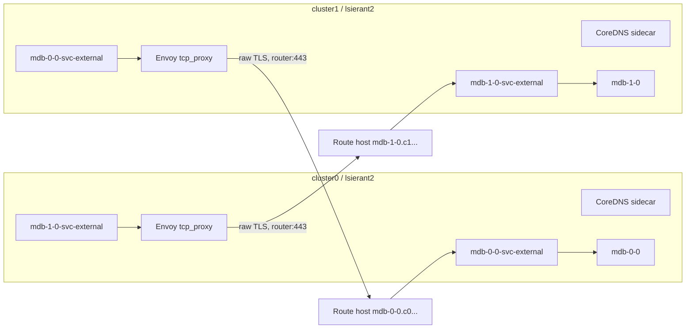

# `lsierant2` external-domain MongoDBMultiCluster PoC

> **Historical snapshot:** This report records the validated 2026-08-29 state.
> On 2026-09-08 the retained deployment was `Pending` after its Cloud QA
> project became inactive. See [`HANDOFF.md`](HANDOFF.md#12-current-live-state-versus-last-known-good-state)
> for current state and the complete investigation.

## Executive result

Verified live on **2026-08-29**.

A second, independent three-member MongoDBMultiCluster replica set is running
across the two OpenShift clusters in namespace/project `lsierant2`:

- cluster0: one member;
- cluster1: two members;
- MongoDBMultiCluster `mdb`: `Running`, generation 1 observed;
- MongoDBUser `mc-no-mesh-user`: `Updated`;
- topology: one PRIMARY and two healthy SECONDARIES;
- authenticated TLS connections work through both cross-cluster relay paths;
- a fresh write with `writeConcern: {w: 3}` and reads through both opposite
  relays succeeded.

The original `lsierant` PoC remains unchanged and `Running`.

## Contexts and domains

Cluster contexts:

- cluster0:
  `default/api-kubehosted-9h9y-p1-openshiftapps-com:6443/admin-kubehosted`
- cluster1:
  `/api-u5p3c2n7r3a9k9m-scnn-p1-openshiftapps-com:6443/kubehosted-admin`

Operator aliases are `cluster0` and `cluster1`; these aliases are used because
the raw context names are not suitable ConfigMap keys.

External process domains:

- cluster0: `c0.lsierant2.mc-no-mesh.test`
- cluster1: `c1.lsierant2.mc-no-mesh.test`

MongoDB process hostnames:

- `mdb-0-0.c0.lsierant2.mc-no-mesh.test:27017`
- `mdb-1-0.c1.lsierant2.mc-no-mesh.test:27017`
- `mdb-1-1.c1.lsierant2.mc-no-mesh.test:27017`

These names are deliberately split-horizon PoC names. They are resolved only
by the namespace DNS deployed with the relay package; no public DNS records,
cluster-wide OpenShift DNS changes, or `hostAliases` are used.

## Architecture

Each cluster contains all three deterministic external per-pod Services:

- `mdb-0-0-svc-external`
- `mdb-1-0-svc-external`
- `mdb-1-1-svc-external`

The Service corresponding to a pod owned by that cluster selects the mongod
pod. A remote duplicate Service has the same name and port shape but selects
the local `mc-no-mesh-relay` pod.



The complete cross-cluster paths are:

1. cluster0 to cluster1:
   `mdb-1-{0,1}.c1.lsierant2.mc-no-mesh.test`
   -> cluster0 namespace DNS
   -> cluster0 remote duplicate `mdb-1-{0,1}-svc-external`
   -> cluster0 Envoy
   -> cluster1 router port 443
   -> passthrough Route selected by unchanged TLS SNI
   -> cluster1 owning `mdb-1-{0,1}-svc-external:27017`
   -> mongod.
2. cluster1 to cluster0:
   `mdb-0-0.c0.lsierant2.mc-no-mesh.test`
   -> cluster1 namespace DNS
   -> cluster1 remote duplicate `mdb-0-0-svc-external`
   -> cluster1 Envoy
   -> cluster0 router port 443
   -> passthrough Route selected by unchanged TLS SNI
   -> cluster0 owning `mdb-0-0-svc-external:27017`
   -> mongod.

Envoy does not terminate or originate TLS. Its only MongoDB listener is a raw
L4 `envoy.filters.network.tcp_proxy` listener on port 27017. Consequently the
original external process hostname remains both the TLS SNI and certificate
identity at the destination mongod.

Router endpoints:

- cluster0:
  `router-default.apps.kubehosted.9h9y.p1.openshiftapps.com:443`
- cluster1:
  `router-default.apps.u5p3c2n7r3a9k9m.scnn.p1.openshiftapps.com:443`

## Client connectivity and a separate client horizon

The process names above solve mongod and Automation Agent connectivity, but
they are not a complete client access design:

- a client that does not use `mc-no-mesh-dns` cannot resolve the `.test`
  process names;
- publishing those names in normal DNS still does not help when the only
  externally reachable listener is the OpenShift router on `443`, because the
  default replica-set topology advertises port `27017`;
- connecting to one Route on `443` is insufficient: after the first `hello`,
  a replica-set driver attempts the other member addresses advertised by
  mongod.

The clean separation is:

| Plane | Addresses | Consumers |
|---|---|---|
| Member transport | Current process names on `27017` | mongod replication, heartbeats, initial sync, Automation Agents |
| Client topology | A `client` replica-set horizon with routable per-member names on `443` | MongoDB drivers |

Replica-set horizons affect the topology returned to the incoming client.
They do not change the addresses mongod or the Automation Agent use for
outbound connections. The existing namespace DNS, duplicate Services, Envoy,
and internal Routes therefore remain necessary for the member transport
plane.

### Proposed horizon

The current PoC has not deployed this horizon. A production-shaped extension
would use one unique, routable hostname per member:

```yaml
spec:
  connectivity:
    replicaSetHorizons:
      - client: mdb-0-0.client.example.com:443
      - client: mdb-1-0.client.example.com:443
      - client: mdb-1-1.client.example.com:443
```

Each member must have the same horizon key, `client`, and every endpoint must
be unique. The list order must match the process order generated from
`clusterSpecList`: cluster0 member 0, then cluster1 members 0 and 1 for this
topology.

Required infrastructure:

1. `mdb-0-0.client.example.com` resolves to the cluster0 router.
2. `mdb-1-0.client.example.com` and
   `mdb-1-1.client.example.com` resolve to the cluster1 router.
3. Each owning cluster has one TLS-passthrough Route per local member. The
   Route host is the member's client horizon name and the backend is the
   existing local pod Service on target port `27017`.
4. The mongod server certificate contains every client horizon hostname, in
   addition to the default process identities.
5. External and internal client networks can reach the relevant router
   listeners on `443`.

All Routes may listen on the same port. SNI selects the per-member Route:

```text
driver -> mdb-1-0.client.example.com:443
       -> cluster1 router, SNI mdb-1-0.client.example.com
       -> passthrough Route
       -> mdb-1-0-svc-external:27017
       -> mongod
```

The port translation is technically valid. The Route accepts TCP/TLS on
`443`, its Service backend uses `27017`, and mongod advertises the independently
configured horizon value `mdb-1-0.client.example.com:443`. The local mongod
`net.port` remains `27017`.

The published client URI should contain multiple horizon seeds:

```text
mongodb://mdb-0-0.client.example.com:443,mdb-1-0.client.example.com:443,mdb-1-1.client.example.com:443/?replicaSet=mdb&tls=true
```

When the initial TLS ClientHello SNI exactly matches the configured horizon
hostname, mongod returns all members using the `client` horizon and port
`443`. A generic seed alias, an IP address, a TLS-terminating ingress, or a
client that does not send the expected SNI can cause mongod to return the
default `:27017` topology instead. The Routes must therefore remain TLS
passthrough.

### Clients inside either cluster

The same client horizon can be the supported endpoint for clients in the same
namespace, a different namespace, or outside Kubernetes. In-cluster clients
then use normal DNS and do not need `mc-no-mesh-dns`. This requires the
OpenShift router to be reachable from pods through its routable address;
router hairpin and egress policy must be tested in both clusters.

If router hairpin is unavailable or undesirable, an optional in-cluster DNS
view can resolve the client horizon names to per-member Services that expose
Service port `443` with target port `27017`. That is an optimization, not a
prerequisite for the external design, and clients using it must opt into that
DNS view.

For the first `lsierant` variant, an in-cluster client can already use the
default fully qualified `.svc.cluster.local` topology from any namespace in
either cluster because every per-pod Service is duplicated locally. An
external client still requires the `client` horizon. For `lsierant2`, the
client horizon should be the general-purpose client endpoint because the
default process names are intentionally available only through the custom
namespace resolver.

### Current operator gaps

`MongoDBMultiCluster.spec.connectivity.replicaSetHorizons` already reaches the
Automation Config through `NewMultiClusterReplicaSetWithProcesses`, so this
can be exercised without a mongod code change. Before treating it as a
production operator feature, the following gaps should be addressed:

- horizon entries are positional while multi-cluster members are derived from
  `clusterSpecList`; scaling or topology changes can shift the mapping;
- MongoDBMultiCluster validation enforces TLS but does not currently perform
  the single-cluster resource's equivalent horizon count and DNS-name checks;
- `MultiReplicaSetConfig` does not pass horizons into certificate-domain
  validation, so the operator does not prove that the supplied server
  certificate contains the client names;
- the operator does not create public DNS records or externally routable
  Routes for the horizon.

For a PoC, a shared certificate containing all default and client SANs plus a
fixed 1+2 topology is sufficient. A durable API should generate or bind
horizons by stable process identity rather than asking users to maintain a
global positional array.

## Namespace DNS and the second container

### Why the relay pod has two containers

The `lsierant2` `mc-no-mesh-relay` Deployment has two containers that share a
pod network namespace and a read-only ConfigMap volume:

| Container | Responsibility | Image |
|---|---|---|
| `envoy` | Accept MongoDB TCP on `27017` and copy the encrypted stream to the opposite OpenShift router on `443` | `docker.io/envoyproxy/envoy:v1.37-latest` |
| `coredns` | Resolve the captured external MongoDB names to local Service ClusterIPs and forward every other DNS query | `quay.io/openshift-release-dev/ocp-v4.0-art-dev@sha256:f02816882ad485fd1586f9c3d4573587feb62bf1c30a64689ce6157a13f1aced` |

The CoreDNS image is not built by this PoC. It is the digest-pinned image used
by the cluster0 `openshift-dns/dns-default` DaemonSet. The running binary
reports:

```text
CoreDNS-1.13.1
linux/amd64, go1.25.11 (Red Hat 1.25.11-1.el9_8) X:strictfipsruntime
```

Pinning the digest avoids a mutable tag and uses an image already selected by
the OpenShift release. `apply.sh` exposes `COREDNS_IMAGE` so another compatible
image can be supplied. This is still a PoC choice: production packaging must
decide whether relying on an OpenShift release payload image is supportable or
whether the operator should publish and support its own CoreDNS image.

CoreDNS is a sidecar rather than a separate Deployment so one relay package
owns the TCP and DNS functions and mounts one `mc-no-mesh-relay` ConfigMap.
That also couples their availability: with one replica, an unavailable relay
pod removes both remote TCP forwarding and the namespace DNS endpoint.

Envoy's UDP DNS filter was investigated, but its documentation marks it alpha
and not production ready. The PoC therefore uses CoreDNS for DNS and Envoy only
for TCP. `envoy.filters.network.tcp_proxy` does not answer DNS.

### CoreDNS ports and Service

The CoreDNS process runs unprivileged on pod port `5353`:

```yaml
command: ["coredns"]
args: ["-conf", "/etc/relay/Corefile"]
```

The `mc-no-mesh-dns` ClusterIP Service selects
`app=mc-no-mesh-relay` and translates normal DNS ports to the sidecar:

```text
UDP 53 -> targetPort 5353
TCP 53 -> targetPort 5353
```

The Service addresses are:

- cluster0: `172.30.157.238`;
- cluster1: `172.30.179.14`.

Kubernetes `dnsConfig.nameservers` requires numeric IP addresses, so the
MongoDB StatefulSets and test client pods use those ClusterIPs with
`dnsPolicy: None`:

```yaml
dnsPolicy: None
dnsConfig:
  nameservers:
    - <mc-no-mesh-dns ClusterIP in this cluster>
  searches:
    - lsierant2.svc.cluster.local
    - svc.cluster.local
    - cluster.local
  options:
    - name: ndots
      value: "1"
    - name: timeout
      value: "2"
    - name: attempts
      value: "3"
```

This changes only the opted-in MongoDB/client pods. It does not modify
OpenShift DNS, CoreDNS cluster configuration, or other workloads.

### Corefile behavior

Both clusters run this Corefile:

```text
.:5353 {
  errors
  health :8080
  ready :8181
  hosts /etc/relay/hosts {
    ttl 5
    reload 2s
    fallthrough
  }
  forward . /etc/resolv.conf
  cache 30
}
```

The directives have the following effect:

- `.:5353` listens for every DNS name on unprivileged port `5353`.
- `errors` emits DNS processing errors to the container log.
- `health :8080` and `ready :8181` expose process health/readiness; the pod
  readiness probe checks `8181`.
- `hosts /etc/relay/hosts` serves exact A records from the mounted file.
- `ttl 5` gives those answers a five-second TTL.
- `reload 2s` checks the hosts file every two seconds.
- `fallthrough` sends names absent from the hosts file to the next plugin
  instead of returning NXDOMAIN.
- `forward . /etc/resolv.conf` forwards all unmatched queries to the relay
  pod's normal OpenShift cluster resolver.
- `cache 30` caches forwarded and authoritative responses, still respecting
  the shorter record TTL where applicable.

The CoreDNS container retains the relay pod's default cluster DNS policy.
Consequently its own `/etc/resolv.conf` points at the normal OpenShift
resolver, while MongoDB pods point at `mc-no-mesh-dns`. This avoids a forwarding
loop.

### Zone data and reload boundary

The external Services are pre-created before the MongoDB CR so they receive
stable ClusterIPs before the hosts file is rendered. The operator then adopts
and updates those Services without changing their ClusterIPs.

The cluster0 hosts file is:

```text
172.30.228.29  mdb-0-0.c0.lsierant2.mc-no-mesh.test
172.30.51.110  mdb-1-0.c1.lsierant2.mc-no-mesh.test
172.30.111.93  mdb-1-1.c1.lsierant2.mc-no-mesh.test
```

The cluster1 hosts file is:

```text
172.30.179.67   mdb-0-0.c0.lsierant2.mc-no-mesh.test
172.30.240.104  mdb-1-0.c1.lsierant2.mc-no-mesh.test
172.30.58.192   mdb-1-1.c1.lsierant2.mc-no-mesh.test
```

The names are identical in both clusters, but each answer is the ClusterIP of
the corresponding Service object in the querying cluster. That local Service
decides whether the next hop is mongod or Envoy.

Updating only the ConfigMap `hosts` key does not require a MongoDB pod restart.
Kubernetes refreshes the projected file and the `hosts` plugin reloads it.
Clients may observe the old answer until the projection delay and DNS TTL/cache
expire. The Corefile does not enable CoreDNS's `reload` plugin, so changing the
Corefile itself requires restarting the CoreDNS container. Envoy also uses
static configuration and requires a rollout for Envoy configuration changes.
`apply.sh` hashes the complete rendered relay ConfigMap and stamps the hash on
the pod template, causing that conservative rollout.

The DNS Service ClusterIP must remain stable. Deleting and recreating
`mc-no-mesh-dns` with a different ClusterIP would require updating pod
`dnsConfig`, which is a PodSpec change and would replace MongoDB pods. Normal
topology changes only update per-member Service records and do not require
changing the DNS Service IP.

Observed DNS mappings:

| Name | cluster0 answer | cluster1 answer |
|---|---:|---:|
| `mdb-0-0.c0.lsierant2.mc-no-mesh.test` | `172.30.228.29` | `172.30.179.67` |
| `mdb-1-0.c1.lsierant2.mc-no-mesh.test` | `172.30.51.110` | `172.30.240.104` |
| `mdb-1-1.c1.lsierant2.mc-no-mesh.test` | `172.30.111.93` | `172.30.58.192` |

Each answer is the ClusterIP of the same-named external Service object in the
querying cluster.

## Detailed comparison of the two Envoy deployments

### Common Envoy data plane

Both `lsierant` and `lsierant2` use Envoy
`docker.io/envoyproxy/envoy:v1.37-latest`. Every relay runs the same L4 shape:

```yaml
static_resources:
  listeners:
    - name: mongodb
      address:
        socket_address:
          address: 0.0.0.0
          port_value: 27017
      filter_chains:
        - filters:
            - name: envoy.filters.network.tcp_proxy
              typed_config:
                "@type": type.googleapis.com/envoy.extensions.filters.network.tcp_proxy.v3.TcpProxy
                stat_prefix: mongodb
                cluster: remote_router
  clusters:
    - name: remote_router
      connect_timeout: 10s
      type: STRICT_DNS
      lb_policy: ROUND_ROBIN
      load_assignment:
        cluster_name: remote_router
        endpoints:
          - lb_endpoints:
              - endpoint:
                  address:
                    socket_address:
                      address: <opposite OpenShift router hostname>
                      port_value: 443
```

Important consequences:

- Envoy accepts plain TCP carrying MongoDB TLS records; it does not terminate
  TLS.
- There is no downstream TLS context, `tls_inspector`, upstream TLS
  `transport_socket`, or certificate mounted into Envoy.
- Envoy does not choose a member from SNI. It sends every connection to the
  opposite cluster's router.
- The original MongoDB ClientHello reaches the OpenShift router unchanged.
  The router reads SNI, selects the passthrough Route, and forwards the same
  encrypted stream to the correct owning Service.
- `STRICT_DNS` resolves the router hostname using the relay pod's normal
  cluster resolver. `ROUND_ROBIN` can distribute new connections across the
  resolved router addresses.
- `connect_timeout: 10s` limits establishment of the upstream router
  connection. No application-level MongoDB retry is implemented in Envoy.
- Only `27017` is handled. The generated Services expose `27018`, but neither
  relay design listens on or routes it.

### `lsierant`: internal pod-Service FQDNs

`lsierant` does not run a custom DNS container. Its MongoDB identities are
ordinary Kubernetes names such as:

```text
mdb-1-0-svc.lsierant.svc.cluster.local
```

Because `duplicateServiceObjects: true` creates that Service object in both
clusters, normal Kubernetes/OpenShift DNS already resolves the FQDN to the
local Service ClusterIP. Custom DNS would add no value in this variant.

Deployed relay resources:

| Cluster | ConfigMap | Deployments | Pod selector |
|---|---|---|---|
| cluster0 | `mc-envoy-to-cluster1` | `mc-envoy-to-cluster1-mdb-1-0`, `mc-envoy-to-cluster1-mdb-1-1` | `app=envoy-proxy` plus a deployment-specific `mc-envoy-relay` label |
| cluster1 | `mc-envoy-to-cluster0` | `mc-envoy-to-cluster0-mdb-0-0` | `app=envoy-proxy` plus a deployment-specific `mc-envoy-relay` label |

The two cluster0 Deployments mount the same ConfigMap and have the same
upstream. Both remote cluster1 Services select only `app=envoy-proxy`, so both
Envoy pods are eligible endpoints for either member. Their per-member
Deployment names do not create per-member routing; the destination router's
SNI selection does.

Rendered upstreams:

| Source | `remote_router` address |
|---|---|
| cluster0 | `router-default.apps.u5p3c2n7r3a9k9m.scnn.p1.openshiftapps.com:443` |
| cluster1 | `router-default.apps.kubehosted.9h9y.p1.openshiftapps.com:443` |

Service and Route behavior:

| Cluster | Owning Service selectors | Remote duplicate selectors | Route hosts |
|---|---|---|---|
| cluster0 | `mdb-0-0-svc -> mdb-0-0` | `mdb-1-0-svc`, `mdb-1-1-svc -> app=envoy-proxy` | `mdb-0-0-svc.lsierant.svc.cluster.local` |
| cluster1 | `mdb-1-0-svc -> mdb-1-0`, `mdb-1-1-svc -> mdb-1-1` | `mdb-0-0-svc -> app=envoy-proxy` | the two cluster1 `.lsierant.svc.cluster.local` names |

The Envoy config is mounted read-only at `/etc/envoy/envoy.yaml` and started
with:

```text
envoy -c /etc/envoy/envoy.yaml --log-level info
```

This first PoC has no xDS or config-hash rollout mechanism. Changing its Envoy
ConfigMap requires an explicit Deployment rollout.

### `lsierant2`: external identities plus split-horizon DNS

`lsierant2` has one `mc-no-mesh-relay` Deployment per cluster. Each Deployment
contains one Envoy and one CoreDNS container. Remote external Services select
`app=mc-no-mesh-relay`; the `mc-no-mesh-dns` Service deliberately uses the same
selector to reach the CoreDNS sidecar in that relay pod.

Rendered Envoy upstreams:

| Source | ConfigMap | `remote_router` address |
|---|---|---|
| cluster0 | `mc-no-mesh-relay` | `router-default.apps.u5p3c2n7r3a9k9m.scnn.p1.openshiftapps.com:443` |
| cluster1 | `mc-no-mesh-relay` | `router-default.apps.kubehosted.9h9y.p1.openshiftapps.com:443` |

Service and Route behavior:

| Cluster | Owning external Service selectors | Remote duplicate selectors | Route hosts |
|---|---|---|---|
| cluster0 | `mdb-0-0-svc-external -> mdb-0-0` | `mdb-1-0-svc-external`, `mdb-1-1-svc-external -> app=mc-no-mesh-relay` | `mdb-0-0.c0.lsierant2.mc-no-mesh.test` |
| cluster1 | `mdb-1-0-svc-external -> mdb-1-0`, `mdb-1-1-svc-external -> mdb-1-1` | `mdb-0-0-svc-external -> app=mc-no-mesh-relay` | the two `*.c1.lsierant2.mc-no-mesh.test` names |

The Envoy config is mounted at `/etc/relay/envoy.yaml`; the Corefile and hosts
table are mounted in the same directory. The Envoy command is:

```text
envoy -c /etc/relay/envoy.yaml --log-level info
```

The extra DNS hop exists because external process names are not Kubernetes
Service DNS names. CoreDNS converts the external identity to a local Service
IP; Envoy then handles only those Service connections whose target is remote.

### Functional difference

| Property | `lsierant` | `lsierant2` |
|---|---|---|
| Process/TLS identity | `*.lsierant.svc.cluster.local` | `*.c0.lsierant2.mc-no-mesh.test` and `*.c1...` |
| Name resolution | Normal cluster Service DNS | Namespace CoreDNS split horizon |
| Per-pod Service kind | Internal `*-svc` | ClusterIP `*-svc-external` |
| Relay selector | `app=envoy-proxy` | `app=mc-no-mesh-relay` |
| Relay pods per cluster | 2 in cluster0, 1 in cluster1 | 1 two-container pod in each cluster |
| Envoy routing decision | None; opposite router dispatches by SNI | None; opposite router dispatches by SNI |
| DNS hot update | Kubernetes Service DNS | CoreDNS hosts file reload |
| Envoy config update | Explicit rollout required | Script-driven config-hash rollout |

## Operator API and code delta

The existing supported API remains:

```yaml
spec:
  duplicateServiceObjects: true
  remoteDuplicatePodService:
    spec:
      selector:
        app: mc-no-mesh-relay
```

The second PoC found that the first implementation applied this override only
to internal `*-svc` pod Services. With `externalAccess.externalDomain`, the
legacy controller creates `*-svc-external` per-pod Services instead.

New commit:

- branch: `poc/multicluster-envoy-relay`
- commit: `71d3e4f1c25078782b03e4e416809acd99170fbc`
- subject: `Support remote external pod service overrides`

Changed files:

- `controllers/operator/mongodbmultireplicaset_controller.go`
  - routes internal and external per-pod Service construction through one
    remote-duplicate override helper;
  - applies the override only when
    `clientClusterName != owningClusterName`;
  - uses selector-replacing reconciliation for remote external duplicates;
  - leaves owning-cluster external Services on their generated mongod
    selectors.
- `controllers/operator/mongodbmultireplicaset_controller_test.go`
  - expands the existing table to cover internal and external Service paths;
  - covers override and no-override behavior;
  - proves local selectors remain generated;
  - proves remote selectors are replaced exclusively;
  - injects stale selector keys, a ClusterIP/ClusterIPs pair, and a NodePort,
    then proves a subsequent reconcile removes stale selectors while
    preserving allocated/immutable Service fields.

No API or CRD schema change was required for this extension. The
`remoteDuplicatePodService` field was introduced by commit
`88d9014e82d8d81b06c04ee03832b172c45753c6`.

Validation:

```text
make generate manifests
go test ./pkg/kube/service ./controllers/operator -count=1
go vet ./pkg/kube/service ./controllers/operator
git diff --check
```

All passed before the new commit.

## TLS

cert-manager in cluster0 issued:

- a namespace-local self-signed CA;
- a CA-backed server certificate;
- a separate automation-agent client certificate.

Server certificate SANs:

```text
DNS:*.c0.lsierant2.mc-no-mesh.test
DNS:*.c1.lsierant2.mc-no-mesh.test
```

There is no `.svc.cluster.local` SAN. The agent certificate has the required
client identity `mms-automation-agent` and no internal server DNS SANs.

The server and agent Secrets plus the public CA ConfigMap were copied to
cluster1 without printing or persisting private material outside Kubernetes.

The existing cluster0 source objects were read without modification:

- ConfigMap `mongodb/my-project`, supplying the Ops Manager URL and
  organization ID;
- Secret `mongodb/my-credentials`;
- Secret `mongodb/image-registries-secret`.

The deployment created isolated copies/configuration in `lsierant2`, including
ConfigMap `lsierant2-project` with project name
`mongodb-lsierant2-mc-envoy-dns-poc`.

## Live Service and endpoint state

cluster0:

| Service | ClusterIP | Selector | Endpoint |
|---|---:|---|---:|
| `mdb-0-0-svc-external` | `172.30.228.29` | owning mongod `mdb-0-0` | `10.131.1.243` |
| `mdb-1-0-svc-external` | `172.30.51.110` | `app=mc-no-mesh-relay` | `10.128.2.222` |
| `mdb-1-1-svc-external` | `172.30.111.93` | `app=mc-no-mesh-relay` | `10.128.2.222` |

cluster1:

| Service | ClusterIP | Selector | Endpoint |
|---|---:|---|---:|
| `mdb-0-0-svc-external` | `172.30.179.67` | `app=mc-no-mesh-relay` | `10.128.3.140` |
| `mdb-1-0-svc-external` | `172.30.240.104` | owning mongod `mdb-1-0` | `10.131.0.36` |
| `mdb-1-1-svc-external` | `172.30.58.192` | owning mongod `mdb-1-1` | `10.128.3.129` |

All external Services are `ClusterIP`, not `LoadBalancer`.

## Routes

All routes are admitted and target the `mongodb` Service port:

- cluster0:
  - `mdb-0-0-external`
  - host `mdb-0-0.c0.lsierant2.mc-no-mesh.test`
  - backend `mdb-0-0-svc-external`
- cluster1:
  - `mdb-1-0-external`
  - host `mdb-1-0.c1.lsierant2.mc-no-mesh.test`
  - backend `mdb-1-0-svc-external`
  - `mdb-1-1-external`
  - host `mdb-1-1.c1.lsierant2.mc-no-mesh.test`
  - backend `mdb-1-1-svc-external`

## Database validation

Authenticated `replSetGetStatus` returned:

```text
mdb-0-0.c0.lsierant2.mc-no-mesh.test:27017  PRIMARY    health=1
mdb-1-0.c1.lsierant2.mc-no-mesh.test:27017  SECONDARY  health=1
mdb-1-1.c1.lsierant2.mc-no-mesh.test:27017  SECONDARY  health=1
```

OpenSSL verification through both remote duplicate Service and relay paths
returned:

```text
Verify return code: 0 (ok)
```

A fresh authenticated post-rerun upsert used:

- document ID: `lsierant2-external-dns-post-rerun`;
- value: `w3-post-rerun-verified`;
- write concern: `w:3`;
- result: acknowledged.

The document was read successfully:

- from cluster0 through
  `mdb-1-0.c1.lsierant2.mc-no-mesh.test`, exercising the cluster0 relay and
  cluster1 Route;
- from cluster1 through
  `mdb-0-0.c0.lsierant2.mc-no-mesh.test`, exercising the cluster1 relay and
  cluster0 Route.

An explicit metadata annotation update triggered a new operator reconcile.
After it completed, the CR remained `Running` and all remote selectors remained
exactly `app=mc-no-mesh-relay`.

## Custom operator image

Image:

```text
image-registry.openshift-image-registry.svc:5000/lsierant2/mc-no-mesh-operator:remote-external-pod-service-v1
```

Running image digest:

```text
sha256:7deb462f00840f11a425cc78080d80a25f31fc7daa5dad15c942dd034d5e5cde
```

The current operator source is paired with database/init images version 1.6.1.
The CR supplies `MDB_LOG_FILE_AUTOMATION_AGENT_STDERR`, required by that older
database sidecar.

## Live resource inventory

Namespace/project:

- cluster0 Namespace `lsierant2`;
- cluster1 Project/Namespace `lsierant2`.

### cluster0 namespace `lsierant2`

Custom resources:

- MongoDBMultiCluster `mdb`
- MongoDBUser `mc-no-mesh-user`

Workloads:

- Deployment `mc-no-mesh-operator`
- Deployment `cluster1-api-proxy`
- Deployment `mc-no-mesh-relay`
- StatefulSet `mdb-0`
- Pods `mc-no-mesh-operator-5c5f546878-jdmb6`,
  `cluster1-api-proxy-5f787969bf-4c9mh`,
  `mc-no-mesh-relay-56848cd58-qbc5h`, `mc-no-mesh-client`, and `mdb-0-0`

Services and Routes:

- Services `operator-webhook`, `cluster1-api-proxy`, `mc-no-mesh-dns`,
  `mdb-svc`, `mdb-0-svc`, `mdb-0-0-svc-external`,
  `mdb-1-0-svc-external`, and `mdb-1-1-svc-external`
- matching Endpoints objects for those Services
- Route `mdb-0-0-external`

Storage:

- PVC `data-mdb-0-0`, `Bound`, 16G, storage class `gp3`

ConfigMaps:

- `lsierant2-project`
- `mc-no-mesh-operator-member-list`
- `mongodb-kubernetes-operator-member-list`
- `cluster1-api-proxy`
- `mc-no-mesh-relay`
- `mc-no-mesh-ca`
- generated `mdb-hostname-override`
- platform `kube-root-ca.crt` and `openshift-service-ca.crt`

Secrets, names only:

- copied `my-credentials`
- copied `image-registries-secret`
- `mongodb-enterprise-operator-multi-cluster-kubeconfig`
- `cluster1-api-proxy-credentials`
- `mc-no-mesh-operator-token`
- `mc-no-mesh-ca-key-pair`
- `mc-no-mesh-mdb-cert`
- `mc-no-mesh-mdb-cert-pem`
- `mc-no-mesh-mdb-agent-certs`
- `mc-no-mesh-mdb-agent-certs-pem`
- `mc-no-mesh-user-password`
- `mdb-mc-no-mesh-user-admin`
- `6a92a13df71a0dd24346d670-group-secret`
- OpenShift-generated Secrets `builder-dockercfg-q5jjr`,
  `default-dockercfg-kqwfd`, `deployer-dockercfg-7k8kq`,
  `mc-no-mesh-operator-dockercfg-xhb8j`,
  `mongodb-kubernetes-appdb-dockercfg-s8rzr`,
  `mongodb-kubernetes-database-pods-dockercfg-dxwp4`, and
  `mongodb-kubernetes-ops-manager-dockercfg-fxj58`
- Helm release Secrets
  `sh.helm.release.v1.mc-no-mesh-lsierant2.v1` through `.v4`

RBAC and identities:

- ServiceAccounts `mc-no-mesh-operator`, `mongodb-kubernetes-appdb`,
  `mongodb-kubernetes-database-pods`, and `mongodb-kubernetes-ops-manager`
- Roles and RoleBindings `mc-no-mesh-operator` and
  `mongodb-kubernetes-appdb`
- platform ServiceAccounts `builder`, `default`, and `deployer`
- platform/OpenShift RoleBindings `admin`, `admin-dedicated-admins`,
  `admin-system:serviceaccounts:dedicated-admin`,
  `alert-routing-edit-dedicated-admins`,
  `dedicated-admins-project-dedicated-admins`,
  `dedicated-admins-project-system:serviceaccounts:dedicated-admin`,
  `system:deployers`, `system:image-builders`, and `system:image-pullers`

cert-manager:

- Issuers `mc-no-mesh-selfsigned` and `mc-no-mesh-ca-issuer`
- Certificates `mc-no-mesh-ca`, `mc-no-mesh-mdb`,
  and `mc-no-mesh-mdb-agent`
- CertificateRequests `mc-no-mesh-ca-sdpwt`, `mc-no-mesh-mdb-pc4lh`, and
  `mc-no-mesh-mdb-agent-r9fkd`

Other:

- NetworkPolicy `cluster1-api-proxy`
- ImageStream `mc-no-mesh-operator`

### cluster1 project `lsierant2`

Workloads:

- Deployment `mc-no-mesh-relay`
- StatefulSet `mdb-1`
- Pods `mc-no-mesh-relay-66464696d5-ws6ng`, `mc-no-mesh-client`,
  `mdb-1-0`, and `mdb-1-1`

Services and Routes:

- Services `mc-no-mesh-dns`, `mdb-svc`, `mdb-1-svc`,
  `mdb-0-0-svc-external`, `mdb-1-0-svc-external`, and
  `mdb-1-1-svc-external`
- matching Endpoints objects for those Services
- Routes `mdb-1-0-external` and `mdb-1-1-external`

Storage:

- PVC `data-mdb-1-0`, `Bound`, 16G, storage class `gp3`
- PVC `data-mdb-1-1`, `Bound`, 16G, storage class `gp3`

ConfigMaps:

- `mc-no-mesh-relay`
- `mc-no-mesh-ca`
- generated `mdb-hostname-override`
- platform `kube-root-ca.crt` and `openshift-service-ca.crt`

Secrets, names only:

- copied `image-registries-secret`
- copied `mc-no-mesh-mdb-cert`
- copied `mc-no-mesh-mdb-cert-pem`
- copied `mc-no-mesh-mdb-agent-certs`
- copied `mc-no-mesh-mdb-agent-certs-pem`
- copied `mc-no-mesh-user-password`
- generated `mdb-mc-no-mesh-user-admin`
- generated `6a92a13df71a0dd24346d670-group-secret`
- `mc-no-mesh-operator-token`
- OpenShift-generated Secrets `builder-dockercfg-gj6l6`,
  `default-dockercfg-ctlg2`, `deployer-dockercfg-lfr6l`,
  `mc-no-mesh-operator-dockercfg-gswd7`,
  `mongodb-kubernetes-appdb-dockercfg-rf8cr`,
  `mongodb-kubernetes-database-pods-dockercfg-n7rrm`, and
  `mongodb-kubernetes-ops-manager-dockercfg-6rkwq`

RBAC and identities:

- ServiceAccounts `mc-no-mesh-operator`, `mongodb-kubernetes-appdb`,
  `mongodb-kubernetes-database-pods`, and `mongodb-kubernetes-ops-manager`
- Roles and RoleBindings `mc-no-mesh-operator` and
  `mongodb-kubernetes-appdb`
- platform ServiceAccounts `builder`, `default`, and `deployer`
- platform/OpenShift project RoleBindings
  `admin-dedicated-admins`,
  `admin-system:serviceaccounts:dedicated-admin`,
  `alert-routing-edit-dedicated-admins`,
  `dedicated-admins-project-dedicated-admins`,
  `dedicated-admins-project-system:serviceaccounts:dedicated-admin`,
  `system:deployers`, `system:image-builders`, and `system:image-pullers`

### Cluster-scoped state

- cluster1 still exposes no `mongodb.com` CRDs and the namespace administrator
  cannot create CRDs;
- the namespace-scoped `cluster1-api-proxy` in cluster0 authenticates with the
  cluster1 namespace ServiceAccount and removes cross-cluster owner references
  from JSON and Kubernetes protobuf write bodies;
- no new ValidatingWebhookConfiguration was created;
- shared `mdbpolicy.mongodb.com` still targets
  `mongodb/operator-webhook`;
- the already-installed shared `mongodbmulticluster.mongodb.com` CRD already
  contained `spec.remoteDuplicatePodService`, so this second deployment did
  not patch it;
- no existing cluster-scoped cert-manager resources were changed.

## Reproduction

Prerequisites:

- `kubectl`, `oc`, `helm`, `jq`, `python3`, `openssl`;
- Docker with buildx when building the operator image;
- both named contexts available;
- cluster0 permission for namespaced resources and the existing
  MongoDBMultiCluster CRD;
- cluster1 permission to create a ProjectRequest and manage namespace-scoped
  resources;
- cluster0 cert-manager;
- readable source objects `mongodb/my-project`, `mongodb/my-credentials`, and
  `mongodb/image-registries-secret`.

Run:

```bash
bash /Users/lukasz.sierant/mdb/projects/mc-no-mesh/lsierant2/apply.sh
```

To reuse the existing image:

```bash
BUILD_OPERATOR_IMAGE=false \
  bash /Users/lukasz.sierant/mdb/projects/mc-no-mesh/lsierant2/apply.sh
```

The successful deployment was followed by a full no-build rerun. The rerun
converged with the CR `Running` and the user `Updated`.

The script is parameterized for contexts, namespace, repository path, source
object names, target object names, project name, image tag, CoreDNS image,
router hosts, and external domains. Runtime passwords and registry
credentials are never printed or persisted in the package directory.

## Cleanup

Review and run:

```bash
CONFIRM_CLEANUP=yes \
  bash /Users/lukasz.sierant/mdb/projects/mc-no-mesh/lsierant2/cleanup.sh
```

This deletes only named `lsierant2` PoC resources and resources carrying the
specific `mongodbmulticluster=lsierant2-mdb` label. It does not remove or
modify the shared MongoDB CRDs, shared webhook, cert-manager installation,
ClusterIssuers, source objects in namespace `mongodb`, or the original
`lsierant` PoC.

Namespace/project deletion is opt-in:

```bash
CONFIRM_CLEANUP=yes DELETE_NAMESPACES=yes \
  bash /Users/lukasz.sierant/mdb/projects/mc-no-mesh/lsierant2/cleanup.sh
```

The cleanup script was syntax-validated but was not executed against the
verified deployment.

## Limitations and caveats

- The deployed PoC has no client horizon. Its default process names and
  `:27017` topology are not a supported generic external-driver endpoint.
- Only MongoDB port 27017 is relayed. Port 27018 is present on generated
  Services but is not listened on or multiplexed through router port 443.
- Envoy uses a static opposite-router hostname. Router endpoint changes are
  handled by `STRICT_DNS`, but topology or route-host changes require
  re-rendering configuration.
- The split-horizon zone is intentionally static for three members. CoreDNS
  hot-reloads projected host-file updates; the package is not a general
  dynamic service-discovery controller.
- The `.test` process domains are namespace-local through the custom resolver,
  not globally published DNS names.
- cluster1's lack of MongoDB CRDs requires the API proxy compatibility layer.
- Current operator source is paired with older 1.6.1 database/init sidecars
  and requires the compatibility environment variable documented above.
- The dedicated operator cannot manage cluster-scoped webhooks. Its configured
  unique webhook name is not registered; the shared webhook is untouched.
- Ops Manager at `https://cloud-qa.mongodb.com` remains an external dependency.
- This validates the network, DNS, TLS, operator, and replica-set design as a
  PoC. Production hardening would require availability, resource sizing,
  monitoring, DNS lifecycle automation, rotation procedures, and a supported
  release/image lifecycle.
