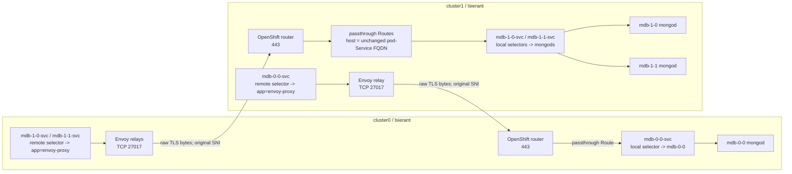

# MongoDBMultiCluster OpenShift Envoy Relay PoC

> **Historical snapshot:** This report records the validated 2026-08-29 state.
> On 2026-09-08 the retained deployment was `Pending` after its Cloud QA
> project became inactive. See [`HANDOFF.md`](HANDOFF.md#12-current-live-state-versus-last-known-good-state)
> for current state and the complete investigation.

## Executive result

Verified live on **2026-08-29**.

The PoC runs a three-member MongoDB Enterprise replica set across two OpenShift
clusters from one central MongoDB Kubernetes Operator:

- cluster0: one member, `mdb-0-0`
- cluster1: two members, `mdb-1-0` and `mdb-1-1`
- MongoDBMultiCluster `lsierant/mdb`: `Running`
- MongoDB version: `8.0.5-ent`
- topology: one `PRIMARY`, two healthy `SECONDARY` members
- storage: three bound `gp3` PVCs requesting `16G` each
- `duplicateServiceObjects: true`
- `externalDomain`: not configured
- internal TLS identity: per-mongod pod-Service FQDNs under
  `*.lsierant.svc.cluster.local`
- remote duplicate pod Services: backed by local Envoy TCP relay pods
- OpenShift Routes: admitted passthrough Routes on the owning clusters
- fresh authenticated `w:3` write and reads through both relay directions:
  successful

The implementation does not use a selector sidecar, selector reconciler, or
one-shot Service patch. The operator now provides a supported API for the
remote duplicate pod-Service selector.

## Git delivery

- Branch: `poc/multicluster-envoy-relay`
- Commit: `88d9014e82d8d81b06c04ee03832b172c45753c6`
- Subject: `Add remote duplicate pod service overrides`
- Trailer:
  `Co-authored-by: Copilot <223556219+Copilot@users.noreply.github.com>`

Only the nine operator feature/generated files were committed. The unrelated,
pre-existing `.idea/mongodb-kubernetes.iml` modification remains unstaged and
uncommitted.

## Objective and constraints

The objective was to preserve the MongoDB pod-Service names that a service
mesh would normally make reachable across clusters, but replace the mesh with
namespace-scoped Envoy L4 relays and OpenShift passthrough Routes.

Important constraints:

- central operator runs only in cluster0;
- cluster1 identity is a project administrator, not a cluster administrator;
- cluster1 has no `mongodb.com` CRDs and cannot install them;
- no `externalDomain` may be configured;
- all process names and TLS identities must remain the internal pod-Service
  FQDNs;
- cert-manager exists only in cluster0;
- Envoy must not terminate or originate MongoDB TLS;
- existing shared operator, cert-manager, ClusterIssuers, and source objects
  in namespace `mongodb` must remain unchanged;
- the shared MongoDBMultiCluster CRD may receive only the narrowly scoped new
  schema property, not a full CRD replacement.

Exact kubeconfig contexts:

- cluster0:
  `default/api-kubehosted-9h9y-p1-openshiftapps-com:6443/admin-kubehosted`
- cluster1:
  `/api-u5p3c2n7r3a9k9m-scnn-p1-openshiftapps-com:6443/kubehosted-admin`

The operator uses aliases `cluster0` and `cluster1`, because the exact context
strings contain characters that cannot be used as ConfigMap data keys.

## Architecture

The second external-domain PoC and a detailed side-by-side of both Envoy
configurations, including the CoreDNS sidecar image and resolver mechanics, is
documented in
[`LSIERANT2-EXTERNAL-DNS.md`](LSIERANT2-EXTERNAL-DNS.md#detailed-comparison-of-the-two-envoy-deployments).

### Identity invariant

“Pod-Service” means the per-mongod Service generated for an individual MongoDB
pod, for example:

`mdb-1-0-svc.lsierant.svc.cluster.local`

That exact FQDN remains:

1. the MongoDB process name in the replica-set configuration;
2. the TLS server identity and SNI;
3. the Service name visible to clients in every cluster;
4. the OpenShift passthrough Route host in the cluster that owns the mongod.

Only the Service backend changes by cluster:

- in the owning cluster, the pod Service selects the owning mongod pod;
- in every other cluster, the duplicate Service with the same name selects
  local `app=envoy-proxy` relay pods.

The owning Service and all duplicates therefore keep the same DNS name while
resolving to different local endpoints.

### Traffic path



#### cluster0 to cluster1

For `mdb-1-0` or `mdb-1-1`:

1. client connects to the pod-Service FQDN in cluster0;
2. the cluster0 remote duplicate Service selects local Envoy relay pods;
3. Envoy accepts TCP on `27017`;
4. Envoy forwards unchanged bytes to
   `router-default.apps.u5p3c2n7r3a9k9m.scnn.p1.openshiftapps.com:443`;
5. the cluster1 router selects the passthrough Route using the unchanged
   MongoDB ClientHello SNI;
6. the Route targets the matching local pod Service on its `mongodb` port;
7. the local pod Service selects `mdb-1-0` or `mdb-1-1`;
8. mongod terminates and verifies TLS.

#### cluster1 to cluster0

For `mdb-0-0`:

1. client connects to
   `mdb-0-0-svc.lsierant.svc.cluster.local` in cluster1;
2. the remote duplicate Service selects the local Envoy relay;
3. Envoy forwards unchanged TCP/TLS bytes to
   `router-default.apps.kubehosted.9h9y.p1.openshiftapps.com:443`;
4. the cluster0 passthrough Route matches the same FQDN in SNI;
5. the Route targets cluster0 Service `mdb-0-0-svc` on `mongodb:27017`;
6. that owning Service selects `mdb-0-0`;
7. mongod terminates and verifies TLS.

### Client connectivity

The default pod-Service names are the member transport plane, not a complete
external client interface. They work for clients in any namespace of either
cluster because normal Kubernetes DNS resolves the fully qualified duplicated
Services. They do not work for external clients, and a seed Route on `443`
would still return the default replica-set topology on port `27017`.

The intended driver-facing extension is a separate `client` replica-set
horizon with one externally routable `hostname:443` endpoint per member.
Each hostname resolves to the router of the cluster that owns that member, and
an owning-cluster TLS-passthrough Route forwards `443` to the existing mongod
Service on `27017`. TLS SNI selects both the OpenShift Route and the mongod
horizon; mongod then returns all members with their client horizon names and
port `443`.

This does not replace the current relay design. Replication, heartbeats,
initial sync, and Automation Agent connections continue to use the default
pod-Service names on `27017`. The horizon changes only the topology presented
to a driver that connects using the matching TLS SNI.

The current PoC has not deployed a client horizon. The proposed configuration,
required DNS/Routes/SANs, internal-client behavior, and current operator gaps
are documented in
[`LSIERANT2-EXTERNAL-DNS.md`](LSIERANT2-EXTERNAL-DNS.md#client-connectivity-and-a-separate-client-horizon).

## Operator API

The MongoDBMultiCluster API now supports:

```yaml
spec:
  duplicateServiceObjects: true
  remoteDuplicatePodService:
    spec:
      selector:
        app: envoy-proxy
```

`remoteDuplicatePodService` is evaluated only when:

```text
clientClusterName != clusterSpecItem.ClusterName
```

The comparison is essential. A pod-Service definition describes one target
mongod but is materialized in every cluster. Applying the override solely from
the target `clusterSpecItem` would also retarget the owning cluster's local
Service away from its mongod. Comparing the client cluster with the owning
cluster keeps local Services normal and changes only remote duplicates.

## Source changes

### `api/mongodb/v1/mdbmulti/mongodb_multi_types.go`

- Adds `RemoteDuplicatePodServiceConfiguration`.
- Adds optional `MongoDBMultiSpec.RemoteDuplicatePodService`.
- JSON field: `remoteDuplicatePodService`.
- Uses the existing Service `SpecWrapper` and annotation conventions.
- Documents that the pod-Service FQDN remains unchanged and that owning
  Services retain the generated mongod selector.

### `controllers/operator/mongodbmultireplicaset_controller.go`

- Adds per-client-cluster pod-Service construction.
- Applies the override only for a remote duplicate.
- Keeps local generated pod selectors unchanged.
- Removes selector, ports, `clusterIP`, and `clusterIPs` from the generic
  override merge input.
- Uses exclusive selector replacement when the override supplies a selector.
- Retains existing behavior when the new field is absent.

### `pkg/kube/service/service.go`

- Adds `CreateOrUpdateServiceReplacingSelector`.
- Shares the existing create/update implementation.
- Preserves API-assigned and immutable Service state.
- Keeps the operator-generated MongoDB ports.
- Preserves `ClusterIP`, `ClusterIPs`, resource version, and allocated
  NodePorts during updates.
- Replaces the selector map instead of additively merging old generated keys.
- Leaves the existing additive Service update behavior unchanged for all
  existing callers.

### `controllers/operator/mongodbmultireplicaset_controller_test.go`

Table-driven controller coverage verifies:

- local pod Service retains the generated mongod selector;
- remote duplicate receives only the relay selector;
- no override preserves existing behavior;
- a later reconcile removes reintroduced stale generated selector keys;
- local and remote objects preserve the same exact pod-Service FQDN:
  `temple-1-0-svc.my-namespace.svc.cluster.local`.

### `pkg/kube/service/service_test.go`

Table-driven Service tests compare normal selector merge with exclusive
selector replacement and verify immutable/allocated fields, including
ClusterIP and NodePort preservation.

### Generated files

- `api/mongodb/v1/mdbmulti/zz_generated.deepcopy.go`
- `config/crd/bases/mongodb.com_mongodbmulticluster.yaml`
- `helm_chart/crds/mongodb.com_mongodbmulticluster.yaml`
- `public/crds.yaml`

These include deepcopy support and the
`spec.remoteDuplicatePodService` OpenAPI schema.

## Source validation

Final successful validation before commit:

```bash
make generate manifests
go test ./api/mongodb/v1/mdbmulti ./pkg/kube/service ./controllers/operator -count=1
go vet ./api/mongodb/v1/mdbmulti ./pkg/kube/service ./controllers/operator
git diff --check
```

Results:

- generated outputs current;
- all focused package tests passed;
- `go vet` passed;
- no whitespace errors;
- staged scope contained exactly the nine requested files.

## Live resource inventory

The following inventory was obtained from the live APIs after the repeatable
package was rerun successfully. Secret names are listed, never their values.

### Existing source objects, read-only

Namespace `mongodb` in cluster0:

- ConfigMap `my-project`
- Secret `my-credentials`
- Secret `image-registries-secret`

The PoC copies these into `lsierant`. It does not mutate or delete the source
objects. The copied `my-project` ConfigMap is then set to the dedicated PoC
Ops Manager project name `mongodb-lsierant-mc-envoy-poc`, avoiding collision
with another managed deployment.

### cluster0 / namespace `lsierant`

Namespace `lsierant` existed before this execution
(`2026-08-25T07:34:42Z`). It is not deleted by default cleanup.

#### MongoDB resources

- MongoDBMultiCluster `mdb` — central desired state, `Running`
- MongoDBUser `mc-poc-user` — SCRAM test user, `Updated`
- StatefulSet `mdb-0` — one replica, `1/1` ready
- Pod `mdb-0-0` — owning cluster0 mongod
- PVC `data-mdb-0-0` — `Bound`, `gp3`, requested `16G`

#### Central operator and API bridge

- Deployment `mc-envoy-poc-operator`
- Pod `mc-envoy-poc-operator-7c7f69dc7b-8hzf9`
- Service `operator-webhook`
- Deployment `cluster1-api-proxy`
- Pod `cluster1-api-proxy-66f7555bcb-fwl9p`
- Service `cluster1-api-proxy`
- ConfigMap `cluster1-api-proxy`
- NetworkPolicy `cluster1-api-proxy`
- ImageStream `mc-envoy-poc-operator`

The ImageStream tag is `remote-pod-service-v2`; the running image digest is:

`sha256:574fa117c96126ac2f396970b7c306a31f7a9df8c5359bd8137786625dab9110`

#### Envoy relays

- ConfigMap `mc-envoy-to-cluster1`
- Deployment `mc-envoy-to-cluster1-mdb-1-0`
- Pod `mc-envoy-to-cluster1-mdb-1-0-6f985457d6-9rs7b`
- Deployment `mc-envoy-to-cluster1-mdb-1-1`
- Pod `mc-envoy-to-cluster1-mdb-1-1-549d46b4bf-2cwxw`

Both relay pods use `docker.io/envoyproxy/envoy:v1.37-latest`.

#### Services and Routes

- Service `mdb-svc` — replica-set aggregate Service
- Service `mdb-0-svc` — cluster0 headless Service
- Service `mdb-0-0-svc` — local, selects `mdb-0-0`
- Service `mdb-1-0-svc` — remote duplicate, selects `app=envoy-proxy`
- Service `mdb-1-1-svc` — remote duplicate, selects `app=envoy-proxy`
- Route `mdb-0-0-internal` — admitted passthrough Route for
  `mdb-0-0-svc.lsierant.svc.cluster.local`

Both cluster0 remote duplicate Services currently resolve to both cluster0
relay pods. They share one static upstream router configuration, so either
relay can carry either cluster1 member's SNI.

#### TLS and configuration

- Issuer `mc-poc-selfsigned`
- Issuer `mc-poc-ca-issuer`
- Certificate `mc-poc-ca`
- Certificate `mc-poc-mdb`
- Certificate `mc-poc-mdb-agent`
- ConfigMap `mc-poc-ca`
- ConfigMap `mdb-hostname-override`
- ConfigMap `mc-envoy-poc-operator-member-list`
- ConfigMap `mongodb-kubernetes-operator-member-list`
- ConfigMap `my-project`

#### RBAC and ServiceAccounts

- ServiceAccount `mc-envoy-poc-operator`
- ServiceAccount `mongodb-kubernetes-appdb`
- ServiceAccount `mongodb-kubernetes-database-pods`
- ServiceAccount `mongodb-kubernetes-ops-manager`
- Role `mongodb-kubernetes-operator-multi-role`
- RoleBinding `mongodb-kubernetes-operator-multi-role-binding`
- Role `mongodb-kubernetes-appdb`
- RoleBinding `mongodb-kubernetes-appdb`

The operator Role includes the MongoDBUser finalizer subresource required to
create/update the generated connection Secret after password rotation.

#### Client

- Pod `mc-poc-client` — `mongo:8.0.5` client used for TLS, authentication,
  replica-set, write, and read verification

#### Secrets

PoC/copy/generated Secret names:

- `my-credentials`
- `image-registries-secret`
- `mc-envoy-poc-operator-token-secret`
- `cluster1-api-proxy-credentials`
- `mongodb-enterprise-operator-multi-cluster-kubeconfig`
- `mc-poc-ca-key-pair`
- `mc-poc-mdb-cert`
- `mc-poc-mdb-cert-pem`
- `mc-poc-mdb-agent-certs`
- `mc-poc-mdb-agent-certs-pem`
- `mc-poc-user-password`
- `mdb-mc-poc-user-admin`
- `6a7b3beed47ce5bb6f7a1549-group-secret`
- `6a91ea0de74d992b81f33436-group-secret`
- `mc-envoy-poc-operator-dockercfg-55jr2`
- `mongodb-kubernetes-appdb-dockercfg-lh5l6`
- `mongodb-kubernetes-database-pods-dockercfg-4l7bf`
- `mongodb-kubernetes-ops-manager-dockercfg-xj79x`
- Helm release Secrets `sh.helm.release.v1.mc-envoy-poc.v1` through `.v7`

Platform-generated namespace Secret names:

- `builder-dockercfg-xl9wj`
- `default-dockercfg-n8gqd`
- `deployer-dockercfg-tdsml`

#### Non-PoC namespace baseline/residual objects

- ConfigMaps `kube-root-ca.crt`, `openshift-service-ca.crt`
- ServiceAccounts `builder`, `default`, `deployer`
- RoleBindings `admin-dedicated-admins`,
  `admin-system:serviceaccounts:dedicated-admin`,
  `alert-routing-edit-dedicated-admins`,
  `dedicated-admins-project-dedicated-admins`,
  `dedicated-admins-project-system:serviceaccounts:dedicated-admin`,
  `system:deployers`, `system:image-builders`, and `system:image-pullers`
- ConfigMap `tls-echo-server` and Secret `tls-echo-cert` from the earlier test

The old `tls-echo` Deployment, Service, and Route were removed. The remaining
ConfigMap and Secret were not part of the permitted three-object removal and
are not targeted by default cleanup.

### cluster1 / project `lsierant`

Project `lsierant` was created for the PoC on
`2026-08-28T19:26:20Z`.

#### MongoDB resources

- StatefulSet `mdb-1` — two replicas, `2/2` ready
- Pod `mdb-1-0`
- Pod `mdb-1-1`
- PVC `data-mdb-1-0` — `Bound`, `gp3`, requested `16G`
- PVC `data-mdb-1-1` — `Bound`, `gp3`, requested `16G`

cluster1 has no MongoDB CRs because it does not expose the `mongodb.com` APIs.

#### Envoy relay

- ConfigMap `mc-envoy-to-cluster0`
- Deployment `mc-envoy-to-cluster0-mdb-0-0`
- Pod `mc-envoy-to-cluster0-mdb-0-0-6fff555bb4-c8r2v`

The relay uses `docker.io/envoyproxy/envoy:v1.37-latest`.

#### Services and Routes

- Service `mdb-svc` — replica-set aggregate Service
- Service `mdb-1-svc` — cluster1 headless Service
- Service `mdb-0-0-svc` — remote duplicate, selects `app=envoy-proxy`
- Service `mdb-1-0-svc` — local, selects `mdb-1-0`
- Service `mdb-1-1-svc` — local, selects `mdb-1-1`
- Route `mdb-1-0-internal` — admitted passthrough Route for
  `mdb-1-0-svc.lsierant.svc.cluster.local`
- Route `mdb-1-1-internal` — admitted passthrough Route for
  `mdb-1-1-svc.lsierant.svc.cluster.local`

#### Configuration

- ConfigMap `mc-poc-ca`
- ConfigMap `mdb-hostname-override`

#### RBAC and ServiceAccounts

- ServiceAccount `mc-envoy-poc-operator`
- ServiceAccount `mongodb-kubernetes-appdb`
- ServiceAccount `mongodb-kubernetes-database-pods`
- ServiceAccount `mongodb-kubernetes-ops-manager`
- Role `mongodb-kubernetes-operator-multi-role`
- RoleBinding `mongodb-kubernetes-operator-multi-role-binding`
- Role `mongodb-kubernetes-appdb`
- RoleBinding `mongodb-kubernetes-appdb`

All PoC access is namespace-scoped.

#### Client

- Pod `mc-poc-client`

#### Secrets

PoC/copy/generated Secret names:

- `image-registries-secret`
- `mc-envoy-poc-operator-token-secret`
- `mc-poc-mdb-cert`
- `mc-poc-mdb-cert-pem`
- `mc-poc-mdb-agent-certs`
- `mc-poc-mdb-agent-certs-pem`
- `mc-poc-user-password`
- `mdb-mc-poc-user-admin`
- `6a7b3beed47ce5bb6f7a1549-group-secret`
- `6a91ea0de74d992b81f33436-group-secret`
- `mc-envoy-poc-operator-dockercfg-kgtcb`
- `mongodb-kubernetes-appdb-dockercfg-vkx99`
- `mongodb-kubernetes-database-pods-dockercfg-gq7t7`
- `mongodb-kubernetes-ops-manager-dockercfg-ldwt5`

Platform-generated project Secret names:

- `builder-dockercfg-5hhh6`
- `default-dockercfg-vbkb6`
- `deployer-dockercfg-8tsw4`

Platform baseline objects include `kube-root-ca.crt`,
`openshift-service-ca.crt`, the `builder/default/deployer` ServiceAccounts,
and RoleBindings `admin`, `admin-dedicated-admins`,
`admin-system:serviceaccounts:dedicated-admin`,
`alert-routing-edit-dedicated-admins`,
`dedicated-admins-project-dedicated-admins`,
`dedicated-admins-project-system:serviceaccounts:dedicated-admin`,
`system:deployers`, `system:image-builders`, and `system:image-pullers`.

### Cluster-scoped state

- CRD `mongodbmulticluster.mongodb.com` was changed only by adding the
  `spec.remoteDuplicatePodService` schema property.
- No full CRD replacement or shared CRD upgrade was performed.
- The shared `mdbpolicy.mongodb.com` ValidatingWebhookConfiguration still
  targets `mongodb/operator-webhook`.
- No shared ClusterRole, ClusterRoleBinding, cert-manager installation,
  ClusterIssuer, or shared operator resource was changed.

## TLS and cert-manager mechanics

cert-manager in cluster0 creates:

1. self-signed Issuer `mc-poc-selfsigned`;
2. CA Certificate `mc-poc-ca` in Secret `mc-poc-ca-key-pair`;
3. CA Issuer `mc-poc-ca-issuer`;
4. server/client Certificate `mc-poc-mdb` in Secret `mc-poc-mdb-cert`;
5. automation-agent client Certificate `mc-poc-mdb-agent` in Secret
   `mc-poc-mdb-agent-certs`.

The MongoDB server certificate is Ready and has:

- Common Name: `mdb.lsierant.svc.cluster.local`
- SAN: `mdb.lsierant.svc.cluster.local`
- SAN: `*.lsierant.svc.cluster.local`
- usages: server auth and client auth

Every per-mongod Service name is exactly one label below
`lsierant.svc.cluster.local`, so the wildcard covers
`mdb-0-0-svc`, `mdb-1-0-svc`, and `mdb-1-1-svc`.

The public CA certificate is stored in ConfigMap `mc-poc-ca` and copied to
cluster1. TLS Secrets and the CA ConfigMap are copied without logging private
keys or Secret values.

## Envoy mechanics

Each Envoy configuration uses:

- listener: TCP `27017`;
- filter: `envoy.filters.network.tcp_proxy`;
- upstream type: `STRICT_DNS`;
- upstream destination: opposite OpenShift router canonical hostname on
  `443`;
- no Envoy downstream TLS filter;
- no upstream `transport_socket`;
- no TLS termination or re-origination.

Therefore Envoy forwards the original MongoDB TLS ClientHello, SNI, encrypted
application records, and certificate verification exchange unchanged.

The repeatable script reads the admitted Route's
`routerCanonicalHostname` and renders it into the Envoy ConfigMap. A rendered
manifest hash is stamped on each relay Deployment, causing a rollout only when
the relay configuration changes.

## Namespace-scoped cluster1 API proxy

cluster1 cannot install or serve the MongoDB CRDs. The legacy multicluster
controller emits cross-cluster owner references, which the cluster1 API server
rejects because it cannot resolve the owner GVK and validate
`blockOwnerDeletion`.

`cluster1-api-proxy` runs in cluster0 and:

- authenticates upstream with the cluster1 namespace ServiceAccount;
- forwards only to
  `api.u5p3c2n7r3a9k9m.scnn.p1.openshiftapps.com:6443`;
- removes `metadata.ownerReferences` from JSON writes;
- removes owner references from Kubernetes protobuf writes;
- streams informer watches using `HTTPResponse.read1`;
- is reachable only from the dedicated operator pod through NetworkPolicy.

This proxy is unrelated to Service selector replacement. It exists only for
the cluster1 CRD/owner-reference limitation.

## Validation evidence

### Replica-set state

Live `replSetGetStatus`:

```text
mdb-0-0-svc.lsierant.svc.cluster.local:27017  PRIMARY    health=1
mdb-1-0-svc.lsierant.svc.cluster.local:27017  SECONDARY  health=1
mdb-1-1-svc.lsierant.svc.cluster.local:27017  SECONDARY  health=1
```

### Service selectors

```text
cluster0 mdb-0-0-svc -> controller=mongodb-enterprise-operator,
                         statefulset.kubernetes.io/pod-name=mdb-0-0
cluster0 mdb-1-0-svc -> app=envoy-proxy
cluster0 mdb-1-1-svc -> app=envoy-proxy

cluster1 mdb-0-0-svc -> app=envoy-proxy
cluster1 mdb-1-0-svc -> controller=mongodb-enterprise-operator,
                         statefulset.kubernetes.io/pod-name=mdb-1-0
cluster1 mdb-1-1-svc -> controller=mongodb-enterprise-operator,
                         statefulset.kubernetes.io/pod-name=mdb-1-1
```

A live stability test injected the stale generated selector keys back into a
remote duplicate Service, triggered reconciliation, and observed the selector
return to exactly `{"app":"envoy-proxy"}` without changing the Service name or
FQDN.

### Routes

All three Routes are admitted, use `passthrough`, and target Service port
`mongodb`:

- `mdb-0-0-internal` -> `mdb-0-0-svc`
- `mdb-1-0-internal` -> `mdb-1-0-svc`
- `mdb-1-1-internal` -> `mdb-1-1-svc`

Each Route host is the matching pod-Service FQDN.

### TLS

OpenSSL checks through both remote duplicate pod-Service paths reported:

```text
Protocol version: TLSv1.3
Verification: OK
```

### Authentication and replication

MongoDBUser `mc-poc-user` is `Updated`. Its password was rotated at runtime,
copied to cluster1 without printing it, and authenticated connectivity was
verified:

- cluster0 local pod Service -> cluster0 primary;
- cluster0 remote duplicate pod Service -> cluster1 secondary;
- cluster1 remote duplicate pod Service -> cluster0 primary.

Fresh post-rerun write:

- document ID: `handoff-88d9014e-final`
- value: `final-package-verified`
- write concern: `w:3`
- result: acknowledged, one upsert
- read from cluster0 through `mdb-1-0-svc`: successful
- read from cluster1 through `mdb-0-0-svc`: successful

## Repeatable package

Artifacts:

- `apply.sh` — idempotent deployment and convergence
- `cleanup.sh` — confirmed, named-resource cleanup
- numbered manifests `00` through `14`
- `README.txt`
- this report

`apply.sh`:

- resolves its artifact directory from `BASH_SOURCE`;
- accepts contexts, namespace, repository, source object names, target object
  names, Ops Manager settings, image tag, and router hosts through environment
  variables;
- checks tools, contexts, connectivity, source objects, CRD access, and
  namespace permissions;
- generates ServiceAccount kubeconfigs and passwords only in memory;
- reuses an existing user password Secret;
- removes transient Docker registry auth through an EXIT trap;
- patches only the new shared CRD schema property;
- reads admitted router canonical hostnames;
- stamps configuration hashes to roll proxy/relay Deployments only when
  rendered configuration changes;
- waits for Routes, Deployments, Certificates, clients, MongoDBMultiCluster,
  and MongoDBUser convergence.

The hardened script was run twice against the live clusters with
`BUILD_OPERATOR_IMAGE=false`. Both final runs converged successfully; the
second was a no-op convergence check.

## Prerequisites

- `kubectl`, `oc`, `helm`, `jq`, `python3`, `openssl`, and `awk`
- Docker with buildx when building the custom operator image
- both exact kubeconfig contexts
- cluster0 permission to patch the MongoDBMultiCluster CRD schema property
- namespace-scoped create/update permissions in both PoC namespaces
- cluster1 permission to create a ProjectRequest if the project is absent
- cert-manager APIs in cluster0
- source objects in cluster0 namespace `mongodb`:
  `my-project`, `my-credentials`, `image-registries-secret`
- reachable Ops Manager/Cloud Manager endpoint
- OpenShift routers reachable from relay pods on `443`

## Reproduction

Default current environment:

```bash
bash /Users/lukasz.sierant/.copilot/session-state/445e4c78-b250-4d6e-b90e-b5c01b036665/files/mc-envoy-poc/apply.sh
```

Reuse the existing custom image without rebuilding:

```bash
BUILD_OPERATOR_IMAGE=false \
  bash /Users/lukasz.sierant/.copilot/session-state/445e4c78-b250-4d6e-b90e-b5c01b036665/files/mc-envoy-poc/apply.sh
```

Important optional environment variables:

```text
CLUSTER0_CONTEXT
CLUSTER1_CONTEXT
POC_NAMESPACE
REPO_PATH
SOURCE_NAMESPACE
SOURCE_OPS_MANAGER_CONFIGMAP
SOURCE_CREDENTIALS_SECRET
SOURCE_IMAGE_PULL_SECRET
OPS_MANAGER_CONFIGMAP
CREDENTIALS_SECRET
IMAGE_PULL_SECRET
OPS_MANAGER_BASE_URL
OPS_MANAGER_ORG_ID
OPS_MANAGER_PROJECT_NAME
OPERATOR_IMAGE_TAG
BUILD_OPERATOR_IMAGE
CLUSTER0_ROUTER_HOST
CLUSTER1_ROUTER_HOST
```

## Cleanup

Default cleanup removes only named PoC resources and leaves both
namespace/project objects and the shared CRD schema property:

```bash
CONFIRM_CLEANUP=yes \
  bash /Users/lukasz.sierant/.copilot/session-state/445e4c78-b250-4d6e-b90e-b5c01b036665/files/mc-envoy-poc/cleanup.sh
```

Opt-in namespace/project deletion:

```bash
CONFIRM_CLEANUP=yes \
DELETE_CLUSTER0_NAMESPACE=yes \
DELETE_CLUSTER1_PROJECT=yes \
  bash /Users/lukasz.sierant/.copilot/session-state/445e4c78-b250-4d6e-b90e-b5c01b036665/files/mc-envoy-poc/cleanup.sh
```

Opt-in removal of only the new CRD schema property:

```bash
CONFIRM_CLEANUP=yes \
REMOVE_CRD_SCHEMA_PROPERTY=yes \
  bash /Users/lukasz.sierant/.copilot/session-state/445e4c78-b250-4d6e-b90e-b5c01b036665/files/mc-envoy-poc/cleanup.sh
```

The cleanup script refuses to remove the schema property while another
MongoDBMultiCluster still uses it. It never deletes the full CRD, shared
operator, shared webhook, cert-manager, ClusterIssuers, source namespace
objects, or cluster resources unrelated to this PoC.

Namespace deletion is deliberately opt-in because cluster0 `lsierant`
pre-existed the PoC and contains the old `tls-echo-server` ConfigMap and
`tls-echo-cert` Secret. cluster1 project deletion is also opt-in.

## Known limitations and caveats

- The deployed PoC has no driver-facing client horizon. The `.svc.cluster.local`
  topology is usable only from networks that can resolve and reach the
  duplicated Services; it is not an external replica-set endpoint.
- Only MongoDB port `27017` is relayed through the single router `443`
  passthrough path.
- Duplicate Services still expose backup port `27018`, but Envoy does not
  listen on `27018`; this PoC does not claim backup-agent port multiplexing.
- Envoy cluster configuration is static rather than dynamically discovered.
  The repeatable script updates router hostnames and rolls relays by rendered
  configuration hash.
- cluster0 uses two relay pods for cluster1. Both remote pod Services select
  both relay pods because the supported override is global and both relays use
  the same cluster1 router upstream.
- cluster1 lacks `mongodb.com` CRDs and its namespace administrator cannot
  create them; the namespace-scoped owner-reference-filtering API proxy is a
  PoC compatibility mechanism.
- The operator image is built from repository source, while database and init
  sidecars remain at available version `1.6.1`.
- `spec.statefulSet` supplies
  `MDB_LOG_FILE_AUTOMATION_AGENT_STDERR` because the `1.6.1` database sidecar
  requires it while current operator source no longer adds it by default.
- The dedicated operator is not permitted to register a cluster-wide webhook.
  The shared `mdbpolicy.mongodb.com` configuration remains owned by and points
  to the shared operator in namespace `mongodb`.
- The aliases `cluster0` and `cluster1` are stable operator keys, not the raw
  kubeconfig context strings.
- The deployment depends on external Ops Manager availability and the
  dedicated external project.
- The integrated ImageStream and build process are OpenShift-specific.
- This is a functional PoC, not production hardening. Production design would
  require lifecycle automation, HA/capacity planning, observability, network
  policy review, credential rotation integration, dynamic relay discovery,
  and failure-mode testing.
